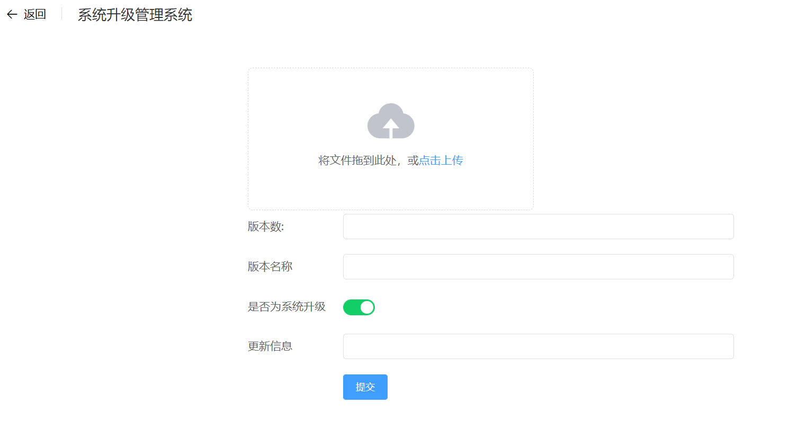

# OTAServer
本程序为windows下OpenHarmony的OTA更新服务器，用于结合系统更新app实现在线OTA更新，由于先前使用mongoose实现的OTA更新服务器效能很差，单设备更新时会随机出现下载卡顿的情况，因此使用drogon库进行重构此项目。与mongoose库简单的架构相比，drogon网络层使用基于epoll(macOS/FreeBSD下是kqueue)的非阻塞IO框架，提供高并发、高性能的网络IO,同时Drogon也是一个跨平台框架，支持Linux，也支持macOS、FreeBSD，OpenBSD，HaikuOS，和Windows。实测性能也更好。
## 实现功能
### 文件上传

通过浏览器访问服务器的ip地址和端口，会进入上传页面，在此页面将更新包拖拽到上传框，然后填写更新包的相关信息，点击上传。服务器会自动计算更新包的sha256sum值和大小,url，结合上传信息生成serverInfo.json。以供系统更新app获取版本更新信息。
### 文件下载
服务器提供了下载功能，当系统更新app根据版本更新信息的url字段访问服务器时，会触发文件下载功能。
示例：通过浏览器访问/api/download/update.zip，会下载服务器uploads目录下的update.zip文件
### 配置文件
服务器提供了读取配置文件的功能，在服务器目录下放置一个config.json配置文件,修改配置时不再需要重新编译服务器源码,config.json的示例如下
```json
{
    "listeners": [
        {
            "address": "0.0.0.0",
            "port": 80,
            "https": false
        }
    ],
    "app": {
        "number_of_threads": 4,
        "document_root": "./static",
        "home_page": "index.html",
        "upload_path": "../uploads",
        "client_max_body_size": "1G"
    }
}
```
## 编译安装
本程序基于drogon框架编写，编译时需要提前编译drogon并安装至系统中，编译过程可参考 [drogon的官方文档](https://github.com/drogonframework/drogon/wiki/CHN-02-%E5%AE%89%E8%A3%85#%E5%AE%89%E8%A3%85drogon),然后在源码目录输入
>cmake -DCMAKE_BUILD_TYPE=Release -DCMAKE_INSTALL_PREFIX=[安装目录] ..

会在build目录下生成makefile(windows默认是build.ninja),然后在build目录下执行
> make&& make install

windows下则是
> ninja  
> ninja install

若执行完成，再参照[前端](../front/README.md)的编译指示编译，将编译出来的dist文件夹的内容放入服务器目录的static文件夹，再将源码目录的config.json,uploads,config文件夹复制到服务器目录下，然后运行webserver即可