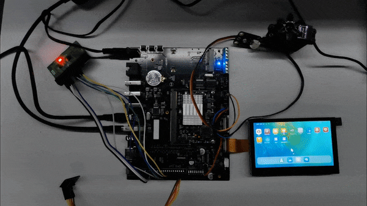
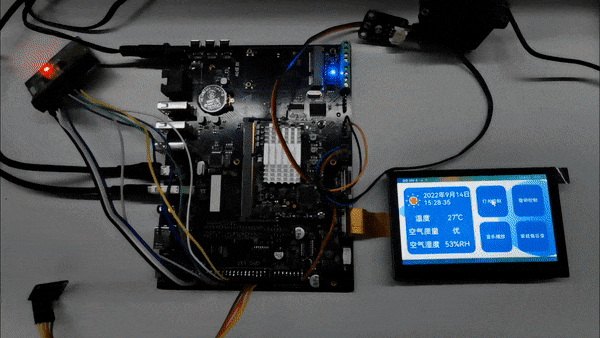
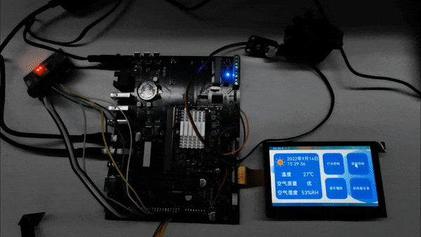
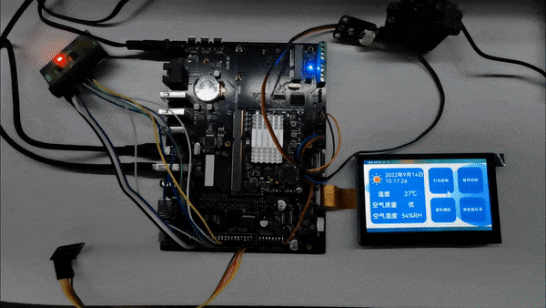
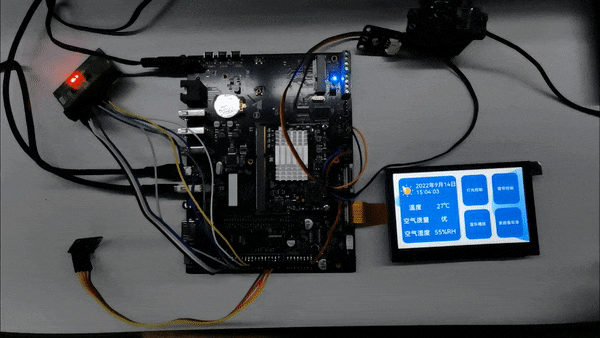

## 智能中控屏

PS：建议学习该sample前先学习[`../napi/napisubsys`](https://gitee.com/openharmony/vendor_unionman/tree/master/unionpi_tiger/sample/napi/napisubsys)下的所有样例

### 简介

> 此样例基于NAPI实现温湿度读取、灯光控制、窗帘控制、家庭备忘录等功能。

### 环境准备

- 系统版本：OpenHarmony 3.1 release及以上
- IDE版本：DevEco Studio 3.0.0.991
- 温湿度传感器、环境光传感器、MG996R舵机、40PIN测试小板

### 如何运行

1. 将[`../napi/napisubsys`](https://gitee.com/openharmony/vendor_unionman/tree/master/unionpi_tiger/sample/napi/napisubsys)下的所有样例编译打包并烧录

2. DevEco Studio打开该项目，签名并运行

### 功能演示

##### 温湿度

##### 灯光控制

##### 窗帘控制

##### 家庭备忘录

##### 环境光

