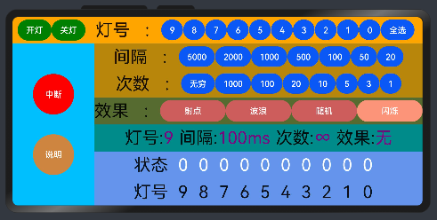
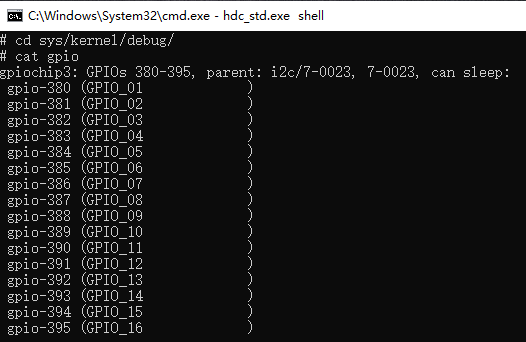
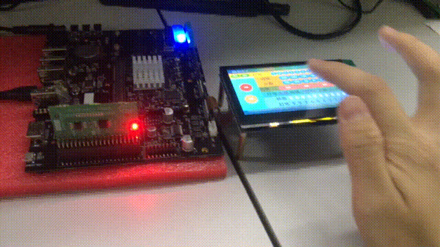
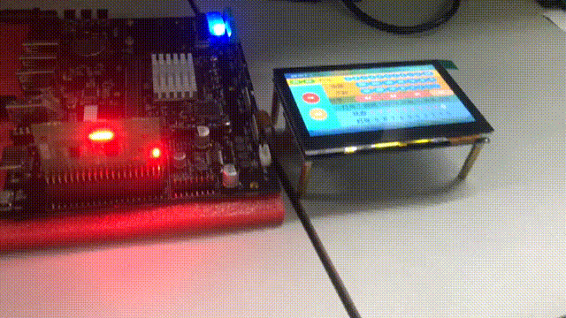
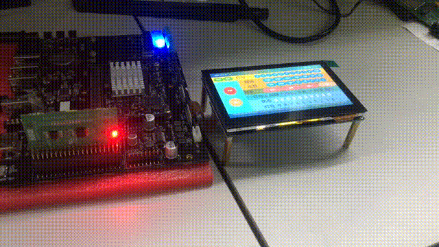

# 一、**样例介绍**

基于OpenHarmony NAPI框架和HDF框架实现控制设备端扩展板GPIO的LED灯的控制效果app

## 1.1app页面效果

## 1.2app演示
<a id="demo">演示目录</a>

[1.选择并实时更新](#select)  
[2.开关灯（点个与全部）](#openClose)  
[3.闪烁效果和中断](#sparkle)  
[4.射点效果](#flow1)  
[5.波动效果](#flow2)  
[6.随机效果](#random)  

## 1.3app功能
1.gpio开关灯   
2.可选择开关灯的灯号、延时、次数  
3.有特殊效果：射点、波浪、随机、闪烁   
4.可随时中断效果  
5.实时同步显示状态


# 二、文件说明
## hcs文件
在\vendor\unionman\unionpi_tiger\hdf_config\khdf\device_info\device_info.hcs文件里添加下面代码，让HDF的gpio接口可以正常调用
```
device_gpio :: device {
                device0 :: deviceNode {
                    policy = 2;
                    priority = 10;
                    permission = 0644;
                    moduleName = "HDF_PLATFORM_GPIO_MANAGER";
                    serviceName = "HDF_PLATFORM_GPIO_MANAGER";
                }
                device1 :: deviceNode {
                    policy = 0;
                    priority = 10;
                    permission = 0644;
                    moduleName = "linux_gpio_adapter";
                    deviceMatchAttr = "linux_gpio_adapter";
                }
            }
```
\vendor\unionman\unionpi_tiger\hdf_config\khdf\hdf.hcs文件里添加
```
#include "device_info/device_info.hcs"
```
## c/c++文件
本项目使用的是unionpi_tiger\sample\napi\napisubsys\gpio_hdf目录下的c/c++文件  
主要文件包含：   
gpio_hdf.cpp ———— HDF接口处理业务逻辑和注册NPAPI驱动  
BUILD.gn ———— ohos_shared_library编译成so文件 
<br></br>
本项目用到的HDF接口函数为  
```
GpioSetDir(gpioNum, direction);
GpioSetDir(gpioNum, direction);
GpioRead(gpioNum, &getValue);
```
## ts文件
本项目使用的是unionpi_tiger\sample\napi\napisubsys目录下的@ohos.gpio_hdf.d.ts文件  
编写接口定义@ohos.**nameX**.d.ts文件，放到OpenHarmony SDK目录ets\\${ets_version}\\api目录下。使用SDK 8则${ets_version}为3.1.6.6，SDK 7则为3.0.0.0。 

## so文件
本地编译输出到out\\${device}\\lib.unstripped文件夹,，命名规则为lib**nameX**.z.so，**nameX**与ohos_shared_library中的命名有关
可通过打包镜像img烧录到开发板上，若已经烧录过系统，可直接通过串口传输工具或者u盘等传输方式来发送so文件，复制so文件到系统下/system/lib/module/中
注意@ohos.**nameX**必须和NAPI模块的BUILD.gn文件中ohos_shared_library("**nameX**")指定的动态库名一致。 
 
## 整体思路
.png)

# 四、编写app
## 查看gpioNum
进入到hdc_std.exe目录打开cmd
```
hdc_std.exe shell
```
若想查看gpioNum可执行下面代码进行查看
```
cd sys/kernel/debug
cat gpio
```

## DevEco Studio 引用ts文件
```
import prompt from '@ohos.prompt';
import gpio_hdf from '@ohos.gpio_hdf';
```  
## 代码说明
### 1.数据变量
```
data: {
        pin: 380,                       //pinNum;[380,389]
        status: [0,0,0,0,0,0,0,0,0,0],  //灯号状态
        delay: 100,                     //间隔
        time: 10,                       //次数
        full: false,                    //是否全选
        blank: " ",                     //空格
        timerID1: null,                 //setTimeout返回值
        timerID2: null,                 //setTimeout返回值
        type: "无",                      //效果运行类型
        temp: 0,                        //临时变量
        isinf: true,                    //是否无穷次数
    },
```
### 2.开启软件执行的函数
关闭全部灯
```
//初始化
    onInit() {
        //进入程序灭掉全部灯，保证与初始状态全为0相同
        for(var i = 380; i <= 389; i++){
            this.pin = i
            this.removeLedEffect()//因IDE不能调用接口，使previewer试图变空白，注释掉即可正常预览试图
        }

    },
```
### 3.改变数据变量数值
```
    
    //改变gpio口
    changeGpio(pinNum) {
        this.full = false
        this.pin = pinNum + 380
        prompt.showToast({
            message: "选择" + this.pin
        })
    },
    //改变间隔时间
    changeDelay(delay) {
        this.delay = delay
        prompt.showToast({
            message: "选择" + this.delay + "ms"
        })
    },
    //改变次数
    changeTime(time) {
        this.isinf = false
        this.time = time
        prompt.showToast({
            message: "选择" + this.time + "次"
        })
    },
    //改变是否全选
    changeFull() {
        this.full = true
        prompt.showToast({
            message: "全选"
        })
    },
    //改变次数是否无穷
    changeIsinf() {
        this.isinf = true
        prompt.showToast({
            message: "选择∞"
        })
    },
```
<a id="select">选择并实时更新</a>  
  
[返回演示目录](#demo)
### 4.开关灯函数
#### 开灯函数接口执行流程图
.png)

```
//开灯
    addLedEffect() {
        //若全选执行全开灯
        if(this.full){
            this.fullAddLedEffect()
            this.full = true
        }
        //单个pin开灯,使用napi接口
        gpio_hdf.setLedStatus(this.pin, gpio_hdf.LED_ON).then((result) => {
                if (result === 0) {
                console.info("Turned on LED." + result)
                    this.status.splice(this.pin - 380,1,1)  //更新状态
                    prompt.showToast({
                        message: "pin."+this.pin+"开灯"
                    })
                } else {
                    console.info("Turned on LED failed." + result)
                    prompt.showToast({
                        message: "pin."+this.pin+"开灯失败" + result
                    })
                }
        })

    },

    //关灯
    removeLedEffect() {
        //若全选执行全关灯
        if(this.full){
            this.fullRemoveLedEffect()
            this.full = true
        }
        //单个pin关灯,使用napi接口
        gpio_hdf.setLedStatus(this.pin, gpio_hdf.LED_OFF).then((result) => {
                if (result === 0) {
                    console.info("Turned off LED." + result)
                    this.status.splice(this.pin - 380,1,0)  //更新状态
                    prompt.showToast({
                        message: "pin."+this.pin+"关灯"
                    })
                } else {
                    console.info("Turned off LED failed." + result)
                    prompt.showToast({
                        message: "pin."+this.pin+"关灯失败" + result
                    })
                }
            })
    },
    fullAddLedEffect() {
        for(var i = 0; i <= 9; i++){
            this.changeGpio(i)
            this.addLedEffect()
            this.status.splice(i,1,1)   //更新状态；若删除则只有i = 9更新
        }
    },
    fullRemoveLedEffect() {
        for(var i = 0; i <= 9; i++){
            this.changeGpio(i)
            this.removeLedEffect()
            this.status.splice(i,1,0)   //更新状态；若删除则只有i = 9更新
        }
    },
```
<a id="openClose">开关灯（点个与全部）</a>  
  
[返回演示目录](#demo)  
### 5.中断
```
//中断
    shutdown(){
        this.type = "无"
        clearInterval(this.timerID1)
        clearInterval(this.timerID2)
        prompt.showToast({
            message: "关闭程序"
        })
    },
```
### 6.特殊效果
#### 函数接口流程图
sparkle()闪烁函数执行及shutdown()中断过程
.png)
#### 代码实现
```
//效果
   //效果
    sparkle(){
        //清除setTimeout
        clearInterval(this.timerID1)
        clearInterval(this.timerID2)
        /*!this.isinf表示选择的是次数有限
        当1.次数小于0;2.次数有限;不执行函数*/
        if(this.time <= 0 && !this.isinf){
            this.type = "无"
            prompt.showToast({
                message: "次数为0"
            })
            return
        }
        //若不是无穷次数，次数减少1
        if(!this.isinf){
            this.time--
        }
        //type更新
        this.type = "闪烁"
        //执行开灯
        this.addLedEffect()
        //delay时间后执行关灯
        this.timerID1 = setTimeout(() => {
            this.removeLedEffect()
        },this.delay)
        //2 * delay时间后执行递归
        this.timerID2 = setTimeout(() => {
            this.sparkle()
        },this.delay * 2)
    },
```
<a id="sparkle">闪烁特效和中断</a>  
  
[返回演示目录](#demo)  
```
    flow() {
        //清除setTimeout
        clearInterval(this.timerID1)
        clearInterval(this.timerID2)
        /*!this.isinf表示选择的是次数有限
        当1.次数小于0;2.次数有限;不执行函数*/
        if(this.time <= 0 && !this.isinf){
            this.type = "无"
            prompt.showToast({
                message: "次数为0"
            })
            return
        }
        //若不是无穷次数，次数减少1
        if(!this.isinf){
            this.time--
        }
        //type更新
        if(this.type != "射点")   this.temp = 9
        if(this.type == "射点" && this.temp == -1)   this.temp = 9    //更新temp取代while循环，用if判断变量和递归
        this.type = "射点"
        if(this.temp >= 0){
            this.changeGpio(this.temp)
            this.addLedEffect()
            this.timerID1 = setTimeout(() => {
                this.removeLedEffect()
            },this.delay)
            this.timerID2 = setTimeout(() => {
                this.flow()
            },this.delay * 2)
            this.temp--
        }


    },
```

<a id="flow1">射点效果</a>  
  
[返回演示目录](#demo)  

```
    flow2() {
        //清除setTimeout
        clearInterval(this.timerID1)
        clearInterval(this.timerID2)
        /*!this.isinf表示选择的是次数有限
        当1.次数小于0;2.次数有限;不执行函数*/
        if(this.time <= 0 && !this.isinf){
            this.type = "无"
            prompt.showToast({
                message: "次数为0"
            })
            return
        }
        //若不是无穷次数，次数减少1
        if(!this.isinf){
            this.time--
        }
        //type更新
        if(this.type != "波浪")   this.temp = 9
        if(this.type == "波浪" && this.temp == -11)   this.temp = 9   //更新temp取代while循环，用if判断变量和递归
        this.type = "波浪"
        if(this.temp >= 0){
            this.changeGpio(this.temp)
            this.addLedEffect()
            this.timerID1 = setTimeout(() => {
                this.flow2()
            },this.delay)
            this.temp--
        }
        else{
            this.changeGpio(this.temp + 10)
            this.removeLedEffect()
            this.timerID1 = setTimeout(() => {
                this.flow2()
            },this.delay)
            this.temp--
        }


    },
```
<a id="flow2">波动效果</a>  
  
[返回演示目录](#demo)  
```
    random() {
        //清除setTimeout
        clearInterval(this.timerID1)
        clearInterval(this.timerID2)
        /*!this.isinf表示选择的是次数有限
        当1.次数小于0;2.次数有限;不执行函数*/
        if(this.time <= 0 && !this.isinf){
            this.type = "无"
            prompt.showToast({
                message: "次数为0"
            })
            return
        }
        //若不是无穷次数，次数减少1
        if(!this.isinf){
            this.time--
        }
        this.type = "随机"
        var i = Math.floor(Math.random()*10)
        this.changeGpio(i)
        this.addLedEffect()
        this.timerID1 = setTimeout(() => {
            this.removeLedEffect()
        },this.delay)
        this.timerID2 = setTimeout(() => {
            this.random()
        },this.delay * 2)

    },
```
<a id="random">随机效果</a>  
  
[返回演示目录](#demo)  