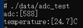

# 读取ADC并转化为温度demo

## 购买外设

[LM35线性模拟温度传感器](https://wiki.dfrobot.com.cn/_SKU_DFR0023_LM35%E7%BA%BF%E6%80%A7%E6%A8%A1%E6%8B%9F%E6%B8%A9%E5%BA%A6%E4%BC%A0%E6%84%9F%E5%99%A8)


## 连线

- 红线 -- 3.3V
- 黑线 -- GND
- 蓝线 -- ADC_1

连线实物图


## 编译

1) 修改 `vendor/unionman/unionpi_tiger/sample/BUILD.gn`

```gn
import("//build/ohos.gni")

group("sample_group") {
  deps = [ "hdf:hdf",
           "hardware/adc:adc_test" # 添加这句话]
}
```

2. 编译 打包 见https://gitee.com/openharmony/device_board_unionman/tree/master/unionpi_tiger#%E7%BC%96%E8%AF%91%E4%B8%8E%E8%B0%83%E8%AF%95

3. 打开`cmd窗口`利用hdc_std工具传输文件 (获取hdc_std工具可参考https://ost.51cto.com/posts/10190)

   `hdc_std file send Z:\master\out\unionpi_tiger\packages\phone\system\bin\adc_test data/`

4. 与开发板交互

   `hdc_std shell`

5. 修改权限
`chmod 777 data/adc_test`

6. 运行！
`./data/adc_test`

## 结果


