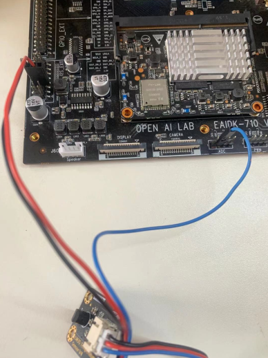

# ADC读取demo

## ADC参数

参考sample/adc目录：

```java
#define ADC_1	2
#define ADC_2	3
#define ADC_HW	1
#define ADC_HP	0
#define ADC_CHANNEL_1	"/sys/bus/iio/devices/iio:device0/in_voltage2_input"
#define ADC_CHANNEL_2	"/sys/bus/iio/devices/iio:device0/in_voltage3_input"
#define ADC_CHANNEL_HW	"/sys/bus/iio/devices/iio:device0/in_voltage1_input"
#define ADC_CHANNEL_HP	"/sys/bus/iio/devices/iio:device0/in_voltage0_input"
```

## 获取ADC接口：

```python
int get_adc_data(int adc_channel, int * value);
```

## ADC连接图

图1	adc连接实物图


