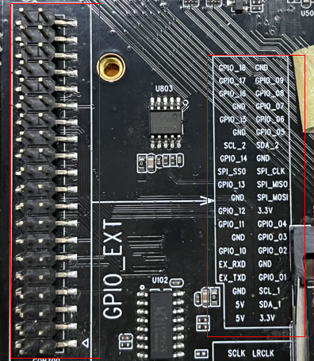
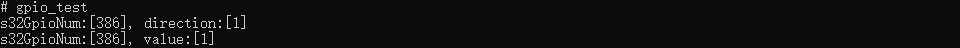
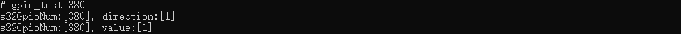

# GPIO控制

GPIO（General Purpose Input/Output Port），即通用输入输出端口，就是芯片的一些引脚。

作为输入端口时，我们可以通过它们读入引脚的状态--高电平或低电平。如：检测按键的按下与放开。

作为输出端口时，我们可以通过它们输出高电平或低电平来控制连接的外围设备。如：控制LED亮灭。

详细代码参考`sample/gpio`目录

图1 gpio 接口实物图


## 对外接口

```java
/**
 * set gpio export
 * @param gpioNum gpioNum
 * @param bExport export,0:not export 1:export
 */
int UM_GPIO_Export(int gpioNum, int bExport);

/**
 * set gpio direction
 * @param gpioNum gpioNum
 * @param direction direction,0:in 1:out
 */
int UM_GPIO_SetDirection(int gpioNum, int direction);

/**
 * set gpio value
 * @param gpioNum gpioNum
 * @param s32Value value,0:low 1:high
 */
int UM_GPIO_SetValue(int gpioNum, int s32Value);

/**
 * check gpio export or not
 * @param gpioNum gpioNum
 * @param *ps32Value export,0:not export 1:exported
 */
int UM_GPIO_IsExport(int gpioNum, int *ps32Value);

/**
 * get gpio direction
 * @param gpioNum gpioNum
 * @param *ps32Value direction,0:in 1:out
 */
int UM_GPIO_GetDirection(int gpioNum, int *ps32Value);

/**
 * get gpio value
 * @param gpioNum gpioNum
 * @param *ps32Value value,0:low 1:high
 */
int UM_GPIO_GetValue(int gpioNum, int *ps32Value);
```

## GPIO对应关系

```java
// gpios
#define UM_GPIO_01 380 /* GPIO.7 */
#define UM_GPIO_02 381 /* GPIO.0 */
#define UM_GPIO_03 382 /* GPIO.2 */
#define UM_GPIO_04 383 /* GPIO.3 */
#define UM_GPIO_05 384 /* GPIO.21 */
#define UM_GPIO_06 385 /* GPIO.22 */
#define UM_GPIO_07 386 /* GPIO.23 */
#define UM_GPIO_08 387 /* GPIO.24 */
#define UM_GPIO_09 388 /* GPIO.25 */
#define UM_GPIO_10 389 /* GPIO.1 */
#define UM_GPIO_11 390 /* GPIO.4 */
#define UM_GPIO_12 391 /* GPIO.5 */
#define UM_GPIO_13 392 /* GPIO.6 */
#define UM_GPIO_14 393 /* GPIO.30 */
#define UM_GPIO_15 394 /* GPIO.26 */
#define UM_GPIO_16 395 /* GPIO.27 */
```

更多GPIO口参考可通过`cat /sys/kernel/debug/gpio`查看

## GPIO控制

在串口调试窗口下可通过修改如下文件的值来控制GPIO

```shell
# echo 386 > /sys/class/gpio/export
# echo out > /sys/class/gpio/gpio386/direction
# echo 1 > /sys/class/gpio/gpio386/value
# echo 0 > /sys/class/gpio/gpio386/value
```

## 如何编译

1.将此`gpio`目录复制到openharmony源码的`vendor/unionman/a311d/sample/hardware`目录下

2.修改`device/unionman/a311d`路径下BUILD.gn文件，将`gpio`源码纳入编译体系，具体修改内容如下：

```
group("a311d_group") {
  deps = [
    "//device/unionman/a311d/system:system",
    "//device/unionman/a311d/kernel:kernel",
    ...
    "//vendor/unionman/a311d/sample/hardware/gpio:gpio_test",
  ]
}
```

## 运行结果

> 本例子只是模拟一个gpio口（GPIO_07）来做设置out模式，且将其设置为高电平，有需要的话可以自己设置程序来控制gpio来操作

烧录成功后，在串口调试窗口下直接执行该程序，将打印如下结果：



或者在gpio_test后加上输入参数，则对指定的gpio口进行操作


