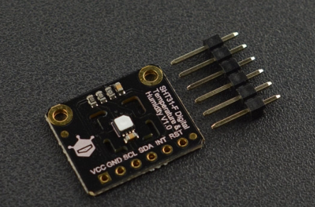
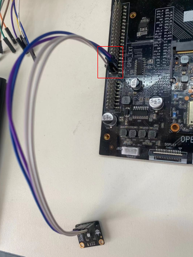

# I2C

图1 SHT31-DIS-F芯片实物图


接线及组装方式：使用杜邦线, 将温湿度传感器连接到开发板的40pin EXT上的I2C接口

## 功能描述

本模块采用SHT31-DIS-F芯片，这个芯片是SHT2x系列温湿度传感器的新一代继承者，相比上一代芯片精度更高，在SHT3x系列中属于标准版,同时这款芯片上面还有一层保护膜。

芯片测量数据经过出厂校正、线性化和温度补偿，具有温湿度报警输出、软硬件复位功能。

传感器的湿度测量范围是0-100%RH，温度测量范围是-40-125℃。I2C接口，可选I2C 地址，工作电压范围宽（2.15V至5.5 V）。

保护膜是IP67的PTFE膜，可防止传感器开孔接触灰尘，因此允许传感器在恶劣环境条件下使用，如密切接触灰尘可能对传感器的精准性具有影响的地方。由于最小封装和膜的高 水气渗透性，相对湿度和温度
信号的响应时间与没加膜的传感器所实现的相同。虽然，保护膜可完美防止灰尘的进入，但在一般情况下它不能防止挥发性化学物质的污染。

- 工作电压：2.15V~5.5V
- 工作电流：<1.5mA
- 湿度测量精度：±2%RH
- 湿度测量范围：0-100%RH
- 温度测量精度：±0.2℃
- 温度测量范围：-40℃~125℃
- 通信接口：Breakout 2.54mm-6Pin I2C
- 外形尺寸：19mm x 16mm
- 安装孔尺寸：2mm
- 安装孔间距：15mm
- 工作温度：-40℃~125℃

图2 连接方式示意图


## 具体实现(sample/i2c/HumidityTest)

```java
#define I2C_DEV_CHAR_3	"/dev/i2c-3"
#define I2C_DEV_CHAR_4	"/dev/i2c-4"
```

图3 连接实物图

