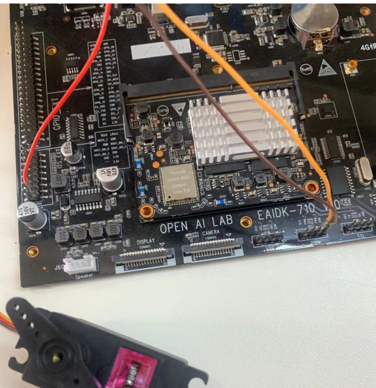

# PWM舵机调试

PWM就是脉冲宽度调制，也就是占空比可变的脉冲波形。pwm的占空比，就是指高电平保持的时间，与该pwm时钟周期时间之比。如：舵机的转角就是通过调节pwm占空比来控制，也就是一个周期中高电平所占的百分比来控制的。详细例子参考：sample/pwm

## 设置及打开PWM

九联A311D开发板有两个pwm引脚分别对应目录为：
PWM_1:`/sys/class/ SteeringGearB/`
PWM_2:`/sys/class/SteeringGear/`

### 打开或者关闭PWM(以pwm_2为例）

```shell
$ echo 1 > /sys/class/SteeringGear/enabled
$ echo 0 > /sys/class/SteeringGear/enabled
```

### 设置pwm的溢出值

```shell
$ echo 1000000 > /sys/class/SteeringGear/period
```

### 设置pwm一个周期高电平的时间

```shell
$ echo 500000 > /sys/class/SteeringGear/duty_cycle
```

### 设置pwm的极性

```shell
$ echo normal > /sys/class/SteeringGear/polarity
$ echo inversed > /sys/class/SteeringGear/polarity
```

### pwm接口函数

```java
#define PWM1	1
#define PWM2	2

#define PWM1_PEX	"/sys/class/SteeringGearB"
#define PWM2_PEX	"/sys/class/SteeringGear"

int set_pwm_enable(int pwmChannel, int isEnable);
int set_pwm_period(int pwmChannel, long period);
int get_pwm_dutyCycle(int pwmChannel, long * value);
int get_pwm_peroid(int pwmChannel, long * value);
int set_pwm_dutyCycle(int pwmChannel, long dutyCycle);
int is_pwm_enabled(int pwmChannel, int * value);
int set_pwm_polarity(int pwmChannel, int polarity);
int get_pwm_polarity(int pwmChannel, int * value);
```

## 接线情况（TIANKONGRC MG996R舵机）

一共有两路pwm输出，根据开发板标识从左到右依次为（3.3V，PWM_1，PWM_2，GND），舵机的连线根据舵机的说明进行连接。这里是以MG996R为例，连接如图所示（这里电源连接的是板子上的5.0V电源）。

## 通信接口：pwm接口

接线及组装方式：使用杜邦线，将舵机连接到开发板的pwm接口

## 特性描述

- MG996R 舵机是一款单线驱动360°舵机
- 连接线长度：30厘米
- 信号线（黄）电源线（红）地线（棕）
- 工作死区：4微秒
- 工作电压：3.0V-7.2V
- 适用温度：-10°~60°

## 连接方式

舵机连接A311D开发板：
舵机A 连接开发板pwm_1或pwm_2
舵机+ 连接开发板5v供电pin脚
舵机+ 连接开发板GND接地pin脚

图1 舵机连接实物图


