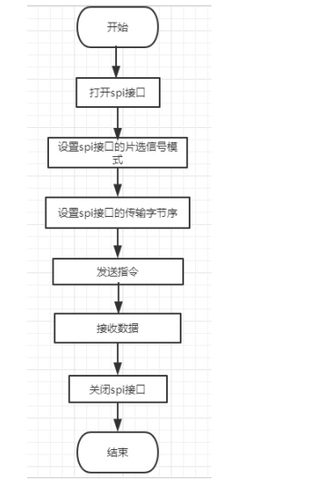
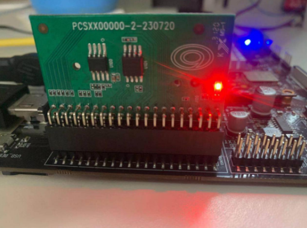

# SPI

SPI（Serial Peripheral Interface，串行外设接口）是一种同步串行数据传输标准，是一种高速的，全双工，同步的通信总线，在很多器件中被广泛应用。

SPI NAND FLASH，从名字上就直接解释了该类型存储设备的基本情况----内部以nand flash作为存储介质，对外为SPI类型的接口。

详细代码参考`sample/spi`目录

图1 spi使用流程图

图2 spi实物连接图


## 宏定义及接口

```c
#define SPI_CPHA        0x01
#define SPI_CPOL        0x02
#define SPI_MODE_0      (0|0)
#define SPI_MODE_1      (0|SPI_CPHA)
#define SPI_MODE_2      (SPI_CPOL|0)
#define SPI_MODE_3      (SPI_CPOL|SPI_CPHA)

#define DEFAULT_DEV  "/dev/spidev32766.0"

#define SPI_CS_HIGH     0x04                //Chip select high  
#define SPI_LSB_FIRST   0x08                //LSB  
#define SPI_3WIRE       0x10                //3-wire mode SI and SO same line
#define SPI_LOOP        0x20                //Loopback mode  
#define SPI_NO_CS       0x40                //A single device occupies one SPI bus, so there is no chip select 
#define SPI_READY       0x80                //Slave pull low to stop data transmission  

#define UM_GPIO_SPI_CS          486     /* SS0 */

//函数功能：打开40_ext上的spi接口
int DEV_HARDWARE_SPI_begin();
//功能函数：关闭40_ext上的spi接口
int DEV_HARDWARE_SPI_end(void);
/*
功能函数：设置spi接口的CPOL和CPHA模式
参数定义：
int mode: 指定spi接口的CPOL和CPHA位
*/
int DEV_HARDWARE_SPI_Mode(int mode);
/*
功能函数：获取spi接口的CPOL和CPHA模式
*/
int DEV_HARDWARE_SPI_GET_Mode(int *mode);
/*
功能函数：设置spi接口的读写数据位数
参数定义：
int bits: 指定spi接口的读写数据位数 默认为8
*/
int DEV_HARDWARE_SPI_SET_BitOrder(int order);
/*
功能函数：获取spi接口的读写数据位数
*/
int DEV_HARDWARE_SPI_GET_BitOrder(int *order);
/*
功能函数：设置spi接口的片选信号模式（高有效/低有效）
参数定义：
int mode: 指定spi接口的片选信号模式，默认为低有效 
*/
int DEV_HARDWARE_SPI_SET_ChipSelect(int CS_Mode);
/*
功能函数：设置spi接口的传输字节序（lsb/msb） 
参数定义：
int mode: 指定spi接口的传输字节序模式 
*/
int DEV_HARDWARE_SPI_GET_ChipSelect(int *CS_Mode);
/*
功能函数：设置spi接口的读写的最大频率
参数定义：
int speed: 指定spi接口的读写的最大频率 一般设置 10000000
*/
int DEV_HARDWARE_SPI_SET_SPEED(int speed);
/*
功能函数：获取spi接口的读写的最大频率
参数定义：无
*/
int DEV_HARDWARE_SPI_GET_SPEED(int *speed);
/*
功能函数：spi全双工传输数据
          需要注意，双向传输数据时，读和写的数据长度相等
参数定义：
int[] txBuf: 写数据buffer
int txBufLen: 写数据buffer的长度
返回值  ： spi全双工传输数据读取到的buffer，其数据长度与写入数据长度相同
*/
int DEV_HARDWARE_SPI_transferFullDuplex(unsigned           char * txbuf, int len, unsigned char * rxbuf);
```

