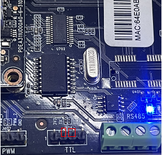
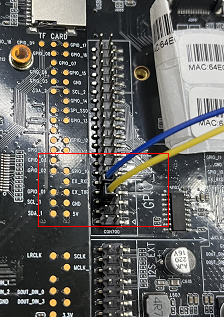
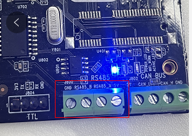

# UART外设

串口工具或者直接将rt、tx短接即可，注意要保持读写的波特率一致。详细例子参考：sample/uart

## 设备定义

```java
#define UART_TTL_NAME	"/dev/ttyS4"
```

图1 ttl


```java
#define UART_EXT_TTL_NAME	"/dev/ttyACM0"
```

图2 ext ttl


```java
#define UART_485_NAME	"/dev/ttyACM1"
```

图3 rs485


## 打开串口设备

```java
fd = open(uart_dev, O_RDWR);
```

## 设置波特率

```java
ret = uartDevInit(fd, 115200);
```

## 写数据

```java
ret = write(fd, send_data + send_len, need_send_len)
```

**注**：出现rx，tx接上后串口工具没有接收到数据，可交换下rx，tx接口尝试
