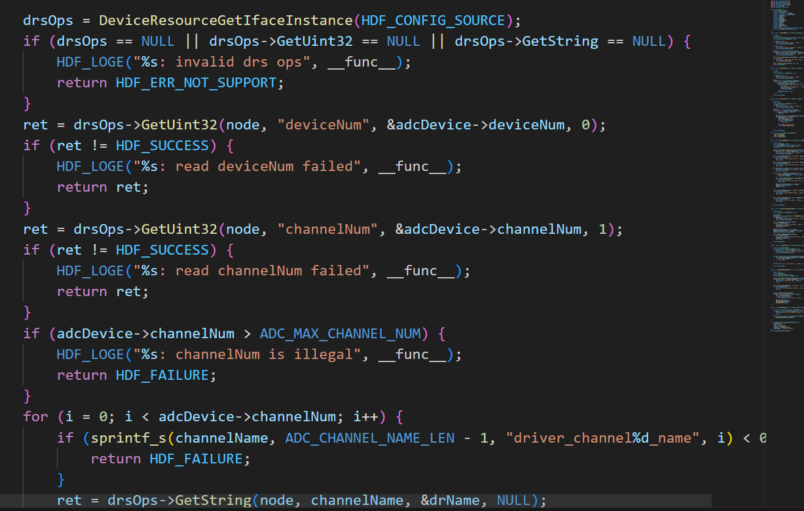
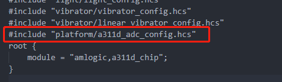
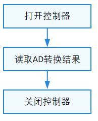

# 关于ADC的HDF实现

## ADC设备简介：

LM35线性模拟温度传感器：


参考手册知：

link : https://img.dfrobot.com.cn/wiki/5b973267c87e6f19943ab3ad/8b4777fdf3c535371fe8b1fe05150607.pdf

1. LM35测温范围是0℃到100℃，灵敏度为10mV/℃，输出电压与温度成正比。
2. 输入输出以及电压和温度的关系如下
   

又：开发板分辨率为12位，即2^{12}=4096，查看原理图可知ADC的信号基准电压为1.8V。

则得：
信号电压值计算为：`V = 1.8*val/4096 V=1.8∗val/4096`

每10mv为1°C，则温度值为:`T = V/0.01=val∗0.044`


## ADC驱动适配
对于OpenHarmony标准系统来说，内核使用的是统一的Linux系统内核，这也就是说对于大部分的一些驱动模型，驱动接口，都可以使用统一的一套框架进行适配，也就是在Linux内核部署OpenHarmony的HDF驱动子系统，这样可以提供归一化的驱动平台底座，做到一次开发，多系统部署。
而UnionPi-Tiger开发板并没有对ADC的HDF进行适配，则要调用ADC的HDF接口前先要进行适配。

### 统一服务模式
在HDF框架中，同类型设备对象较多时（可能同时存在十几个同类型配置器），若采用独立服务模式，则需要配置更多的设备节点，且相关服务会占据更多的内存资源。相反，采用统一服务模式可以使用一个设备服务作为管理器，统一处理所有同类型对象的外部访问（这会在配置文件中有所体现），实现便捷管理和节约资源的目的。`ADC模块即采用统一服务模式`。

ADC模块各分层的作用为：

1. 接口层（`adc_if_u.c`）：提供打开设备，写入数据，关闭设备的能力。
2. 核心层(`adc_core.c`)：主要负责服务绑定、初始化以及释放管理器，并提供添加、删除以及获取控制器的能力。
3. 适配层`(adc_iio_adapter.c`)：由驱动适配者实现与硬件相关的具体功能，如控制器的初始化等。

统一服务模式图示：

在统一模式下，所有的控制器都被核心层统一管理，并由核心层统一发布一个服务供接口层，因此这种模式下驱动无需再为每个控制器发布服务。

### 适配步骤
由官方文档可知：

ADC模块适配必选的三个环节是实例化驱动入口，配置属性文件，以及实例化核心层接口函数。

1. 实例化驱动入口

2. 配置属性文件

3. 实例化核心层接口函数

由于，在OpenHarmony源码中已经存放对于驱动子系统适配linux内核的代码和编译脚本，具体路径为`drivers/hdf_core/adapter/khdf/linux`
则适配过程主要是进行属性文件的配置，以及对接口的调用和对各层的简单分析

#### 配置属性文件
1. 开启HDF_PLATFORM_ADC模块控制宏   
   开启路径`device/board/unionman/unionpi_tiger/kernel/build/unionpi_tiger_standard_defconfi`的`CONFIG_DRIVERS_HDF_PLATFORM_ADC`设置为Y

   

   即把ADC的HDF的驱动能力打开，实质上是使能了`drivers/hdf_core/adapter/khdf/linux/platform/adc`下的Makefile进行编译

   PS：建议编译后来检查下`\\drivers\hdf_core\framework\support\platform\src\adc`
生成的编译文件的修改日期，以确保其是更改配置后生成的中间文件以及目标文件，否则有可能会出现更改配置而还是没出现或者没用上更改的配置，至此，建议更改配置文件后先使用`hb clean`进行清理旧时的编译文件，再`hb build`进行全量编译以确保更改配置有效编译。
   

2. 在device_info.hcs文件中添加deviceNode描述   
   在路径`vendor/unionman/unionpi_tiger/hdf_config/khdf/device_info/device_info.hcs`
   添加device Node描述
   ```
               device_adc :: device {
                device0 :: deviceNode {
                    policy = 2;
                    priority = 60;
                    permission = 0644;
                    moduleName = "HDF_PLATFORM_ADC_MANAGER";
                    serviceName = "HDF_PLATFORM_ADC_MANAGER";
            }
                device1 :: deviceNode {
                    policy = 0;
                    priority = 65;
                    permission = 0644;
                    moduleName = "linux_adc_adapter";
                    deviceMatchAttr = "linux_adc_adapter";
                }
            }
   ```
   由于上文提到：ADC模块采用统一服务模式，则此设备描述的节点一为ADC管理器，其参数：policy配置为2，即对外发布服务，priority则为优先级，越小优先级越高；permission为权限等级，moduleName与serviceName统一为HDF_PLATFORM_ADC_MANAGER（因为是统一服务模式）；然后从节点二开始配置具体ADC控制器信息。

3. 添加a311d_adc_config.hcs器件属性文件   
   在`vendor/unionman/unionpi_tiger/hdf_config/khdf/platform`路径下,添加a311d_adc_config.hcs私有配置
```
   root {
    platform {
        adc_config {
            match_attr = "linux_adc_adapter";//与deviceMatchAttr的值一致
            template adc_device {
                channelNum = 2;	//ADC通道数量
                driver_channel0_name = "";	//通道0在linux文件系统路径
                driver_channel1_name = ""; //通道1在linux文件系统路径
                deviceNum = 0;	//设备号标识
                scanMode =  0;	//扫描模式（必要，但实际使用参数无意义）
                rate = 1000;	//转换速率（必要，但实际使用参数无意义）
            }

            device_adc_0x0000 :: adc_device {
                channelNum = 2;
                deviceNum = 0;
                driver_channel0_name = "/sys/bus/iio/devices/iio:device0/in_voltage2_raw";
                driver_channel1_name = "/sys/bus/iio/devices/iio:device0/in_voltage3_raw";
            }
        }
    }
}
```

以上私有配置配置了设备号，通道数以及实质操作的文件的路径（即将通道2，3分别映射到driver_channel0_name及driver_channel1_name上）以供HDF驱动查找读取
adc_iio_adapter.c::AdcIioReadDrs:


4. 包含在hdf.hcs文件中   
   路径`vendor/unionman/unionpi_tiger/hdf_config/khdf/hdf.hcs`中加上`#include "platform/a311d_adc_config.hcs"`   
   
   

至此，则完成了属性文件的配置

### 编写用户程序：

由官方文档知流程：



且提供接口：


则有程序：
```C
#include <stdio.h>
#include <stdlib.h>
#include "adc_if.h"
#include "hdf_log.h"
#include "osal_time.h"


/* 设备号0，通道号1 */ 
#define ADC_DEVICE_NUM  0
#define TEMP_CONST (1.8/(0.01*4096))

int32_t main(int argc, char *argv[])
{
    int32_t ret;
    uint32_t channelNum=0;
    DevHandle adcHandle = NULL;
    uint32_t read_val = 0;
    double temperature = 0;
    // 默认打开通道0，可以输入参数使用另外的通道
    if(argc == 2)
    {
        channelNum=atoi(argv[1]);
    }

    /* 打开ADC设备 */ 
    adcHandle = AdcOpen(ADC_DEVICE_NUM);
    if (adcHandle == NULL) {
        HDF_LOGE("%s: Open ADC%u fail!", __func__, ADC_DEVICE_NUM);
        printf("%s: Open ADC%u fail!\n", __func__, ADC_DEVICE_NUM);
        return -1;
    }
    /* 读取ADC数据 */ 
    ret = AdcRead(adcHandle, channelNum, &read_val);
    if (ret != HDF_SUCCESS) {
        HDF_LOGE("%s: ADC read fail!:%d", __func__, ret);
        printf("%s: ADC read fail!:%d", __func__, ret);
        AdcClose(adcHandle);
        return -1;
    }
    /* 计算温度 */ 
    temperature = ((double)read_val) * TEMP_CONST;

    printf("Temperature is %.1f°C\n", temperature);

    /* 访问完毕关闭ADC设备 */ 
    AdcClose(adcHandle);
    return HDF_SUCCESS;
}

```
由上知把设备号信息配置为0，且将通道2，3分别映射到`driver_channel0_name`及`driver_channel1_name`上，则函数`AdcOpen`的参数为0，本实例读取`in_voltage2_raw`的数据则使用`driver_channel0_name`即使用`channelNum`参数0,获取模拟值后根据以上公式进行转换从而获得温度值再打印出来。

编译脚本：BUILD.gn:
```
import("//build/ohos.gni")
import("//drivers/hdf_core/adapter/uhdf2/uhdf.gni")

ohos_executable("adc") {
  sources = [ "adc.c" ]

  include_dirs = [
    ".",
    "//drivers/hdf_core/framework/include/platform",
    "//third_party/node/src",
  ]

  deps = [ "//drivers/hdf_core/adapter/uhdf2/platform:libhdf_platform" ]

  external_deps = [
    "hdf_core:libhdf_utils",
    "hilog:libhilog",
  ]

  install_enable = true
  install_images = [ chipset_base_dir ]
  module_install_dir = "bin"
  part_name = "product_unionpi_tiger"
}


```
## 结果展示

进行编译烧录后，把可执行文件移入板中后运行得结果：


## 参考文档：
1. 标准系统HDF平台驱动(一)——ADC驱动适配：https://ost.51cto.com/posts/21996#LinuxOpenHarmony_48
2. ADC平台驱动使用：https://docs.openharmony.cn/pages/v3.2/zh-cn/device-dev/driver/driver-platform-adc-des.md/