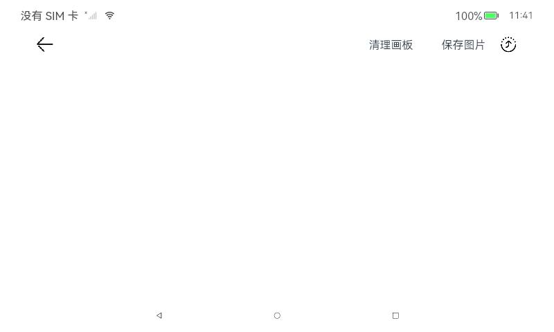
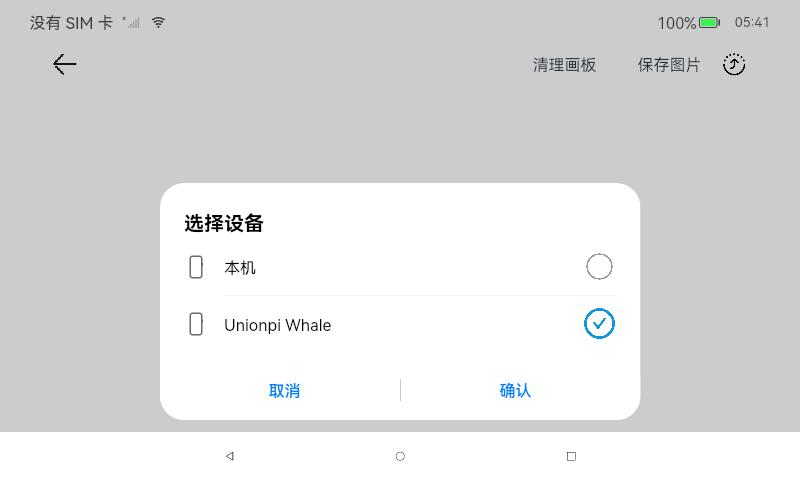

# 分布式手写板

### 介绍

本示例使用设备管理及分布式键值数据库能力，实现多设备之间手写板应用拉起及同步书写内容的功能。

本示例用到了分布式键值数据库接口[@ohos.data.distributedKVStore](https://gitee.com/openharmony/docs/blob/master/zh-cn/application-dev/reference/apis/js-apis-distributed-data.md)

分布式设备管理能力接口(设备管理)，实现设备之间的kvStore对象的数据传输交互[@ohos.distributedHardware.deviceManager](https://gitee.com/openharmony/docs/blob/master/zh-cn/application-dev/reference/apis/js-apis-device-manager.md)

### 效果预览

| 首页                                 | 设备弹窗                       |
| ------------------------------------ | ---------------------------------- |
|         |  |

使用说明

1. 设备连接同一无线网络，安装分布式手写板应用。进入应用，点击允许使用多设备协同，点击主页上查询设备按钮，显示附近设备。
2. 选择设备确认，若已建立连接，启动对方设备上的手写板应用，否则提示建立连接。输入PIN码建立连接后再次点击查询设备按钮，选择设备提交，启动对方设备应用。
3. 建立连接前绘制的内容在启动对方设备后同步，此时设备上绘制的内容会在另一端同步绘制。
4. 点击撤销按钮，两侧设备绘制内容同步撤销。

### 工程目录

```
├──entry/src/main/ets                 // 代码区
│  ├──common
│  │  ├──constants
│  │  │  └──CommonConstants.ets       // 公共常量类
│  │  └──utils
│  │     ├──Logger.ets                // 日志打印类
│  │     └──RemoteDeviceUtil.ets      // 设备管理类
│  ├──entryability
│  │  └──EntryAbility.ets             // 程序入口类
│  ├──pages
│  │  └──Index.ets                    // 主界面
│  ├──view
│  │  └──CustomDialogComponent.ets    // 自定义弹窗组件类
│  └──viewmodel
│     ├──DistributedObjectModel.ts    // 分布式数据对象管理类
│     ├──KvStoreModel.ets             // 分布式键值数据库管理类
│     └──Position.ets                 // 绘制位置信息类
└──entry/src/main/resources           // 资源文件目录
```

### 具体实现

在分布式手写板应用中，分布式设备管理包含了分布式设备搜索、分布式设备列表弹窗、远端设备拉起三部分。
首先在分布式组网内搜索设备，然后把设备展示到分布式设备列表弹窗中，最后根据用户的选择拉起远端设备。

#### 分布式设备搜索

通过SUBSCRIBE_ID搜索分布式组网内的远端设备，详见startDeviceDiscovery(){}模块[源码参考](entry/src/main/ets/common/utils/RemoteDeviceUtil.ets)。

#### 分布式设备列表弹窗

使用@CustomDialog装饰器来装饰分布式设备列表弹窗，[源码参考](entry/src/main/ets/view/CustomDialogComponent.ets)。

#### 远端设备拉起

通过startAbility(deviceId)方法拉起远端设备的包，[源码参考](entry/src/main/ets/common/utils/RemoteDeviceUtil.ets)。

#### 分布式数据管理

(1) 管理分布式数据库
创建一个KVManager对象实例，用于管理分布式数据库对象。通过distributedKVStore.createKVManager(config)，并通过指定Options和storeId，创建并获取KVStore数据库，并通过Promise方式返回，此方法为异步方法，例如this.kvManager.getKVStore(STORE_ID, options).then((store) => {})

(2) 订阅分布式数据变化
通过订阅分布式数据库所有（本地及远端）数据变化实现数据协同[源码参考](entry/src/main/ets/model/KvStoreModel.ets)。

### 相关权限

[ohos.permission.DISTRIBUTED_DATASYNC](https://gitee.com/openharmony/docs/blob/master/zh-cn/application-dev/security/permission-list.md#ohospermissiondistributed_datasync)

[ohos.permission.ACCESS\_SERVICE\_DM](https://gitee.com/openharmony/docs/blob/master/zh-cn/application-dev/security/permission-list.md#ohospermissionaccess_service_dm)

### 依赖

不涉及。

### 约束与限制

1. 本示例仅支持标准系统上运行；
2. 本示例仅支持API10版本SDK，SDK版本号(API Version 10 Release)，镜像版本号(4.0 Release)；
3. 本示例需要使用DevEco Studio 版本号(4.0 Release)才可编译运行；
4. 本示例涉及使用系统接口：@ohos.distributedHardware.deviceManager，需要手动替换Full SDK才能编译通过，具体操作可参考[替换指南](https://gitee.com/openharmony/docs/blob/master/zh-cn/application-dev/faqs/full-sdk-switch-guide.md)；
5. 本示例涉及系统接口，需要配置系统应用签名，可以参考[特殊权限配置方法](https://gitee.com/openharmony/docs/blob/master/zh-cn/application-dev/security/app-provision-structure.md#修改harmonyappprovision配置文件)，把配置文件中的“app-feature”字段信息改为“hos_system_app”。

### 下载

如需单独下载本工程，执行如下命令：

```
git init
git config core.sparsecheckout true
echo unionpi_tiger/sample_api10/app/Distributed/DistributeDraw/ > .git/info/sparse-checkout
git remote add origin https://gitee.com/openharmony/vendor_unionman.git
git pull origin master
```