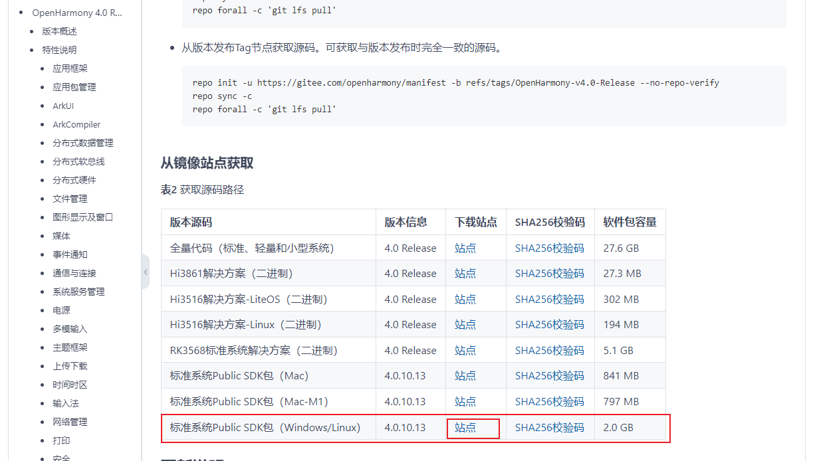
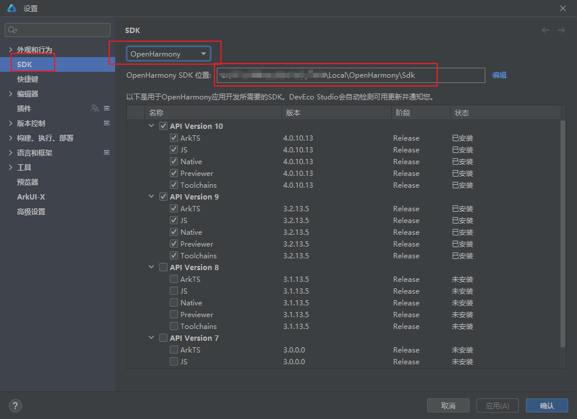
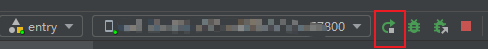
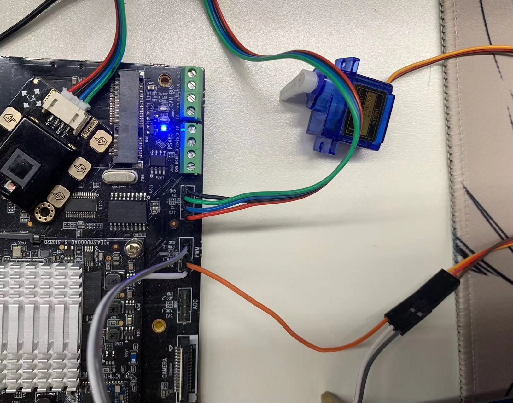
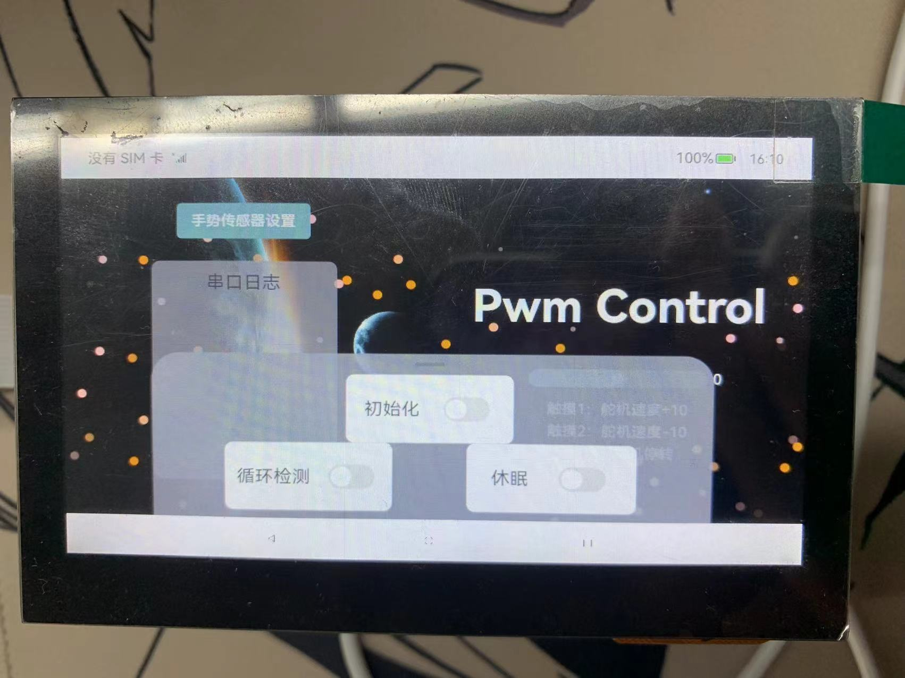

# PWM控制器

本demo在串口、PWM两个基础外设上，实现了北向应用层对南向外设的控制，南北向NAPI同异步通信，北向应用层打印串口日志等功能。

## 环境

OH版本：OpenHarmony4.0

开发板：Unionman Tiger

编译器：DevEco Studio 4.0 Release 、 Visual Studio Code(Windows)

外设：Gesture & Touch Sensor V2.0、SG90舵机

## 代码框架

```c
├── APP				//应用开发代码
    ├── entry
       └── src
           ├── main
           │   ├── ets
           │   │   ├── entryability
           │   │   │   └── EntryAbility.ts
           │   │   └── pages
           │   │   │   ├── init.ets 		 //背景设置
           │   │       └── Index.ets         // 主要代码
           │   ├── module.json5              // 配置文件
    └── ...
├── @ohos.control_demo.d.ts    
└── pwm_control_subsys  //设备开发代码
    ├── bundle.json		//组件规则
    └── mymodule
        ├── BUILD.gn	//模块组
        └── pwm_control
            ├── BUILD.gn	//模块规则
            ├── napitest.cpp	//主函数
            ├── pwm		//pwm驱动
            │   ├── um_pwm.c
            │   └── um_pwm.h
            └── uart	//uart驱动
                ├── um_uart.cpp
                └── um_uart.h
```


## 设备开发

### 一、新建子系统

在OpenHarmony根目录下创建`pwm_control_subsys`文件夹

### 二、添加子系统

 在`build/subsystem_config.json`子系统清单里添加自己的子系统

```json
"pwm_control_subsys": {
    "path": "pwm_control_subsys",
    "name": "pwm_control_subsys"
  }
```

### 三、添加组件

 打开`vendor/unionman/unionpi_tiger/config.json`文件，在`"subsystems":`中添加下列语句

```json
{
      "subsystem": "pwm_control_subsys",
      "components": [
        {
          "component": "mymodule",
          "features": []
        }
      ]
    }
```

### 四、 加入组件和模块

将位于`unionpi_tiger/sample_api10/napi/pwm_control_subsys`下所有文件复制到OpenHarmony根目录下新建的`pwm_control_subsys`

### 五、编译烧录

全量编译烧录请参考[ 九联Unionpi-Tiger开发套件](https://gitee.com/openharmony/device_board_unionman/blob/master/unionpi_tiger/README_zh.md#编译与调试)

> OpenHarmony提供了单独编译组件，加快编译速度
>
> 编译指令：
>
> ```shell
> ./build.sh --product-name unionpi_tiger --build-target mymodule --ccache
> ```
>
>  在编译完成后，会在`out/unionpi_tiger/pwm_control_subsys/mymodule/`路径下生成相对应的 **libcontrol_demo.z.so** 文件。
>
> 重新挂载为已经挂载了的文件系统（以读写权限挂载）：
>
> ```shell
> hdc shell mount -o remount,rw /
> ```
>
> 通过hdc file发送到板子的`/system/lib/module/`路径下：
>
> ```shell
> hdc file send <本地路径>\libcontrol_demo.z.so /system/lib/module/
> ```

### 六、修改系统配置文件

APP需要使用开发板 pwm 的系统文件，就需要系统文件的权限修改成可读写状态。但是APP不够权限进行修改系统文件权限，因此需要在开机初始化时使用root用户进行修改权限。

打开 `device\board\unionman\unionpi_tiger\config\init\arm\init.A311D.cfg` 文件，在 **"jobs - name ：init" 的 "cmds"** 中添加下面语句

```shell
"write /sys/class/pwm/pwmchip0/export 0",
"chmod 666 /sys/class/pwm/pwmchip0/pwm0/duty_cycle",
"chmod 666 /sys/class/pwm/pwmchip0/pwm0/period",
"chmod 666 /sys/class/pwm/pwmchip0/pwm0/enable",
"chmod 666 /sys/class/pwm/pwmchip0/pwm0/polarity"
```

> 也可以选择使用hdc recv将开发板里的`system/etc/init.cfg`文件拉取到本地进行修改，修改完成后再hdc send发送到板子上。
>
> 指令：
>
> ```shell
> hdc file recv /system/etc/init.cfg <本地路径>
> hdc file send <本地路径>\init.cfg /system/etc/
> ```

## 应用开发

### 一、添加API10

若在DevEco的SDK管理里只能下载API9，那么就需要自行下载或编译API10并导入SDK
> 注：使用API10需要OpenHarmony4.0配套的DevEco Studio

**南向开发的API导出SDK方法：**

1、单独编译sdk：`./build.sh --product-name ohos-sdk`

2、编译成功后导出out/sdk/packages/ohos-sdk/目录下的文件即可

3、替换full-sdk：[ 如何替换full-SDK](https://gitee.com/openharmony/docs/blob/master/zh-cn/application-dev/faqs/full-sdk-switch-guide.md)



**下载release SDK方法：**

若不方便编译SDK，还可以选择直接在[zh-cn/release-notes · OpenHarmony/docs](https://gitee.com/openharmony/docs/tree/master/zh-cn/release-notes)此处选择OpenHarmony相对应版本的SDK进行下载

1、 解压文件`ohos-sdk-windows_linux-public.tar.gz`

2、在OpenHarmony SDK目录下新建一个`10`文件夹（OpenHarmony SDK路径可在下图设置内找到）

3、 解压后进入到`ohos-sdk\windows`路径

4、将当前路径下的五个压缩包解压到OpenHarmony SDK目录下的API10目录`C:\Users\xxx\AppData\Local\OpenHarmony\Sdk\10\

### 二、导入D.TS文件

将位于`unionpi_tiger/sample_api10/napi/pwm_control_subsys/@ohos.control_demo.d.ts`接口定义文件，复制到OpenHarmony SDK目录下的API目录`C:\Users\xxx\AppData\Local\OpenHarmony\Sdk\10\ets\api`。


### 三、编译烧录应用

1、 使用OpenHarmony应用开发工具：DevEco studio；打开同一目录下的`APP`文件夹项目

2、 使用Micro USB数据线连接PC与开发板OTG口并接通电源后点击Run即可

## 连线

* SG90连线：
  * 棕线 -- GND
  * 橙线 -- PWM_1
  * 红线 -- 3.3V
* Gesture & Touch Sensor V2.0连线：
  * 黑线 -- GND
  * 绿线 -- RX
  * 蓝线 -- TX
  * 红线 -- 3.3V
* 连线实物图：



## 演示效果

