# OpenHarmony多种外设控制

## 一、样例介绍

基于OpenHarmony NAPI框架实现北向应用控制南向设备端多种外设。

## 二、开发环境

 	1. 搭载OpenHarmony-4.0-Release版本的Unionpi Tiger开发板
 	2. OpenHarmony-4.0-Release版本的全量代码

​	从版本分支获取源码。可获取该版本分支的新源码，包括版本发布后在该分支的合入。

```
repo init -u git@gitee.com:openharmony/manifest.git -b OpenHarmony-4.0-Release --no-repo-verify
repo sync -c
repo forall -c 'git lfs pull'
```

​	从版本发布Tag节点获取源码。可获取与版本发布时完全一致的源码。

```
repo init -u git@gitee.com:openharmony/manifest.git -b refs/tags/OpenHarmony-v4.0-Release --no-repo-verify
repo sync -c
repo forall -c 'git lfs pull'
```

3. DevEco Studio 4.0

​	下载地址：https://contentcenter-vali-drcn.dbankcdn.cn/pvt_2/DeveloperAlliance_package_901_9/9a/v3/HBD3TfhiT_GFqeX44Qcwtg/devecostudio-windows-4.0.0.600.zip?HW-CC-KV=V1&HW-CC-Date=20231027T004333Z&HW-CC-Expire=315360000&HW-CC-Sign=279824A013505EFC063997614DC1B6AB1C3A2EE5AC48CEF15DDB3E1F79DA435A

​	一定要使用OpenHarmony4.0配套的软件，不然到时候进行应用开发使用API10会很麻烦

4. OpenHarmony SDK API10 

5. 外设：舵机(PWM)、 手势识别及触摸传感器(Uart)、温度传感器(ADC)

## 三、外设介绍

各个外设的详细介绍可以查看以下文档：

|          外设          |                             地址                             |
| :--------------------: | :----------------------------------------------------------: |
| LM35线性模拟温度传感器 | https://wiki.dfrobot.com.cn/_SKU_DFR0023_LM35%E7%BA%BF%E6%80%A7%E6%A8%A1%E6%8B%9F%E6%B8%A9%E5%BA%A6%E4%BC%A0%E6%84%9F%E5%99%A8 |
|       MG996R舵机       | https://blog.csdn.net/weixin_45751396/article/details/119415920 |
|  手势识别及触摸传感器  | https://wiki.dfrobot.com.cn/_SKU_SEN0285__Gesture_Touch_Sensor_V1.0%E6%89%8B%E5%8A%BF%E8%AF%86%E5%88%AB%E5%8F%8A%E8%A7%A6%E6%91%B8%E4%BC%A0%E6%84%9F%E5%99%A8 |

## 四、实现步骤

### 4.1 南向设备开发

#### 4.1.1 代码架构

```
vari_dev_subsys
├── images
│   ├── README中的图片
├── myadcnapi
│   └── src
│       ├── BUILD.gn
│       ├── myadc.cpp
│       └── @ohos.adcnapi.d.ts
├── mypwmnapi
│   └── src
│       ├── BUILD.gn
│       ├── mypwm.cpp
│       ├── @ohos.mypwm.d.ts
│       ├── um_pwm.c
│       └── um_pwm.h
├── myuartnapi
│   └── uartnapi
│       ├── BUILD.gn
│       ├── @ohos.uartnapi.d.ts
│       ├── serial_uart.h
│       ├── uart.cpp
│       └── uart_main.cpp
└── README.md

```

#### 4.1.2 NAPI接口开发

1. **新增子系统vari_dev_subsys**

   在OpenHarmony源码根目录下任意位置创建一个目录`vari_dev_subsys`作为子系统的目录。把新增的子系统配置到`build/subsystem_config.json`中。

   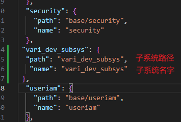

2. **新增部件到产品定义中**

​	打开`vendor/unionman/unionpi_tiger/config.json`文件，在`"subsystems":`中添加下列语句

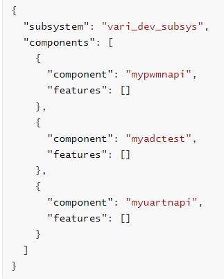


3. **查看部件的配置信息**（以PWM部件为例）

打开`vari_dev_subsys/mypwmnapi/budndle.json`，根据自己情况和需求修改,必须确保部件名与vendor/unionman/unionpi_tiger/config.json中的部件名一致

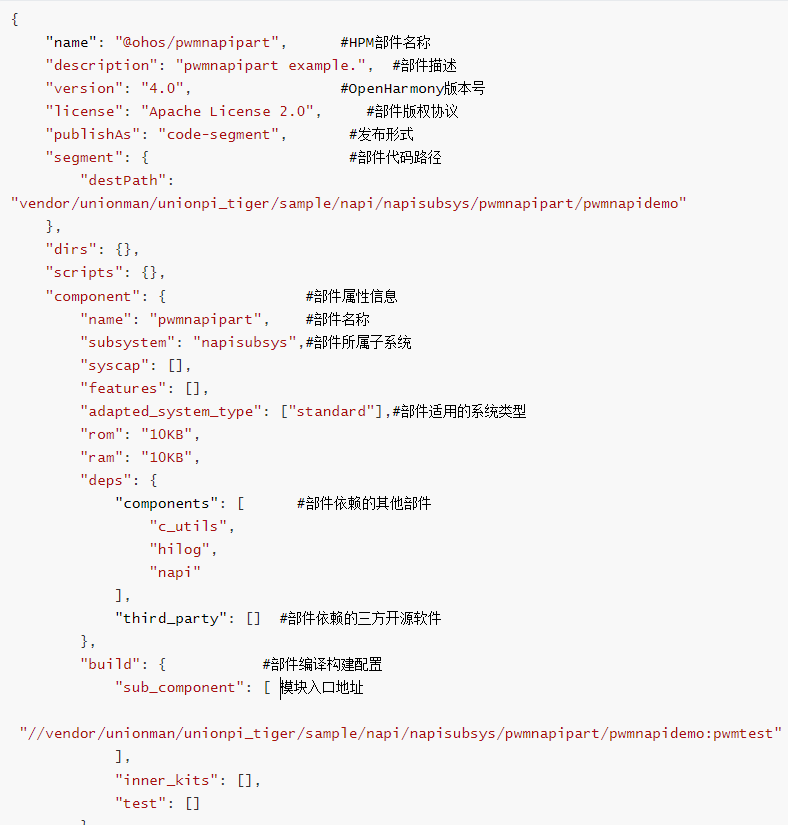

4. **查看模块配置信息**

​	打开`/mypwmnapi/src/BUILD.gn`,根据自己情况和需求修改

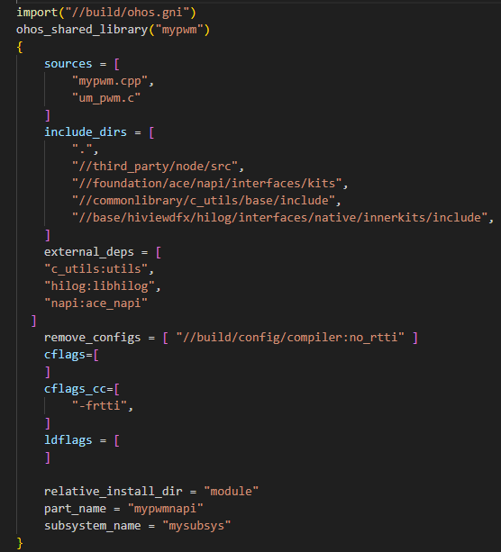

5. 查看NAPI接口文件（以PWM为例）

​	打开`vari_dev_subsys/mypwmnapi/src/@ohos.mypwm.d.ts`

```
declare namespace mypwm {
    function get_Hello_Generator(): string;
    function updateAndGetsliderValue(value:number):number;
}

export default mypwm;
```

6. **编写开机自启动命令**

​	为了让应用程序更加方便地访问设备方面的文件，需要给相应的设备文件提高权限。

有两种方式，分别为：源码编写烧录镜像、HDC进入终端修改启动文件（推荐第二种）

- 源码编写，编译烧录

打开`device\board\unionman\unionpi_tiger\config\init\arm\init.A311D.cfg`

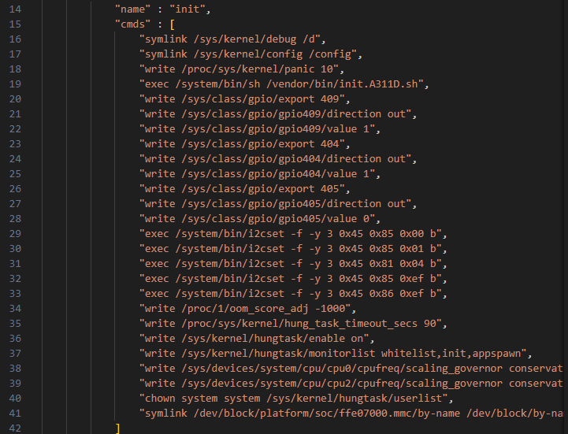

在上面的cmds代码段中添加自启动命令

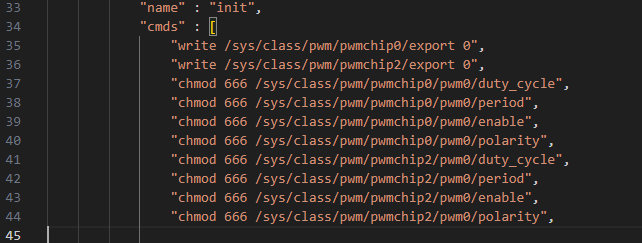

- HDC进入终端修改启动文件

Windows终端：

`hdc file recv /system/etc/init.cfg ./Desktop`

将启动文件拷贝到桌面，在‘init’部分添加想要加入的命令，上图给出了所需的命令

保存后再用hdc file send发送给开发板

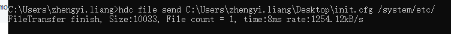

7. **编译烧录**

见 [编译烧录unionman-tiger](https://gitee.com/openharmony/device_board_unionman/blob/OpenHarmony-v4.0-Release/unionpi_tiger/README_zh.md#编译与调试)

如果已经烧录了镜像为了节约时间也可以直接将编译出的**三个文件**用HDC工具发送到开发板指定位置：

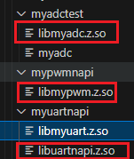

下面以发送PWM编译出来的动态库文件为例

```shell
hdc_std shell mount -o remount,rw /          //重新挂载为已经挂载了的文件系统（以读写权限挂载）
hdc_std file send libmypwm.z.so /system/lib/module/
```

发送成功提示：

FileTransfer finish, Size:9520, File count = 1, time:10ms rate:952.00kB/s

### 4.2 北向应用开发

#### 4.2.1 代码架构

```
ets
├─entryability
│      EntryAbility.ets
│
├─images_black								#帧动画的图片
│      4337e81bd5784c21984de88f01c5e30e.gif_p1.png
│      ……
│      4337e81bd5784c21984de88f01c5e30e.gif_p45.png
│
└─pages
        Index.ets							#主界面
        loadingComponent_part1.ets			#加载动画界面
```

#### 4.2.1 更换OpenHarmony SDK API 10

参考资料：

[如何更换OpenHarmony SDK API 1-51CTO.COM](https://ost.51cto.com/posts/25171)

坑点：不要去每日构建流水线下载SDK，会经常报错出现奇奇怪怪的问题。亲测有效！！！

就比如：
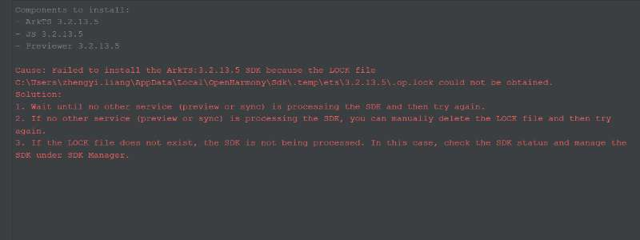

应该去官方下载稳定的系统镜像、SDK等资源：

[zh-cn/release-notes/Readme.md · OpenHarmony/docs - Gitee.com](https://gitee.com/openharmony/docs/blob/OpenHarmony-v4.0-Release/zh-cn/release-notes/Readme.md)

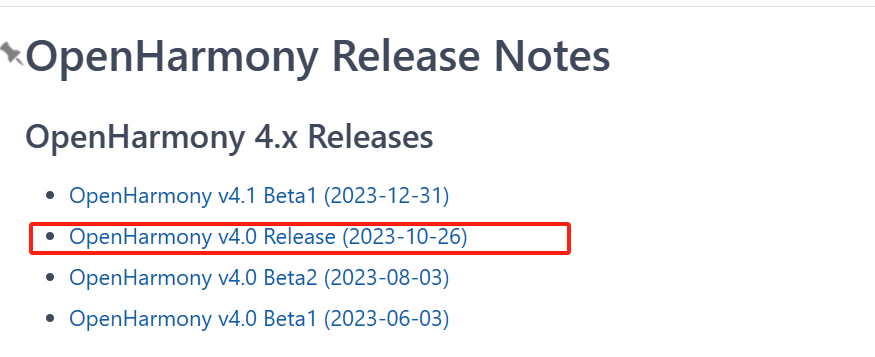

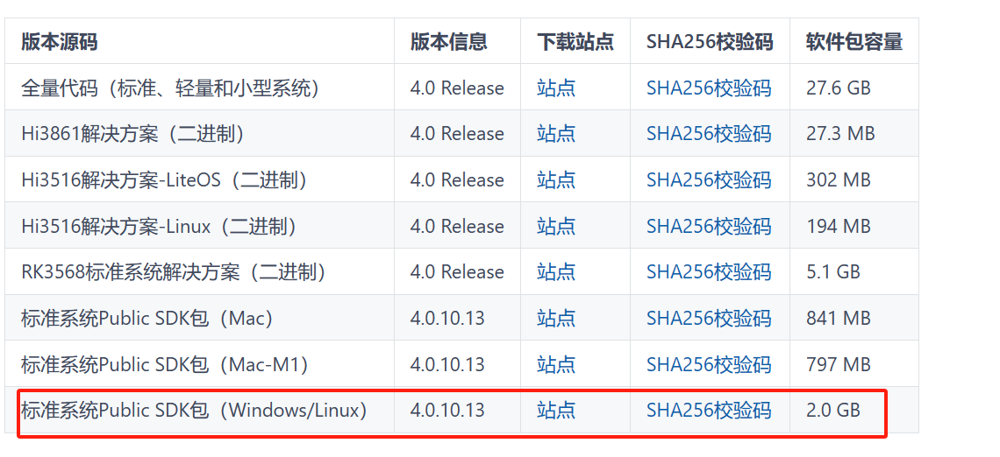

打开DevEco Studio，菜单Tools->SDK Manager，查看Studio中配置的OpenHarmony SDK的路径位置，环境上该路径为：D:\installed-software\OpenHarmony-sdk。当前目录下已经有API9的SDK，需要新增下api10的SDK，创建一个名称为10的目录，如下：

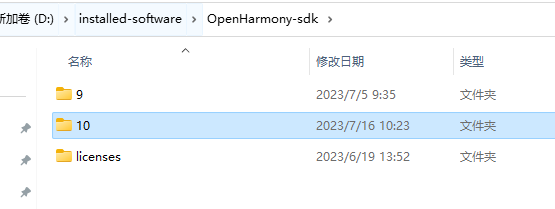

复制SDK压缩包然后，全选这5个zip压缩包，解压到当前位置。如果遇到弹窗是否覆盖，覆盖即可。如图：

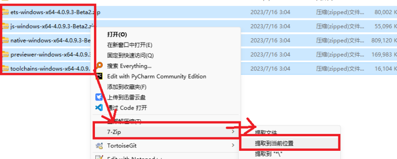

再打开DevEco Studio就可以看到看到新的API，如图：

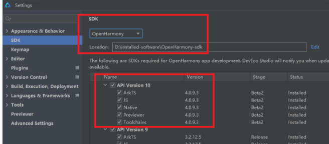

#### 4.2.2 NAPI接口应用

1. **导入.d.ts接口文件**

​	编写接口定义@ohos.**nameX**.d.ts文件，放到OpenHarmony SDK目录ets${ets_version}\api目录下。

注意@ohos.**nameX**必须和NAPI模块的BUILD.gn文件中ohos_shared_library("**nameX**")指定的动态库名一致。

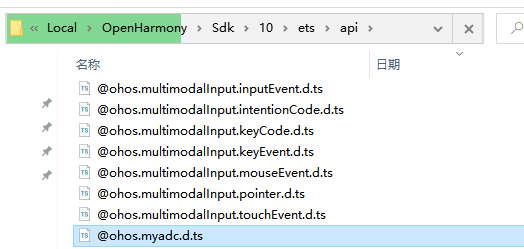

2. **引入模块**


3. **接口使用**

- 滑块组件搭配pwm_napi的updateAndGetsliderValue（）接口，可以动态调节PWM的占空比

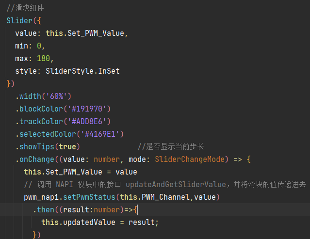

- 文本选择器子组件，用于选择ADC的通道数。因为是子组件，可以修改成通道选择通用模板供PWM选择PWM通道数

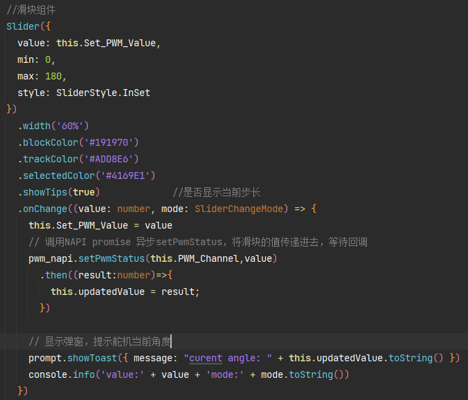

- Interval定时器搭配ADC_Napi的adc_value()接口，持续刷新温度值。

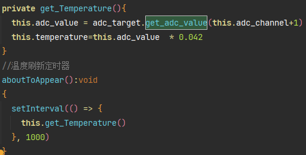

- 互斥锁搭配uart_napi的异步接口uartcallback()，防止主线程一直阻塞在串口的数据获取中

​	手势识别及触摸传感器功能实现：

| 操作    | 功能             |
| ------- | ---------------- |
| 触摸点1 | 读取ADC通道1的值 |
| 触摸点2 | 读取ADC通道2的值 |
| 触摸点4 | 舵机向左旋转180° |
| 触摸点5 | 舵机向左旋转180° |

#### 4.2.3 加载动画设计

思路：使用自定义弹窗组件，当主界面一加载时就启动该组件一次，该弹窗的界面在引用已经写好的动画界面。

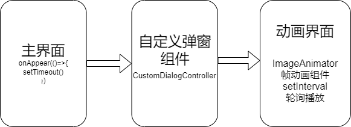

##### 1.使用@CustomDialog装饰器装饰自定义弹窗。

@CustomDialog装饰器用于装饰自定义弹框，此装饰器内进行自定义内容（也就是弹框内容）。

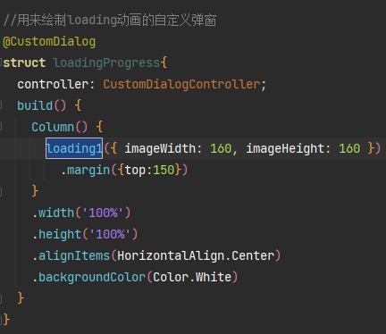

需要注意的是：需要把这个自定义弹窗的代码放到需要使用的页面里面，就像这样：
自定义弹窗中主要有两个需要写的：
**controller**：控制自定义弹窗的
**build函数**:和主界面是一模一样的，没有区别，直接和主页面一样写代码即可。

编写在主界面之上


##### 2.创建构造器，与装饰器呼应相连

```
dialogController: CustomDialogController = new CustomDialogController({
    builder: CustomDialogExample({}),
})

```

下面参数分别是参数名，参数类型，是否必填，参数作用
1、builder，CustomDialog，是，自定义弹窗内容构造器。
2、cancel，() => void，否，点击遮障层退出时的回调。
3、autoCancel，boolean，否，是否允许点击遮障层退出。默认值：true
4、alignment，DialogAlignment，否，弹窗在竖直方向上的对齐方式。默认值：DialogAlignment.Default
5、offset，Offset，否，弹窗相对alignment所在位置的偏移量。
6、customStyle，boolean，否，弹窗容器样式是否自定义。默认值：false，弹窗容器的宽度根据栅格系统自适应，不跟随子节点；高度自适应子节点；圆角为24vp。
7、gridCount，number，否，弹窗宽度占栅格宽度的个数。默认为按照窗口大小自适应，异常值按默认值处理。

##### 3.点击与onClick事件绑定的组件使弹窗弹出

```
Button('click me')
  .onClick(() => {
    this.dialogController.open()
  })

```

##### 小总结：

三步走：1.在主页面之外用@CustomDialog装饰器自己编写个UI

​		2.在主界面里，build()之前创建一个弹窗构造器（配置弹窗属性）

​		3.主界面的build里添加使用方法，.open

参考文档：https://blog.csdn.net/m0_62599305/article/details/134018286

#### 改造成入场动画

https://ost.51cto.com/posts/27032

1.将弹窗页面宽、高拉满,形成一个界面

2.使用Text().onAppear()+setTimeout()，主界面文本一出现就跳出这个全屏弹窗，定时器到时间后就取消

#### 4.2.4 为应用签名，运行

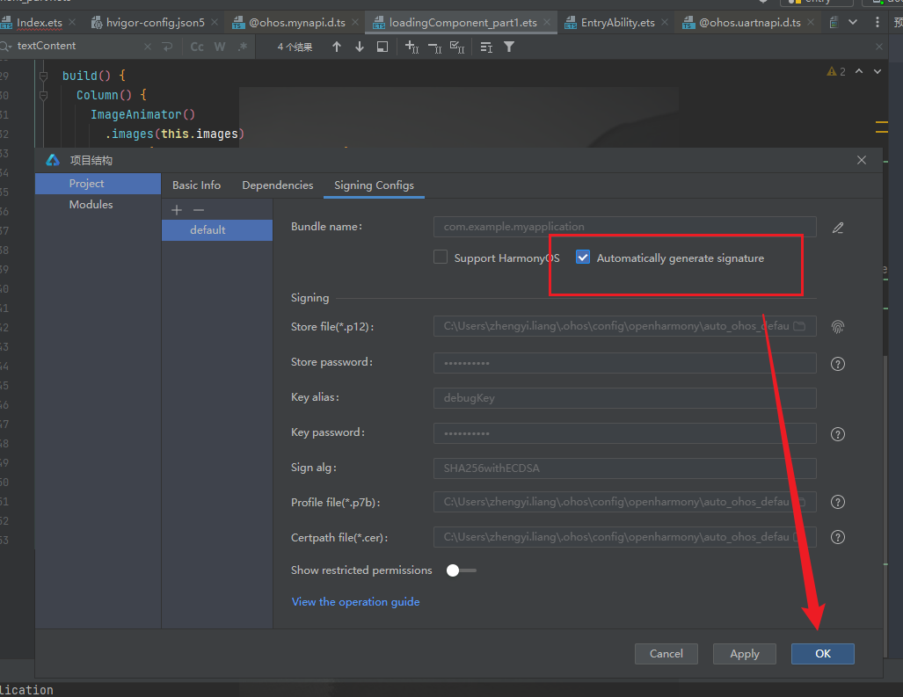