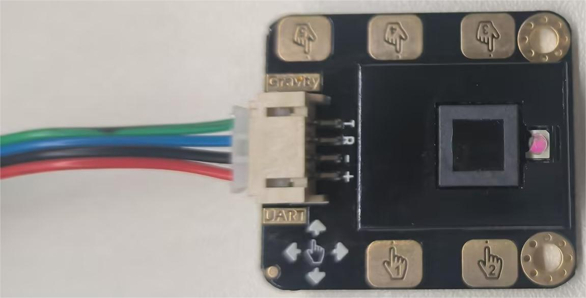
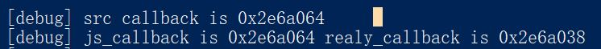

# uart手势模块的检测app
## 作品介绍
通过NAPI框架实现，检测手势后调用js端的回调函数
## 开发环境
1. 搭载OpenHarmony-3.2-Beat5版本的Unionpi Tiger开发板  
2. DevEco Studio 3.1.0.0  
3. uart手势识别带触摸传感器
## uart简介
UART（Universal Asynchronous Receiver/Transmitter，通用异步收发器）是一种双向、串行、异步的通信总线，仅用一根数据接收线和一根数据发送线就能实现全双工通信。典型的串口通信使用3根线完成，分别是：发送线（TX）、接收线（RX）和地线（GND），通信时必须将双方的TX和RX交叉连接并且GND相连才可正常通信
## 手势识别带触摸传感器简介
商品链接：[**Gravity: 手势识别带触摸传感器**](https://www.dfrobot.com.cn/goods-1994.html)


这款是一款集成了手势识别功能和触摸识别功能的传感器模块，它的检测距离为30cm，距离0-30cm可调。其中，能够识别向右、向左、向后、向前、下压、上拉及上拉下压后手松开共7种手势，以及5路的触摸信号，并具有自动睡眠和唤醒的功能。模块自带手势识别算法，输出数据简洁可靠，可通过串口直接与arduino及树莓派等控制器或上位机通讯。用于智能灯、人机交互、智能小车、趣味游戏等多功能远距离手势控制端。  


### 接线方式
​ **3.3V —— 正极**

​ **RX —— TX**

​ **TX —— RX**

​ **GND —— 负极**

### 通信参数及方式
#### 通信参数
串口波特率 9600;  
8 个数据位;  
无校验位;  
1 个停止位;   
#### 通信方式
格式：  
0xAA，数据码，检验码，0x55;  
帧头：0xAA;  
帧尾：0x55;  

数据码：  
右：0x01;  
左：0x02;  
后：0x03;  
前：0x04;  
下压：0x05;   
上拉：0x06;   
上拉下压后手松开：0x07;   
触摸 1：0x21;  
触摸 2：0x22;  
触摸 3：0x23;  
触摸 4：0x24;  
触摸 5：0x25;  

校验码：  
校验码为数据码的反码，比如做右动作时，数据码为 0x01，校验码为 0xFE。 
## uart实现
由于hdf框架的uart驱动无法使用(前面初始化部分返回都为success,read却一直返回-17,也没有读到数据),经过修改适配层源码后解决了这一问题，通过对hdf uart部分源码的研究，发现适配层没有编写`int32_t (*SetTransMode)(struct UartHost *host, enum UartTransMode mode)`的相关代码，只是写了个空实现，这导致hdf uart部分不能实现阻塞模式的读取，因此先实现这一部分，代码如下:

主要思路是根据参数修改file mode的O_NDELAY，然后设置阻塞模式需要的两个参数VMIN和VTIME分别为1和0(读到一个字节就结束阻塞,不设置超时时间)
```C++
static int32_t UartAdapterSetTransMode(struct UartHost *host, enum UartTransMode mode)
{
  struct termios termios;
  struct file *fp = NULL;
  if (host == NULL) {
      return HDF_ERR_INVALID_OBJECT;
  }
  fp = (struct file *)host->priv;
  if (UartAdapterIoctlInner(fp, TCGETS, (unsigned long)&termios) < 0) {
      HDF_LOGE("tcgets fail");
      return HDF_FAILURE;
  }
  if(mode==UART_MODE_RD_BLOCK){
        fp->f_flags&=~O_NDELAY;
        termios.c_cc[VMIN] = 1;
        termios.c_cc[VTIME] = 0;
  }else if(mode==UART_MODE_RD_NONBLOCK){
      fp->f_flags|=O_NDELAY;
      termios.c_cc[VMIN] = 0;
      termios.c_cc[VTIME] = 0;
  }else{
        return HDF_ERR_INVALID_PARAM;
  }
  if (UartAdapterIoctlInner(fp, TCSETS, (unsigned long)&termios) < 0) {
      HDF_LOGE("tcsets fail");
      return HDF_FAILURE;
  }
  return HDF_SUCCESS;
}
```
然后使用UartOpen()打开串口，设置好参数和阻塞模式后就可以调用UartRead()成功读到数据了
## NAPI层
### 实现原理
js层可设置相应的回调函数(触摸模块的事件处理函数),为了监控触摸事件，在注册napi函数之后，开启一个新的线程。该线程会一直读取串口数据，当串口有数据到来时，如果js层之前已经设置过回调函数，则调用该回调函数。但由于只能由主线程才能调用`napi_call_funtion`(如果跨线程调用会crash),需要借助napi框架`threadsafe_funtion`的相关函数，设置回调时，首先调用`napi_create_threadsafe_function`将js传来的回调函数转换为一个`napi_threadsafe_function`，然后串口读取线程调用`napi_call_threadsafe_function`来间接调用js层的回调函数
### 实现代码
#### 设置js回调函数
```C++
static napi_value onTouch(napi_env env, napi_callback_info cb)
{
    napi_value ret;
    napi_get_undefined(env, &ret);
    // 获取js传来的参数
    size_t argc = 1;
    napi_value argv;
    napi_get_cb_info(env, cb, &argc, &argv, nullptr, nullptr);
    // 校验参数数量
    NAPI_ASSERT(env, argc == 1, "requires 1 parameter");
    // 校验参数类型
    napi_valuetype type;
    napi_typeof(env, argv, &type);
    NAPI_ASSERT(env, type == napi_function, "frist parameter type requires callback");
    // 创建传来的回调函数的引用
    napi_ref funRef;
    napi_create_reference(env, argv, 1, &funRef);
    // 创建资源和资源名
    napi_value resource, resourceName;
    napi_get_null(env, &resource);
    napi_create_string_latin1(env, "touchCallback", NAPI_AUTO_LENGTH, &resourceName);
    callbackMutex.lock();
    if (touchCallback != nullptr) {
        // 如果先前设置过回调函数，释放先前回调函数的相关资源
        napi_ref funRef;
        napi_get_threadsafe_function_context(touchCallback, (void**)&funRef);
        napi_delete_reference(env, funRef);
        napi_release_threadsafe_function(touchCallback, napi_tsfn_release);
    }
    // 创建threadsafe_function
    napi_create_threadsafe_function(env, argv, resource, resourceName, 0, 1,
        nullptr, nullptr, funRef, callfunc, &touchCallback);
    callbackMutex.unlock();
    return ret;
}
```
#### threadsafe_function的回调函数
napi_call_threadsafe_function实际上并不会直接调用js的回调函数，而是通知主线程，让主线程调用创建threadsafe_function时设置的回调函数，这个回调函数负责将c/c++的参数转换为js的参数，然后才会调用真正的js回调函数(这些都只能在主线程做),代码如下：
```C++
static void callfunc(napi_env env, napi_value js_callback, void* context, void* data)
{
    // 将*data转换为对应的类型
    uint8_t* codePtr = reinterpret_cast<uint8_t*>(data);
    // 从content中取出指向js回调函数的引用
    napi_ref funRef = reinterpret_cast<napi_ref>(context);
    napi_value code, result, global, fun;
    napi_get_global(env, &global);
    // 将事件码转换为js变量
    napi_create_uint32(env, *codePtr, &code);
    // 取出引用指向的js回调函数
    napi_get_reference_value(env, funRef, &fun);
    delete codePtr;
    // 调用js回调函数
    napi_call_function(env, global, fun, 1, &code, &result);
}
```
#### 串口读取线程调用threadsafe_function函数
该线程会一直读取串口的数据，并调用`napi_call_threadsafe_function`函数，代码如下:
```C++
static void readTouchLoop()
{
    while (true) {
        int32_t res = uart1->readTouch();
        if (res != -1) {
            uint8_t* codePtr = new uint8_t;
            *codePtr = static_cast<uint8_t>(res);
            callbackMutex.lock();
            if (touchCallback != nullptr) {
                napi_call_threadsafe_function(touchCallback, codePtr, napi_tsfn_nonblocking);
            }
            callbackMutex.unlock();
        }
    }
}
```
#### 设置触摸事件枚举
为了方便app层知晓事件码对应了什么事件,napi层需要设置触摸事件的枚举。具体方法是创建EventCode对象，然后将各个触摸事件的枚举值设置为对象的静态字段，然后添加进导出对象中。
```C++
static napi_value defineEventCode(napi_env env)
{
    using namespace Uart;
    napi_value eventCode, right, left, back, forward, pullUp, pullDown, pullMove,
        touch1, touch2, touch3, touch4, touch5;
    // 创建EventCode对象
    napi_create_object(env, &eventCode);
    // 用c++的常量创建对应的js变量
    napi_create_uint32(env, static_cast<uint32_t>(eventCode::right), &right);
    napi_create_uint32(env, static_cast<uint32_t>(eventCode::left), &left);
    napi_create_uint32(env, static_cast<uint32_t>(eventCode::back), &back);
    napi_create_uint32(env, static_cast<uint32_t>(eventCode::forward), &forward);
    napi_create_uint32(env, static_cast<uint32_t>(eventCode::pullUp), &pullUp);
    napi_create_uint32(env, static_cast<uint32_t>(eventCode::pullDown), &pullDown);
    napi_create_uint32(env, static_cast<uint32_t>(eventCode::pullMove), &pullMove);
    napi_create_uint32(env, static_cast<uint32_t>(eventCode::touch1), &touch1);
    napi_create_uint32(env, static_cast<uint32_t>(eventCode::touch2), &touch2);
    napi_create_uint32(env, static_cast<uint32_t>(eventCode::touch3), &touch3);
    napi_create_uint32(env, static_cast<uint32_t>(eventCode::touch4), &touch4);
    napi_create_uint32(env, static_cast<uint32_t>(eventCode::touch5), &touch5);
    // 将js变量设置为对象的静态成员
    napi_property_descriptor desc[] = {
        DECLARE_NAPI_STATIC_PROPERTY("right", right),
        DECLARE_NAPI_STATIC_PROPERTY("left", left),
        DECLARE_NAPI_STATIC_PROPERTY("back", back),
        DECLARE_NAPI_STATIC_PROPERTY("forward", forward),
        DECLARE_NAPI_STATIC_PROPERTY("pullUp", pullUp),
        DECLARE_NAPI_STATIC_PROPERTY("pullDown", pullDown),
        DECLARE_NAPI_STATIC_PROPERTY("pullMove", pullMove),
        DECLARE_NAPI_STATIC_PROPERTY("touch1", touch1),
        DECLARE_NAPI_STATIC_PROPERTY("touch2", touch2),
        DECLARE_NAPI_STATIC_PROPERTY("touch3", touch3),
        DECLARE_NAPI_STATIC_PROPERTY("touch4", touch4),
        DECLARE_NAPI_STATIC_PROPERTY("touch5", touch5),
    };
    napi_define_properties(env, eventCode, sizeof(desc) / sizeof(desc[0]), desc);
    // 返回枚举对象
    return eventCode;
}
```
## app层
先编写对应的.d.ts定义文件
```TypeScript
declare namespace uart_ctl {
  enum EventCode {
    right,
    left,
    back,
    forward,
    pullUp,
    pullDown,
    pullMove,
    touch1,
    touch2,
    touch3,
    touch4,
    touch5
  }

  function onTouch(callback: (event: EventCode) => void): void;

  function closeTouch(): void;
}

export default uart_ctl;
```
然后在index.ets设置回调函数
```TypeScript
.onAppear(() => {
  uart_ctl.onTouch((event) => {
    switch (event) {
      case uart_ctl.EventCode.right:
        Prompt.showToast({ message: "get event right" });
        break;
      case uart_ctl.EventCode.left:
        Prompt.showToast({ message: "get event left" });
        break;
      case uart_ctl.EventCode.back:
        Prompt.showToast({ message: "get event back" });
        break;
      case uart_ctl.EventCode.forward:
        Prompt.showToast({ message: "get event forward" });
        break;
      case uart_ctl.EventCode.pullUp:
        Prompt.showToast({ message: "get event pull up" });
        break;
      case uart_ctl.EventCode.pullDown:
        Prompt.showToast({ message: "get event pull down" });
        break;
      case uart_ctl.EventCode.pullMove:
        Prompt.showToast({ message: "get event pull move" });
        break;
      case uart_ctl.EventCode.touch1:
        Prompt.showToast({ message: "get event touch1" });
        break;
      case uart_ctl.EventCode.touch2:
        Prompt.showToast({ message: "get event touch2" });
        break;
      case uart_ctl.EventCode.touch3:
        Prompt.showToast({ message: "get event touch3" });
        break;
      case uart_ctl.EventCode.touch4:
        Prompt.showToast({ message: "get event touch4" });
        break;
      case uart_ctl.EventCode.touch5:
        Prompt.showToast({ message: "get event touch5" });
        break;
      default:
        Prompt.showToast({ message: "error" });
        break;
    }
  });
})
```
### 遇到的问题
问题1:  
问题描述:在napi层调用hilog打日志，但怎么都看不到日志  
问题原因:OpenHarmony-3.2-Beat5存在bug,native层的所有hilog都看不到。  
解决方案: OpenHarmony系统引入了默认日志级别,修改为D即可


问题2:  
问题描述：在callfunc函数中，方舟运行时传来的js_callback是一个无效的对象，当调用napi_call_function传入它时会直接crash  
问题原因:通过打印日志(打印一开始的js回调函数地址,调用napi_call_function时js_callback的地址,真正的js回调函数的地址)，发现从传入js回调函数到调用js回调函数这个过程中，地址发生了变化，推测是在这其中的时间触发了gc,而gc移动了js回调函数的位置，而方舟运行时没有更新这个地址，仍然传入了旧的地址，旧的地址指向的内存已经被gc释放，s导致crash  

   
解决方案:不使用js保存的js_callback,而是手动将js回调函数的引用存入context中,然后在callfunc函数里再取出来

问题3:  
问题描述: 开机后,使用hdf读取uart数据读取不到,需要使用linux接口操作uart的程序提前打开关闭设备后，才能正常读取数据

## 作品展示
