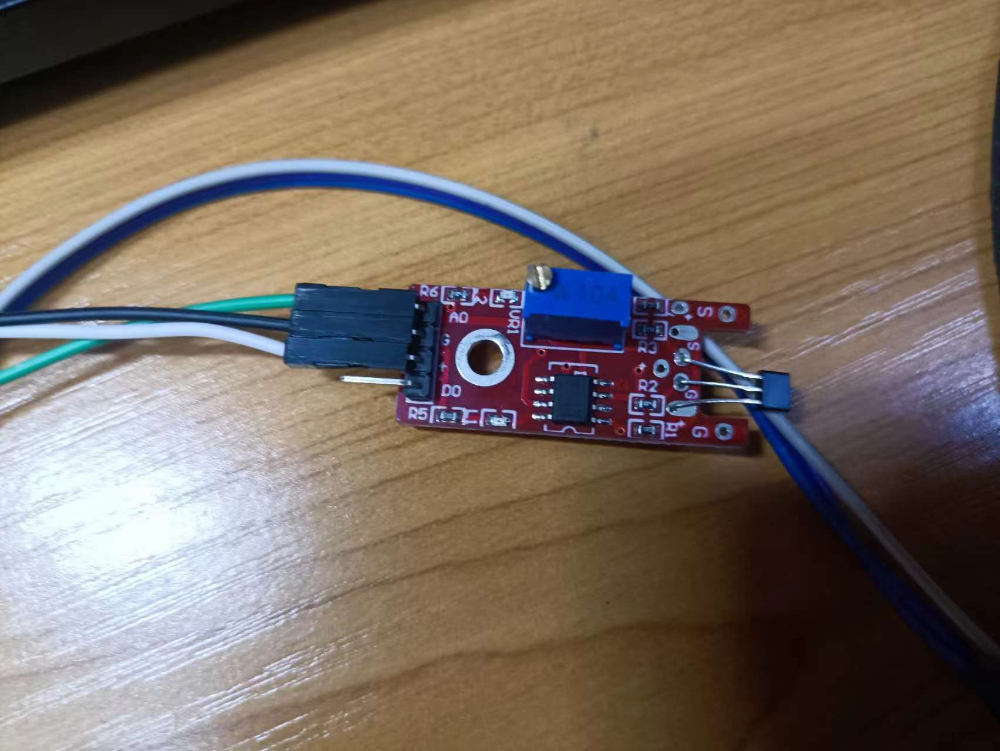
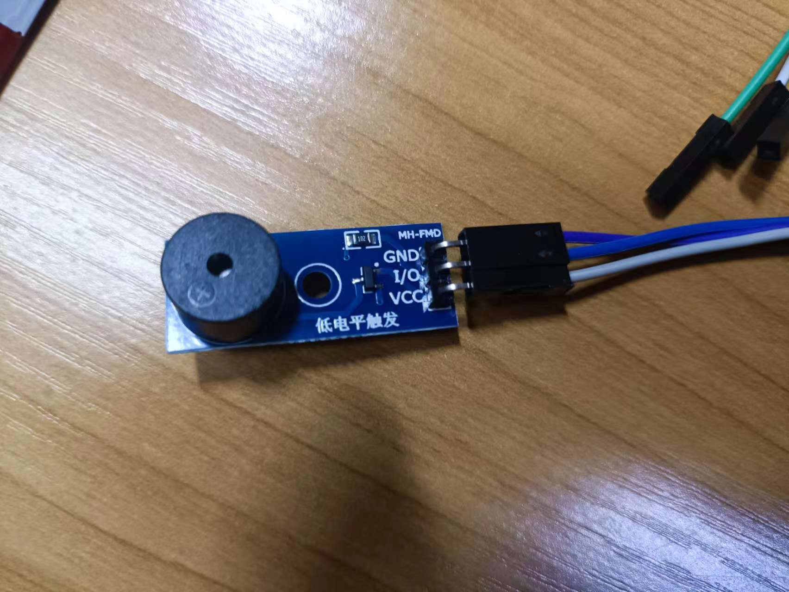
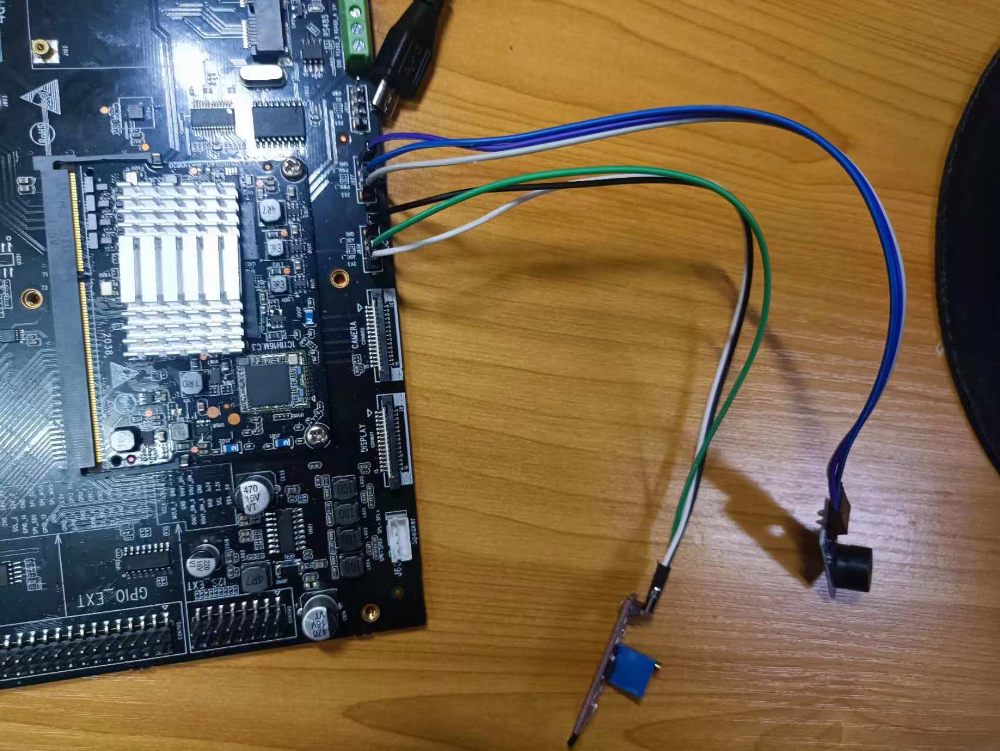

## 项目名称：OpenHarmony 4.0 电子油门声浪模拟

### 概述

本项目基于 OpenHarmony 4.0 版本，旨在通过九联科技人工智能开发板实现无源蜂鸣器和线性霍尔元件的驱动。项目的核心功能是利用霍尔元件的 ADC 值来控制蜂鸣器产生相应的声音变化，模拟电子油门的“声浪”效果。

### 代码结构

```
├─Analog_Accelerator
│  │  BUILD.gn
│  │  readme.md
│  │
│  ├─figures
│  │      buzzer.jpg
│  │      connection.jpg
│  │      hall.jpg
│  │
│  ├─include
│  │      um_adc.h
│  │      um_pwm.h
│  │
│  └─src
│          Buzzer_main.c
│          Hall_main.c
│          pwm_test.c
│          um_adc.c
│          um_pwm.c
```

### 功能模块

- **um_adc.h/um_adc.c**：负责读取 ADC 通道的电压值，用于获取霍尔元件的模拟信号。
- **um_pwm.h/um_pwm.c**：负责生成 PWM 信号，控制蜂鸣器的发声频率和占空比。
- **Buzzer_main.c**：主程序，初始化蜂鸣器并根据霍尔元件的 ADC 值调整 PWM 参数，实现声浪效果。
- **Hall_main.c**：读取霍尔元件的 ADC 值，并根据该值调整蜂鸣器的音调。
- **pwm_test.c**：用于测试 PWM 控制模块的功能性。

### 开发环境

1、搭载OpenHarmony-4.0-Beat5版本的Unionpi Tiger开发板

2、DevEco Studio 4.1.0.400

3、线性霍尔磁力传感器

4、无源蜂鸣器

### 传感器及其连接方法

线性霍尔磁力传感器  

无源蜂鸣器  

传感器与开发板的连接    
### 编译指南

将案例纳入产品部件的一部分，在vendor/unionman/unionpi_tiger/sample下的BUILD.gn加入以下代码

```
import("//build/ohos.gni")
group("sample_group") {
  deps = [
    # "hardware:hardware",
    # "hdf:hdf",
      "Analog_Accelerator:Analog_test",
  ]
}
```

修改案例目录下的BUILD.gn文件

```
import("//build/ohos.gni")
import("//build/ohos/ndk/ndk.gni")

ohos_executable("Analog_test") {
  sources = [
  # "src/hello.c"
    "src/Hall_main.c",
  # "src/pwm_test.c",
    "src/um_adc.c",
    "src/um_pwm.c",
  ]

  include_dirs = [
     "include",
     "//commonlibrary/c_utils/base/include" 
    ]

  external_deps = [
    "c_utils:utils",
    "hilog:libhilog",
  ]

  install_images = [ "system" ]
  install_enable = true #是否默认安装，（缺省则不安装），可选
  part_name = "product_unionpi_tiger" #步入产品部件下
}
```

### 运行指南

1、编译模块指令
./build.sh --product-name unionpi_tiger --build-target Analog_test --ccache

生成的可执行文件处于out文件夹中，产品/子系统/部件/路径下：out/unionpi_tiger/sample/Analog_test

2、将可执行文件hello_test下载到Windows本地，如E盘根目录

3、使用hdc工具推送可执行文件

(1)、在Windows中下载hdc工具，将hdc工具路径配置到系统环境变量

(2)、开发板连接USB_OTG口，并接通电源

(3)、在Windows环境中打开命令行工具（如cmd），使用hdc工具

    Hdc使用可以参考：https://www.cnblogs.com/xinghaiyige/p/17705120.html

(4)、挂载（Windows环境下）

hdc shell mount -o remount,rw /

(5)、推送可执行程序

hdc file send + 编译生成的可执行文件 + 开发板目录 ，如 /bin/ 

示例 ： >hdc file send E:\Analog_test /bin/

(6)、修改权限
`chmod 777 bin/Analog_test`

(7). 运行！
`bin/Analog_test`

### 使用说明

- 将霍尔元件放置在磁场中，蜂鸣器将根据霍尔元件的 ADC 值变化而发出不同音调的声音，模拟电子油门的效果。

### 维护与更新

- 本项目将持续更新以适配 OpenHarmony 的新版本和功能。
- 欢迎提交 issue 和 pull request 以改进项目。

### 许可证

本项目遵循 [Apache License 2.0](https://www.apache.org/licenses/LICENSE-2.0)。请在遵守许可证规定的前提下使用本项目的代码。
