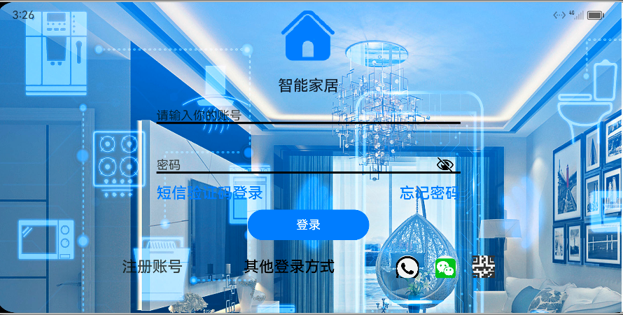
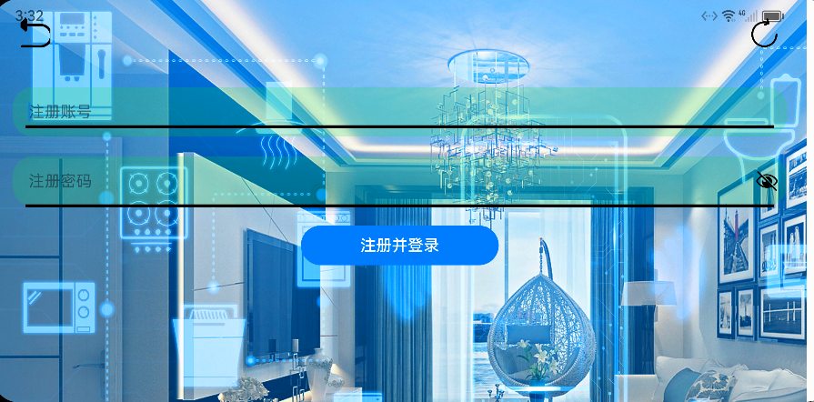
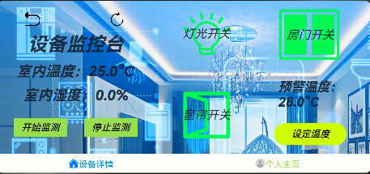
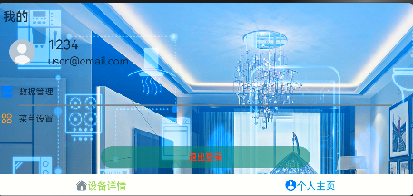

# 第十二组-基于OpenHarmony的智能家居系统的设计与实现

###  介绍

使用了[@ohos/axios]()，[@ohos.i2cnapidemo](entry/src/main/@ohos.i2cnapidemo.d.ts)，[@ohos.gpioled](entry/src/main/@ohos.gpioled.d.ts)，[@ohos.pwmtest](entry/src/main/@ohos.pwmtest.d.ts)等接口，实现了对开发板外设数据的读取和控制以及通过node.js通过Axios发起http请求来实现对后端数据库的访问等功能

###

效果预览

| 登录                                                                                                                                                                  | 注册                                                                                                                                                                 | 修改                                                                                                                                                                  | 主页1                                                                                                                                                                 | 主页2                                                                                                                                                                 |
|---------------------------------------------------------------------------------------------------------------------------------------------------------------------|--------------------------------------------------------------------------------------------------------------------------------------------------------------------|---------------------------------------------------------------------------------------------------------------------------------------------------------------------|---------------------------------------------------------------------------------------------------------------------------------------------------------------------|---------------------------------------------------------------------------------------------------------------------------------------------------------------------|
|  |  |  |  |  |

使用说明

1.登录：在此进行登录以进入控制界面；

2.注册：可以在此进行注册；

3.修改：可以在此进行账号信息密码的修改；

4.主页1:控制台，在此进行设备控制,点击开始监控开始定时获取环境温湿度，点击对应的开关可以打开对应的控制界面，并且可以通过设定预警温度来监控温度，当温度超过设定值时会报警，当监控停止或者重新设定一个更高的温度阈值时，报警效果消失；

5.主页2：用户主页，在此查看用户资料或退出到主界面

### 工程目录

```
entry/src/main/ets/
|---bean
    |---ItemData.ets                       //数据加载格式
|---componets
    |---headDia.ets                        //自定义头部组件
    |---InputFontDia.ets                   //自定义输入组件
|---entryablility
    |---EntryAbility.ets
|---pages
    |---CurtainControl.ets                 //自定义窗帘控制弹窗
    |---DoorControl.ets                    //自定义门控制弹窗
    |---LedControl.ets                     //自定义灯控制弹窗
    |---ForgetAccount.ets                  //修改密码页面
    |---GetAccount.ets                     //注册页面
    |---Login.ets                          //登录页面
    |---txt.ets                            //用户页面容器
|---view
    |---Home.ets                           //设备控制页面
    |---Mine.ets                           //用户个人页面
|---viewmodel
    |---IndexViewModel.ets                 //数据绑定接口
    
```
###   相关权限

在entry/src/main/module.json5中需添加访问权限ohos.permission.INTERNET如下：

```

    //申明网络访问权限
    "requestPermissions": [
      {
        "name": "ohos.permission.INTERNET"
      }
    ],

```

###    注意事项

在开发板上运行时需要给硬件对应的访问权限，具体参考如下：

```

chmod 666 sys/class/gpio/gpio389/direction
chmod 666 sys/class/gpio/gpio389/value
chmod 666 sys/class/gpio/gpio388/direction
chmod 666 sys/class/gpio/gpio388/value
chmod 666 sys/class/gpio/gpio387/direction
chmod 666 sys/class/gpio/gpio387/value
chmod 666 sys/class/gpio/gpio386/direction
chmod 666 sys/class/gpio/gpio386/value
chmod 666 sys/class/gpio/gpio385/direction
chmod 666 sys/class/gpio/gpio385/value
chmod 666 sys/class/gpio/gpio384/direction
chmod 666 sys/class/gpio/gpio384/value
chmod 666 sys/class/gpio/gpio383/direction
chmod 666 sys/class/gpio/gpio383/value
chmod 666 sys/class/gpio/gpio382/direction
chmod 666 sys/class/gpio/gpio382/value
chmod 666 sys/class/gpio/gpio381/direction
chmod 666 sys/class/gpio/gpio381/value
chmod 666 sys/class/gpio/gpio380/direction
chmod 666 sys/class/gpio/gpio380/value

chmod 777 /sys/class/pwm/pwmchip0/pwm0/duty_cycle
chmod 777 /sys/class/pwm/pwmchip0/pwm0/period
chmod 777 /sys/class/pwm/pwmchip0/pwm0/enable
chmod 777 /sys/class/pwm/pwmchip0/pwm0/polarity
chmod 777 /sys/class/pwm/pwmchip2/pwm0/duty_cycle
chmod 777 /sys/class/pwm/pwmchip2/pwm0/period
chmod 777 /sys/class/pwm/pwmchip2/pwm0/enable
chmod 777 /sys/class/pwm/pwmchip2/pwm0/polarity

```

####  参与贡献

1. Fork 本仓库
2. 提交代码
3. 新建 Pull Request