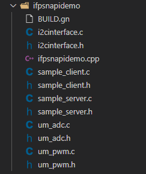
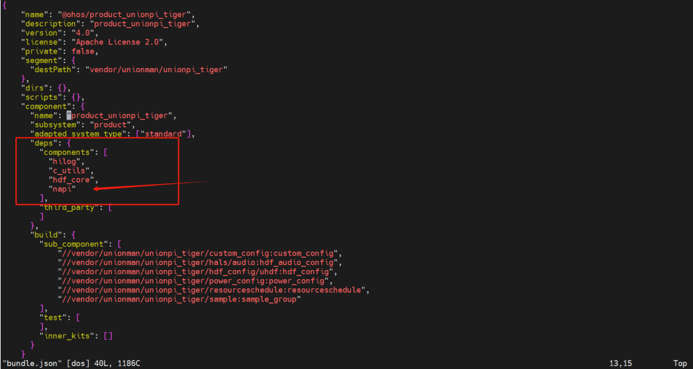
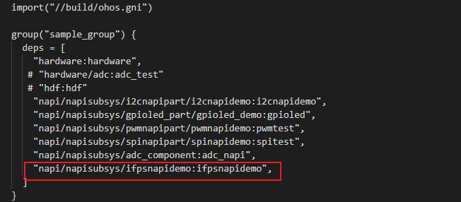
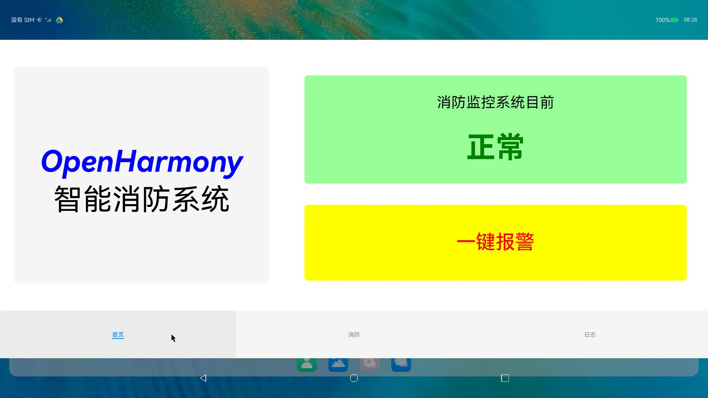
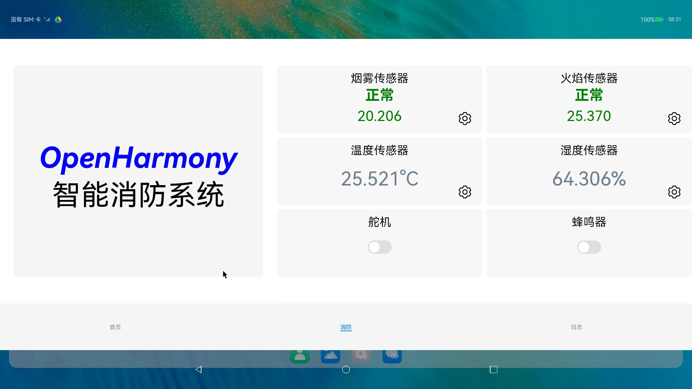
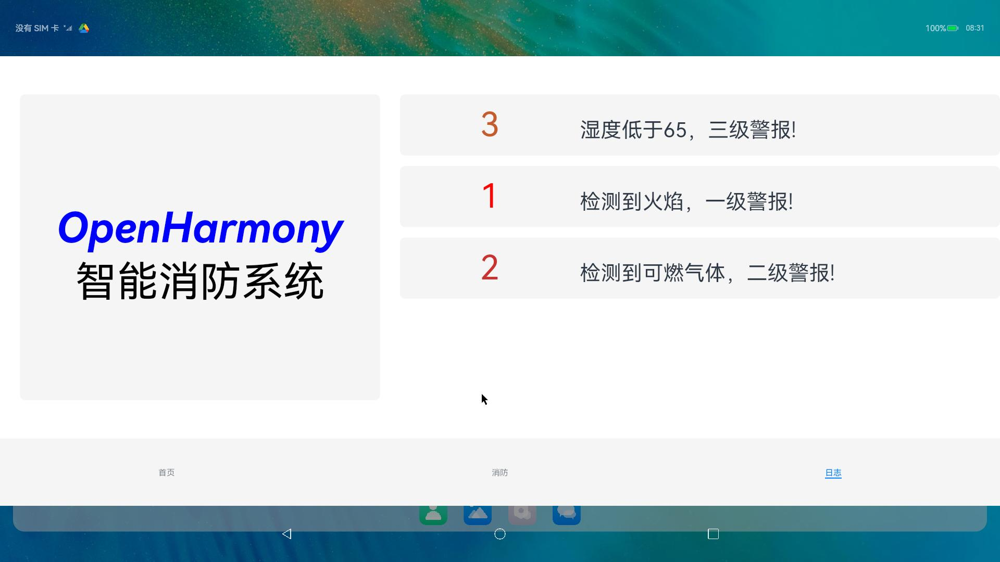
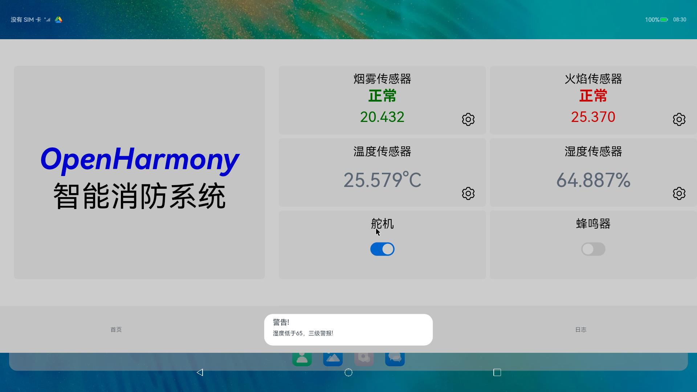

### IFPS

### **作品简介**

基于OpenHarmony的智能消防系统，实现对温湿度的监测，可燃气体及火焰的检测，对应设置三级警报，使用舵机模拟自动灭火设备的开关，蜂鸣器实现报警功能。

### **开发环境简介**

1、搭载OpenHarmony-4.0-Beat5版本的Unionpi Tiger开发板

2、DevEco Studio 4.0.0.600

3、温湿度模块SHT3x-DIS

4、烟雾传感器MQ-2

5、火焰传感器FC-01

6、MG996R舵机

7、无源蜂鸣器

### 温湿度传感器数据采集

### 烟雾传感器数据采集

通过ADC通道1采集ADC值，使用转换公式转换获取烟雾浓度，例程中仅使用简单的线性转换

### 火焰传感器数据采集

通过ADC通道2采集ADC值，通过转换获取到的电压值判断是否检测到火焰

### 蜂鸣器控制

使用PWM控制蜂鸣器，以发出不同频率的声音，对应不同的警报等级

### 舵机控制

### NAPI

全称 Native API，是OpenHarmony系统中的一套原生模块拓展开发框架，基于N-API开发，为开发者提供了JS与C/C++不同语言模块之间的相互访问，交互的能力。它可以用于规范化封装IO、OS底层等，并可以提供相应的JS接口供开发者调用。

#### 编写子系统组件

在vendor/unionman/unionpi_tiger/sample/napi/napisubsys目录下新建ifpsnapidemo文件夹。

##### 文件目录



##### 编写ifpsnapidemo.cpp文件

```c++
#include <cstdio>
#include <cstring>
#include <unistd.h>

#include "napi/native_api.h"
#include "napi/native_node_api.h"

#include "um_adc.h"
#include "um_pwm.h"
#include "i2cinterface.h"
#include "sample_client.h"

static const int SERVO_INIT_DUTY = 500000;
static const int SERVO_MAX_DUTY = 2500000;

#ifdef __cplusplus
extern "C" {
#endif

// 温湿度传感器全局变量声明
static sRHAndTemp_t tempRH;
static float TemperatureC;
static float Humidity;
static float TemperatureF;

// 温湿度传感器 IIC 设备地址
static const uint16_t device_addr = 0x44;

// 温湿度传感器 IIC 设备号
char dev_name[] = "/dev/i2c-5";

// 同步方法实现温湿度传感器软重启
static napi_value Sht3xSoftReset(napi_env env, napi_callback_info info)
{
    int value;
    napi_value ret = nullptr;
    value = SoftReset(dev_name, device_addr);
    usleep(50L * 1000L);
    NAPI_CALL(env, napi_create_int32(env, value, &ret));
    return ret;
}

// 同步方法实现温湿度传感器模式选择
static napi_value Sht3xModeSet(napi_env env, napi_callback_info info)
{
    // 获取JS传入的参数
    size_t argc = 2L;
    napi_value args[2L] = {nullptr};
    NAPI_CALL(env, napi_get_cb_info(env, info, &argc, args, nullptr, nullptr));

    // 验证参数数据类型
    napi_valuetype valuetype0;
    NAPI_CALL(env, napi_typeof(env, args[0], &valuetype0));
    napi_valuetype valuetype1;
    NAPI_CALL(env, napi_typeof(env, args[1], &valuetype1));
    NAPI_ASSERT(env, valuetype0 == napi_number && valuetype1 == napi_number, "Wrong argument type. Number expected.");

    // NAPI类型数据转为C/C++类型
    int mps;
    NAPI_CALL(env, napi_get_value_int32(env, args[0], &mps));
    int repeatability;
    NAPI_CALL(env, napi_get_value_int32(env, args[1], &repeatability));

    // 业务执行
    int value;
    napi_value ret = nullptr;
    value = ModeSet(dev_name, device_addr, mps, repeatability);
    usleep(20L * 1000L);
    NAPI_CALL(env, napi_create_int32(env, value, &ret));
    return ret;
}

// 同步方法实现读取温湿度传感器数据
static napi_value Sht3xReadData(napi_env env, napi_callback_info info)
{
    int value;
    napi_value ret = nullptr;
    value = ReadTempAndHum(dev_name, device_addr, &tempRH);
    usleep(20L * 1000L);
    NAPI_CALL(env, napi_create_double(env, value, &ret));
    TemperatureC = tempRH.TemperatureC;
    Humidity = tempRH.Humidity;
    TemperatureF = tempRH.TemperatureF;
    return ret;
}

// 将摄氏温度传到APP(运行此函数前需要运行Sht3xReadData函数)
static napi_value Sht3xReadTemperatureC(napi_env env, napi_callback_info info)
{
    napi_value tempC = nullptr;
    NAPI_CALL(env, napi_create_double(env, TemperatureC, &tempC));
    return tempC;
}
// 将湿度传到APP(运行此函数前需要运行Sht3xReadData函数)
static napi_value Sht3xReadHumidity(napi_env env, napi_callback_info info)
{
    napi_value hum = nullptr;
    NAPI_CALL(env, napi_create_double(env, Humidity, &hum));
    return hum;
}
// 将华氏温度传到APP(运行此函数前需要运行Sht3xReadData函数)
static napi_value Sht3xReadTemperatureF(napi_env env, napi_callback_info info)
{
    napi_value tempF = nullptr;
    NAPI_CALL(env, napi_create_double(env, TemperatureF, &tempF));
    return tempF;
}


// 同步方法实现获取烟雾传感器adc值
static napi_value Mq2GetAdcValue(napi_env env, napi_callback_info info)
{
    constexpr int adc_channel = 1;
    int value = 0;
    if (get_adc_data(adc_channel, &value) < 0) {
        value = -1;
    }

    napi_value ret;
    NAPI_CALL(env, napi_create_int32(env, value, &ret));
    return ret;
}

// 同步方法实现获取温湿度传感器（ADC通道）权限
static napi_value Mq2GetPermission(napi_env env, napi_callback_info info)
{
    int result = 0;
    constexpr char path[128] = "/sys/bus/iio/devices/iio:device0/in_voltage2_raw";
    result = open_permission(path);

    napi_value ret;
    NAPI_CALL(env, napi_create_int32(env, result, &ret));
    return ret;
}

// 同步方法实现获取火焰传感器adc值
static napi_value FlameSensorGetAdcValue(napi_env env, napi_callback_info info)
{
    constexpr int adc_channel = 2;
    int value = 0;
    if (get_adc_data(adc_channel, &value) < 0) {
        value = -1;
    }

    napi_value ret;
    NAPI_CALL(env, napi_create_int32(env, value, &ret));
    return ret;
}

// 同步方法实现获取火焰传感器（ADC通道）权限
static napi_value FlameSensorGetPermission(napi_env env, napi_callback_info info)
{
    int result = 0;
    constexpr char path[128] = "/sys/bus/iio/devices/iio:device0/in_voltage3_raw";
    result = open_permission(path);

    napi_value ret;
    NAPI_CALL(env, napi_create_int32(env, result, &ret));
    return ret;
}

struct PwmOnData {
    napi_async_work asyncWork = nullptr; // 异步工作项
    napi_deferred deferred = nullptr;    // 用于Promise的resolve、reject处理
    napi_ref callback = nullptr;         // 回调函数
    int args[2] = {0};                   // 2个输入参数
    int result = 0;                      // 业务逻辑处理结果（返回值）
};

// 业务逻辑处理函数，由worker线程池调度执行。
static void executeCB(napi_env env, void *data)
{
    PwmOnData *pwmData = (PwmOnData *)data;

    int pwmPex = pwmData->args[0];
    int pwmAngle = pwmData->args[1];

    set_pwm_period(pwmPex, SERVO_MAX_DUTY);
    double pwmDuty = 1.0 * SERVO_INIT_DUTY * pwmAngle / 45L + SERVO_INIT_DUTY;
    set_pwm_dutyCycle(pwmPex, static_cast<int>(pwmDuty));
    set_pwm_enable(pwmPex, 1);

    pwmData->result = is_pwm_enabled(pwmPex);
}

// 业务逻辑处理完成回调函数，在业务逻辑处理函数执行完成或取消后触发，由EventLoop线程中执行。
static void completeCBForPromise(napi_env env, napi_status status, void *data)
{
    PwmOnData *pwmData = (PwmOnData *)data;
    napi_value result = nullptr;
    napi_create_int32(env, pwmData->result, &result);
    napi_resolve_deferred(env, pwmData->deferred, result);

    // 删除napi_ref对象
    if (pwmData->callback != nullptr) {
        napi_delete_reference(env, pwmData->callback);
    }

    // 删除异步工作项
    napi_delete_async_work(env, pwmData->asyncWork);
    delete pwmData;
}

// pwm设置，用于舵机（PWM1） 蜂鸣器（PWM2）
static napi_value SetPwmStatus(napi_env env, napi_callback_info info)
{
    // 获取2个参数，值的类型是js类型(napi_value)
    size_t argc = 2L;
    napi_value args[2];
    napi_value thisArg = nullptr;
    NAPI_CALL(env, napi_get_cb_info(env, info, &argc, args, &thisArg, nullptr));

    // 创建promise
    napi_value promise = nullptr;
    napi_deferred deferred = nullptr;
    NAPI_CALL(env, napi_create_promise(env, &deferred, &promise));

    // 异步工作项上下文用户数据，传递到异步工作项的execute、complete之间传递数据
    auto pwmData = new PwmOnData {
        .asyncWork = nullptr,
        .deferred = deferred,
    };

    // 将被收到的参数传入
    NAPI_CALL(env, napi_get_value_int32(env, args[0], &pwmData->args[0]));
    NAPI_CALL(env, napi_get_value_int32(env, args[1], &pwmData->args[1]));

    // 创建async work，创建成功后通过最后一个参数(addonData->asyncWork)返回asyncwork的handle
    napi_value resourceName = nullptr;
    napi_create_string_utf8(env, "setPwmStatus", NAPI_AUTO_LENGTH, &resourceName);
    napi_create_async_work(env, nullptr, resourceName, executeCB, completeCBForPromise, (void *)pwmData,
                           &pwmData->asyncWork);

    // 将刚创建的async work加到队列，由底层去调度执行
    napi_queue_async_work(env, pwmData->asyncWork);

    // 返回promise
    return promise;
}

// 注册接口
static napi_value registerifpsNapiDemoApis(napi_env env, napi_value exports)
{
    napi_property_descriptor desc[] = {
        DECLARE_NAPI_FUNCTION("Sht3xSoftReset", Sht3xSoftReset),
        DECLARE_NAPI_FUNCTION("Sht3xModeSet", Sht3xModeSet),
        DECLARE_NAPI_FUNCTION("Sht3xReadData", Sht3xReadData),
        DECLARE_NAPI_FUNCTION("Sht3xReadTemperatureC", Sht3xReadTemperatureC),
        DECLARE_NAPI_FUNCTION("Sht3xReadHumidity", Sht3xReadHumidity),
        DECLARE_NAPI_FUNCTION("Sht3xReadTemperatureF", Sht3xReadTemperatureF),
        DECLARE_NAPI_FUNCTION("Mq2GetAdcValue", Mq2GetAdcValue),
        DECLARE_NAPI_FUNCTION("Mq2GetPermission", Mq2GetPermission),
        DECLARE_NAPI_FUNCTION("FlameSensorGetAdcValue", FlameSensorGetAdcValue),
        DECLARE_NAPI_FUNCTION("FlameSensorGetPermission", FlameSensorGetPermission),
        DECLARE_NAPI_FUNCTION("SetPwmStatus", SetPwmStatus),

    };
    NAPI_CALL(env, napi_define_properties(env, exports, sizeof(desc) / sizeof(desc[0]), desc));
    return exports;
}

// 模块定义
static napi_module ifpsnapidemoModule = {
    .nm_version = 1,
    .nm_flags = 0,
    .nm_filename = nullptr,
    .nm_register_func = registerifpsNapiDemoApis,
    .nm_modname = "ifpsnapidemo",
    .nm_priv = ((void *)0),
    .reserved = {0},
};
#ifdef __cplusplus
}
#endif

// 注册模块
extern "C" __attribute__((constructor)) void RegisterifpsNapidemoModule(void)
{
    napi_module_register(&ifpsnapidemoModule); // 接口注册函数
}

```

##### 编写GN构建脚本

ifpsnapidemo/BUILD.gn

```json

import("//build/ohos.gni")

config("warns") {
  cflags = [ "-Werror" ]
}

ohos_shared_library("ifpsnapidemo") {
  include_dirs = [
    "//foundation/ace/napi/interfaces/kits",
    "//commonlibrary/c_utils/base/include",
    "//base/hiviewdfx/hilog/interfaces/native/innerkits/include",
  ]

  sources = [
    "i2cinterface.c",
    "ifpsnapidemo.cpp",
     "sample_client.c",
    "um_adc.c",
     "um_pwm.c",
  ]
 
  configs = [ ":warns" ]
  
  external_deps = [
    "c_utils:utils",
    "hilog:libhilog",
    "napi:ace_napi",
  ]

  part_name = "product_unionpi_tiger"
}

ohos_executable("sample_server") {
  output_name = "sample_server_executable" 
  sources = [ "sample_server.c" ]
  include_dirs = [ "//base/hiviewdfx/hilog/interfaces/native/innerkits/include" ]
  configs = [ ":warns" ]
  external_deps = [
    "c_utils:utils",
    "hilog:libhilog",
  ]
  install_images = [ "system" ]
}
```

##### 修改配置

ohos4.0release/vendor/unionman/unionpi_tiger/bundle.json



ohos4.0release/vendor/unionman/unionpi_tiger/sample/BUILD.gn



#### 编写TS接口定义文件

编写好NAPI代码之后，需要编写TS接口定义文件(.d.ts),这样开发OpenHarmony应用时，编译器才知道模块定义了哪些函数以及对应的返回值，参数列表等。

@ohos.ifpsnapidemo.d.ts

```ts
declare namespace ifpsnapidemo {

// 传感器软重启
function Sht3xSoftReset(): number;

/**
 * 设置传感器测量模式
 * @param mps 取值为[0,3] 对应mps=0.5、1、2、4、10Hz
 * @param repeatability 取值为[0,2] 对应低刷新率、中刷新率、高刷新率
 */
function Sht3xModeSet(mps: number, repeatability: number): number;

// 读取温湿度数据
function Sht3xReadData(): number;
// 使用下列三个接口时必须先调用ReadData
function Sht3xReadTemperatureC(): number;
function Sht3xReadHumidity(): number;
function Sht3xReadTemperatureF(): number;

function Mq2GetAdcValue(): number;
function Mq2GetPermission(): number;

function FlameSensorGetAdcValue(): number;
function FlameSensorGetPermission(): number;

/**
* 设置pwm的开关状态
* @param pwmPex pwm引脚
* @param pwmAngle pwm角度
*/
function SetPwmStatus(pwmPex: number, pwmAngle: number): Promise<number>;
}

export default ifpsnapidemo;
```

### 构建

进入OpenHarmony源代码的根目录，执行编译

```shell
./build.sh --product-name unionpi_tiger –ccache
```

如果开发板已经烧录了同版本的OpenHarmony操作系统,可以在out/unionpi_tiger/[子系统名]/[组件名]文件夹中找到组件对应的动态库,然后使用hdc工具发送到开发板的/system/lib/module目录中即可，省去了烧录所花的时间

```shell
hdc_std file send libxxx.z.so /system/lib/module
```

在发送时，可能出现以下错误

[Fail]Error opening file: read-only file system, path:/system/lib/module/libxxx.z.so

这是因为system分区被开机挂载为只读分区，解决方案是重新挂载system分区为可读写分区

```shell
hdc_std shell mount / -o rw,remount
```

然后再重新发送动态库至开发板即可

### 编译用户程序

1、往对应版本的SDK中添加自定义的ifpsnapidemo.d.ts 文件

2、使用DevEco Studio打开项目文件夹IFPS-APP

3、添加自动签名

4、执行编译

### 演示效果

| 首页                                                         | 状态                                                         |
| ------------------------------------------------------------ | ------------------------------------------------------------ |
|  |  |

| 日志                                                         | 警报                                                         |
| ------------------------------------------------------------ | ------------------------------------------------------------ |
|  |  |

