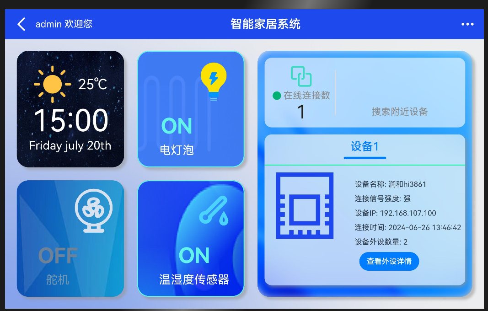
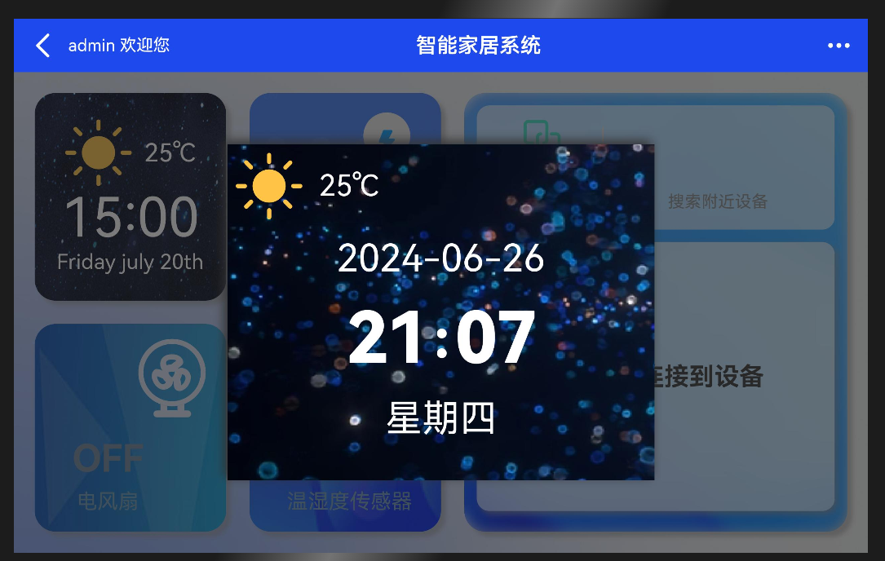
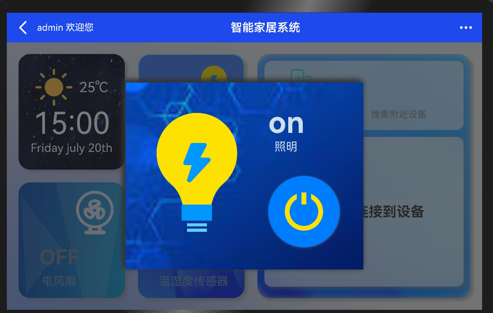
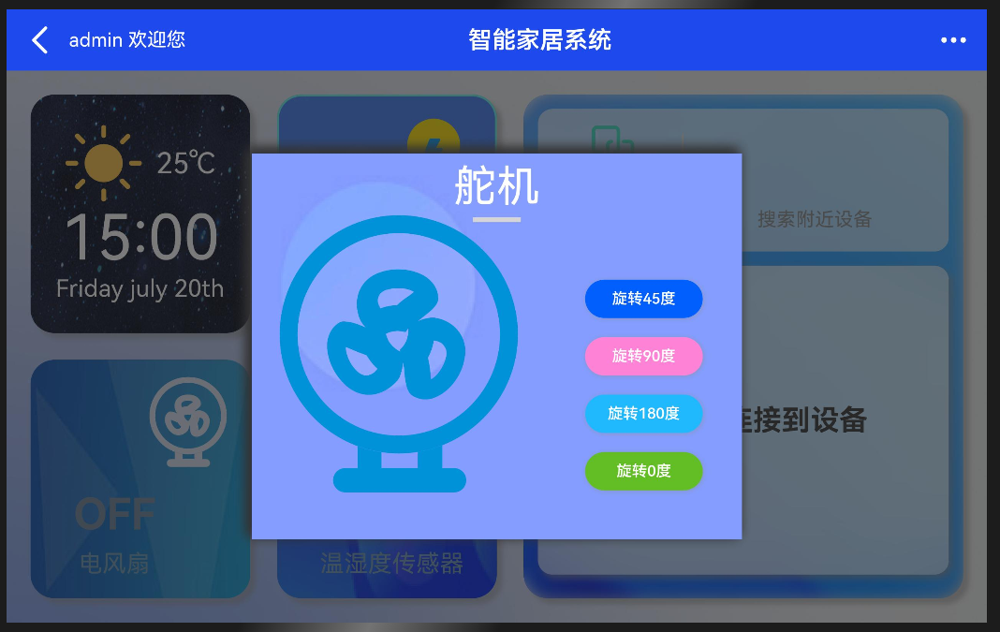
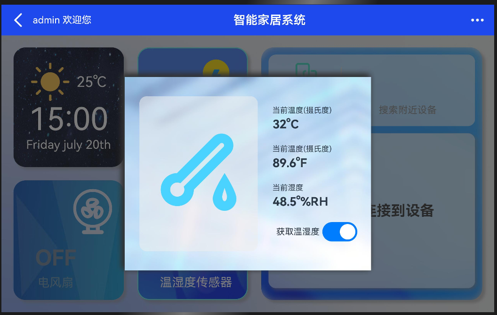
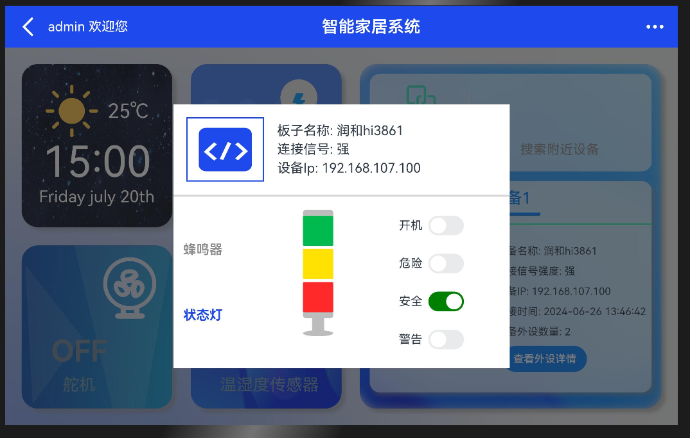
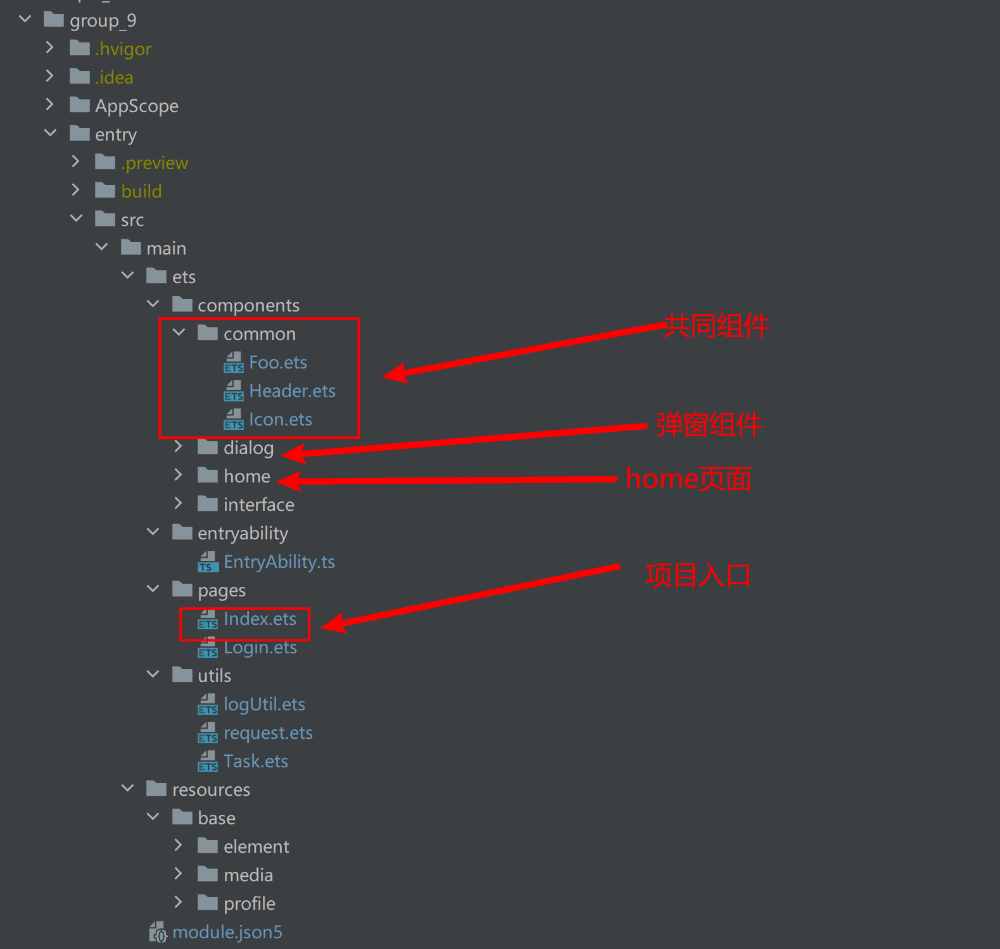
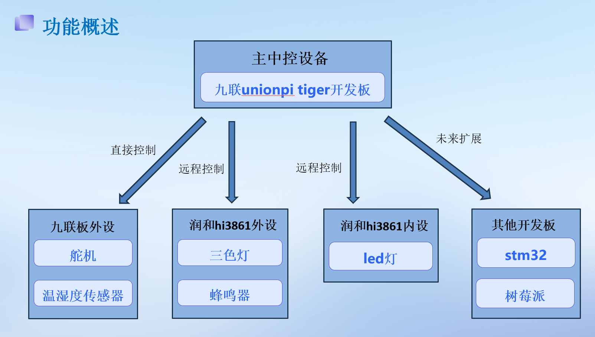
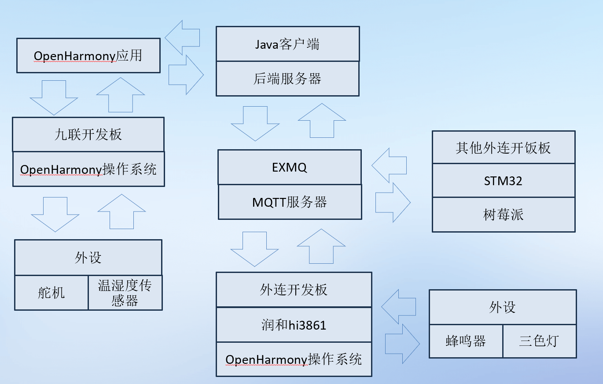

## 基于OpenHarmony系统的智能家居系统

### 介绍
  此项目能够实现用户对于家居的远程控制：用户可以通过OpenHarmony应用来实现对家居设备的远程控制，如灯光、温湿度传感器、舵机等，实现远程开关和调节。同时，智能家居中控系统提供MQTT服务接口，任何设备开发板可以通过MQTT协议来连接上OpenHarmony的中控系统，智能互联，中控系统可以实现不同智能设备之间的互联互通，实现设备之间的协同工作，提升整体智能家居系统的效率和便利性。

### 效果预览
#### 主界面

#### 时间模块

#### led灯模块

#### 舵机模块

#### 温湿度传感器模块

#### 连接外设模块

### 工程目录

### 具体实现
#### 功能概述

#### 架构设计

### 相关权限
ohos.permission.INTERNET

### 依赖
dayjs: "^1.11.7"

### 约束与限制
本示例仅支持标准系统上运行；
本示例支持API9以及以上的版本SDK；
本示例需要使用DevEco Studio 版本号(4.0 Release)才可编译运行。

### 下载
git init
git clone origin https://gitee.com/openharmony/vendor_unionman.git