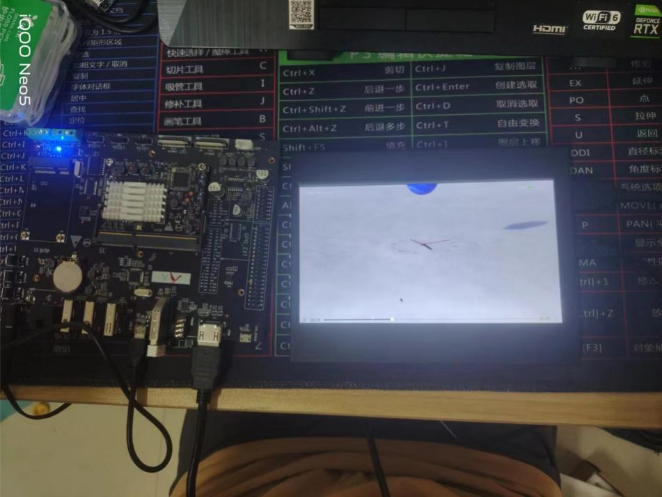
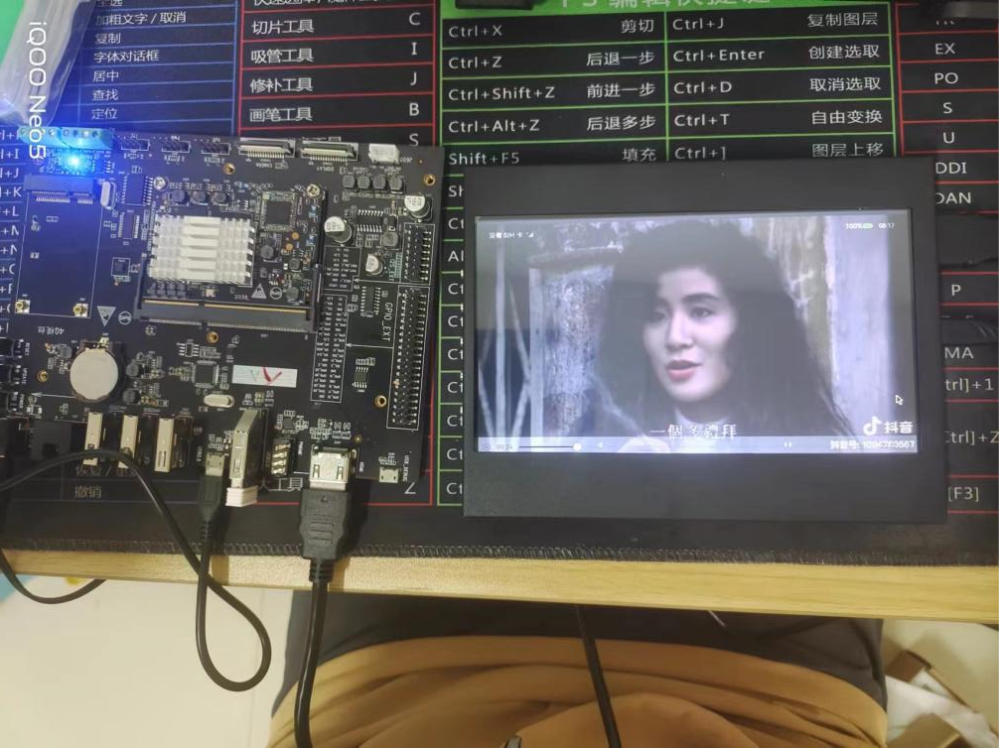
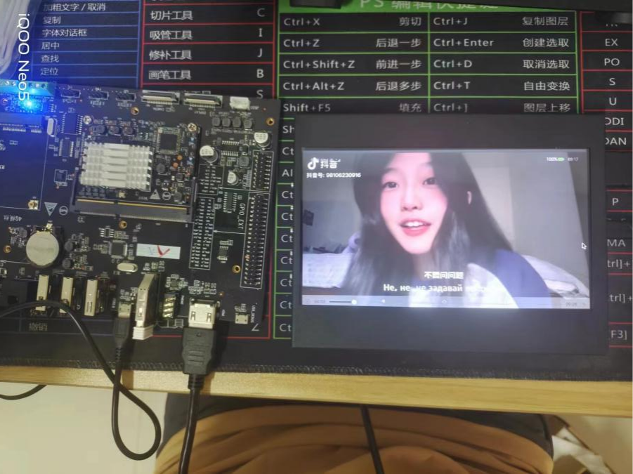
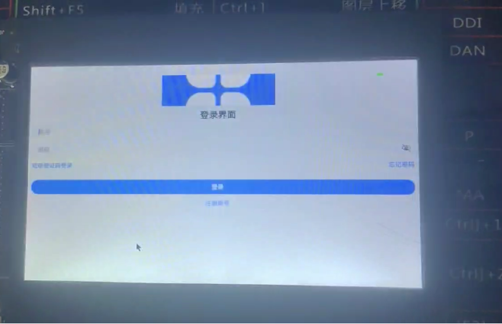
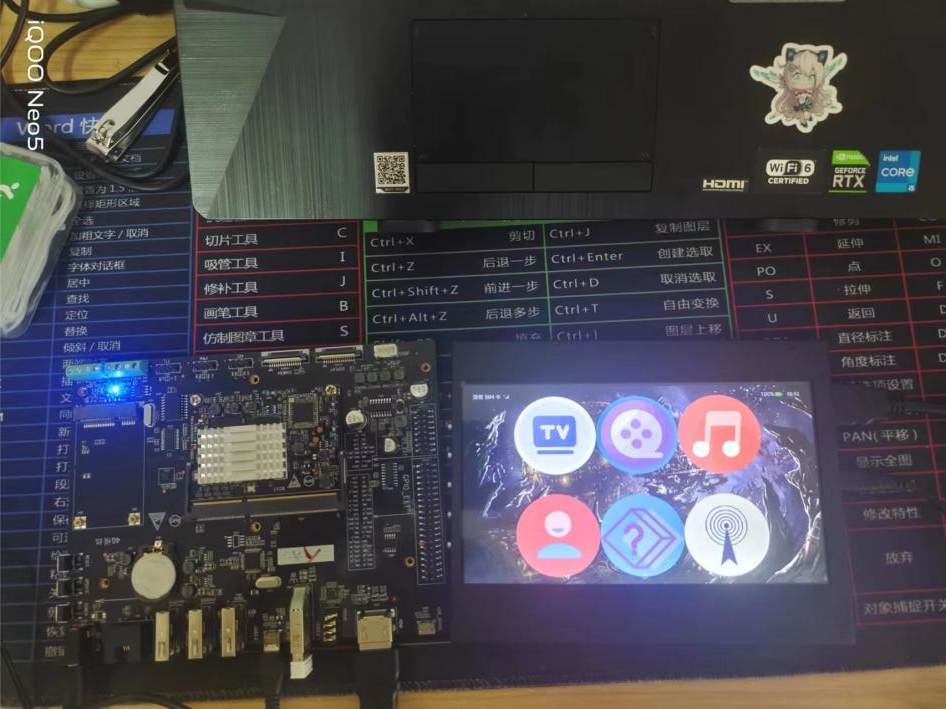

# OpenHarmony-TV端视频播放器的研究及开发

## 简介
本系统是一个综合性的多媒体播放平台，为用户提供了丰富的电视剧、电影和音乐播放功能，同时支持个性化的收藏和管理服务。

- **电视剧播放**
  -  此功能允许用户观看存储在系统内的各种电视剧集。
  -  支持多集连续播放或单集点播。
  -  提供剧集详情、演员阵容、剧情介绍等信息。
  -  支持多种视频质量选择，如高清、超清等。
  -  提供播放控制，如暂停、快进、快退、音量调节等。
  -  支持弹幕、评论、评分等社交互动。



- **电影播放**
  -  此功能允许用户观看系统内的电影资源。
  -  提供电影详情、演员阵容、剧情简介等信息。
  -  支持多种视频质量选择。
  -  提供字幕选择，支持多语言字幕。
  -  提供播放控制、评论、评分等。
  -  可能支持电影推荐和分类浏览。



- **音乐播放**
  -  此功能允许用户收听系统内的音乐内容。
  -  支持在线播放和离线下载。
  -  提供歌曲详情、歌手信息、歌词显示等。
  -  支持多种音乐品质选择。
  -  提供播放控制，如播放/暂停、上一曲/下一曲、循环播放等。
  -  可能支持歌单、专辑、歌手分类浏览。



- **个人中心**
  -  显示用户的账户信息，如用户名、头像、会员状态等。
  -  可能支持设置功能，如更改密码、调整播放设置等。
  -  提供消息通知，如新内容推荐、活动通知等。



- **随机播放**
  -  此功能允许用户随机播放系统内的电视剧、电影或音乐内容。
  -  提供随机播放选项，用户可以选择随机播放电视剧、电影或音乐。
  -  系统会随机选择一部内容开始播放。
  -  支持在特定分类或收藏夹中进行随机播放。
  -  提供停止随机播放和继续当前播放的选项。
  


## 目录
### 目录结构
```
/vendor_unionman_2/unionpi_tiger/sample_hzu/TV-adaptation               
├── figures          
├── hvigor               
├── product            
│   └── phone          
│       └── src           
│           └── main                     
│               ├── ets        
│               ├── resources                         
├── .gitignore                 
├── build-profile.json5
├── hvigorfile.js
├── hvigorw
├── hvigorw.bat
├── oh-package.json5
├── README_zh.md
```
## 约束
- 开发环境
  - **DevEco Studio for OpenHarmony**: 版本号大于3.0.0.900，下载安装OpenHarmony SDK API Version 9。（初始的IDE配置可以参考IDE的使用文档）
- 建议
  -  推荐使用本工程下的launcher.p7b文件，路径：signature/launcher.p7b

### 代码下载

1. git clone https://gitee.com/boeyyaa/vendor_unionman_2.git
2. 通过下载zip的方式直接下载