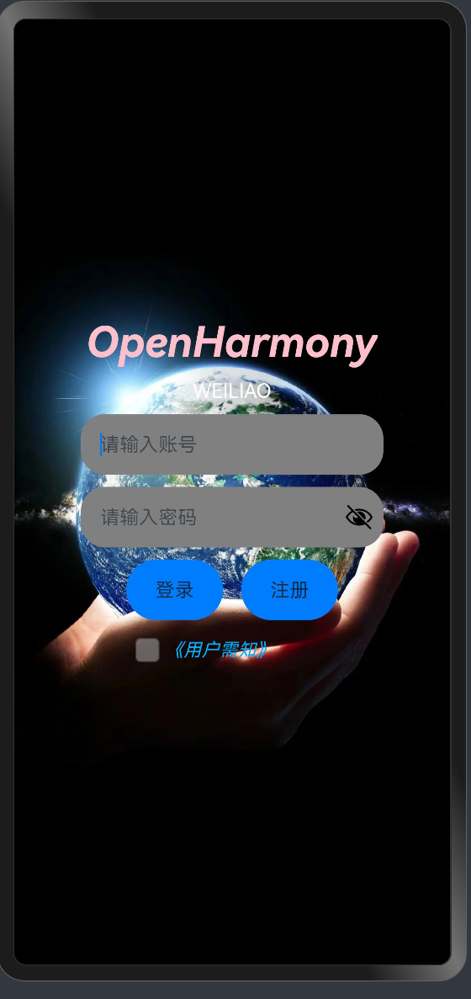
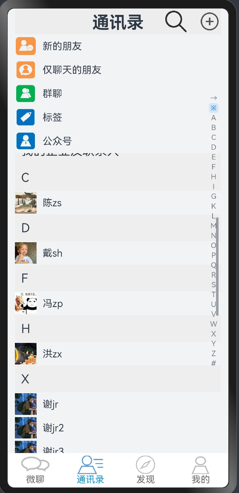
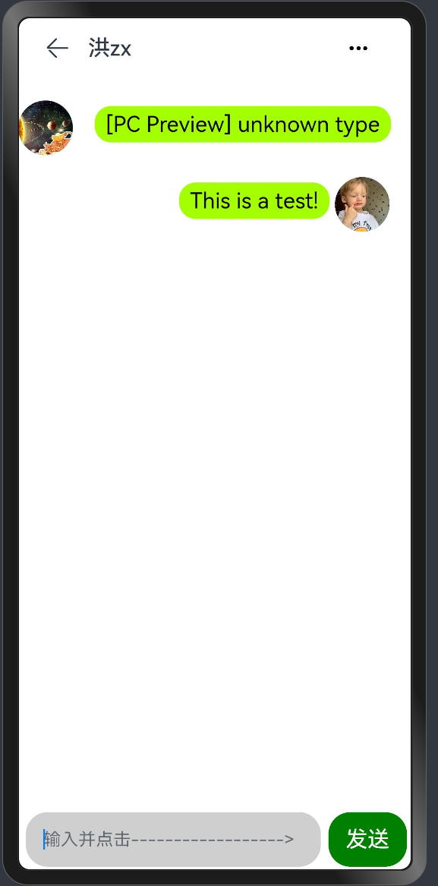
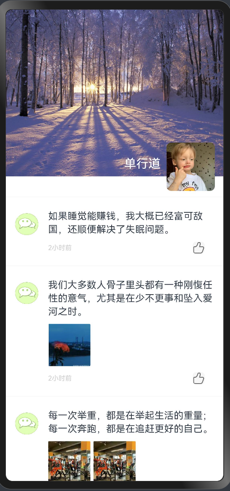

# 微聊

### 介绍

本应用展示了一个通过UDP协议进行通信的聊天软件，界面UI使用ArkUI来编写。使用了@ohos.net.socket'、@ohos.wifiManager'等接口，
实现了用户注册和登录、通信聊天、聊天信息保存、通讯录管理和朋友圈等功能。


### 效果预览

|         应用首页          |             通讯录页面             |           聊天页面            | 朋友圈页面                          |
|:---------------------:|:-----------------------------:|:-------------------------:|--------------------------------|
|  |  |  |  |


###	使用说明

 1. 进入首页后，需要先进行注册和登录，然后阅读和同意使用协议后才能进入聊天主页。

 2. 在聊天主页会显示当前聊天信息，可点击对应的聊天信息跳转至连接页面，也可对聊天信息向右滑动以进行“标记未读”、“不显示”、“删除”等操作

 3. 在通讯录页面会显示所有可进行聊天的对象，选择其中一个要通信的对象，点击进入，也可跳转到连接页面

 4. 在连接页面正确输入对方的IP地址，再点击“进入房间“按钮，即可进入聊天页面。需通信双方都完成这一步才能进行聊天。

 5. 在聊天页面的输入提示框栏内输入要发送的内容，点击”发送“按钮即可发送聊天信息。

 6. 点击聊天页面右上角的三点按钮，即可跳转到聊天信息页面。点击其中的”查看聊天记录“按钮，即可查看聊天历史记录。也可通过点击连接页面中的”聊天记录“按钮来查看聊天历史记录

 7. 在发现页面点击朋友圈，点击点赞图标即可对动态进行点赞


### 工程目录
```
entry/src/main/ets/
|---pages
|   |---agreement.ets                       // 使用协议展示页面                                 
|   |---chatInformation.ets                 // 聊天信息页面
|   |---chatPage.ets                        // 聊天页面
|   |---chatRecord.ets                      // 聊天记录页面
|   |---connectPage.ets                     // 连接页面，在此输入正确的IP地址即可与聊天对象连接
|   |---friendCircle.ets                    // 朋友圈页面
|   |---Index.ets                           // 应用首页，可在此进行注册和登录
|   |---MainInterface.ets                   // 主页接口，包含聊天信息页面、通讯录页面、发现页面、个人主页等四个子页面
|   |---registerPage.ets                    // 注册页面
|   |---SwiperPage.ets                       
|---view                                  
|   |---Address_book.ets                    // 通讯录页面                              
|   |---Find.ets                            // 发现页面
|   |---Home.ets                            // 聊天信息页面
|   |---Mine.ets                            // 个人主页                     
```
 

### 具体实现
 * 主要的聊天功能在chatPage文件中实现，源码参考:[chatPage.ets](entry/src/main/ets/pages/chatPage.ets)，具体实现方法如下
   * 使用socket.constructUDPSocketInstance()创建一个UDPSocket对象
   * 通过wifiManager.getIpInfo().ipAddress来通过当前所连接的wifi自动获取本地的IP地址
   * 经过格式转换后，通过bind()自动绑定本地的IP地址
   * 通过UDPSendOptions对象来存储要传输的数据和通信对方的IP地址，然后通过send方法向对方发送数据。
   * 通过on(‘message’)订阅UDPSocket连接的接收消息事件。为防止接收除英文外字符时出现乱码，将通过util.TextDecoder.create("utf-8")创建TextDecoder对象，并用decodeWithStream方法对数据流进行解码。

### 相关权限

ohos.permission.INTERNET

ohos.permission.GET_WIFI_INFO


### 约束与限制

1.本应用仅支持标准系统上运行。

2.本应用已适配SDK 10版本，openHarmony4.0。

3.本应用需要使用DevEco Studio 4.0 Release，构建版本：4.0.0.600版本才可编译运行。

### 下载
git init
git clone origin https://gitee.com/openharmony/vendor_unionman.git