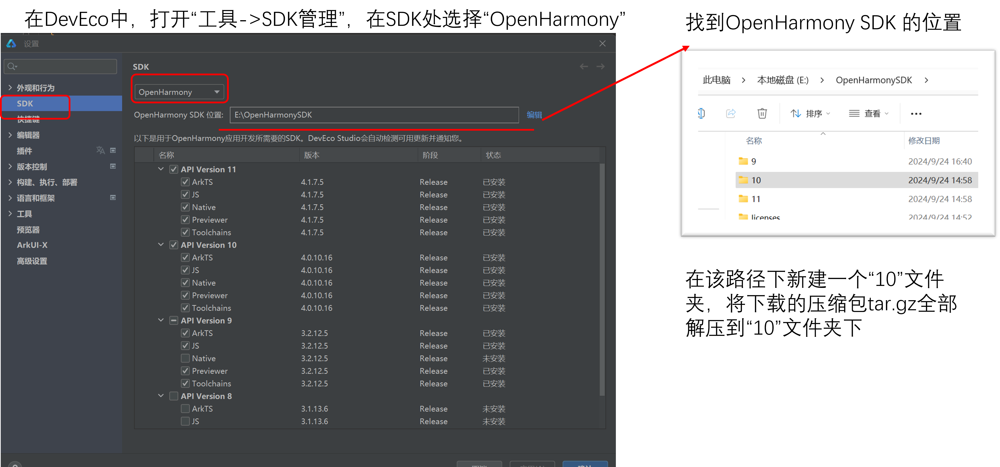
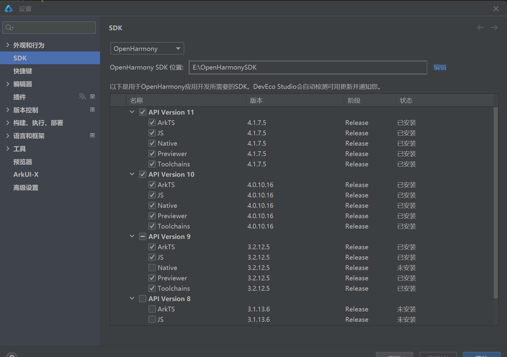

### 一、**项目结构**

```
|
├───napi
│   │   @ohos.fish_tank.d.ts    //接口定义文件，以供应用开发调用
│   │
│   └───fish_part
│       │   bundle.json         //部件声明文件
│       │   BUILD.gn            //构建脚本，配置NAPI模块的构建过程
│       │
│       └───fish_tank_demo
│               BUILD.gn        //构建脚本，配置NAPI模块的构建过程
│               fish_tank.cpp   //c++实现文件，提供fish_tank的原生接口
│               um_adc.h        //adc相关的头文件
│               um_adc.c        //adc相关的底层操作实现
│               um_gpio.h       //gpio相关的头文件
│               um_gpio.c       //gpio相关的底层操作实现
│               um_pwm.h        //pwm相关的头文件
│               um_pwm.c        //pwm相关的底层操作实现
│
└───figures
        测试.gif
        配置SDK地址2.png
        配置SDK地址.png
```

### 二、**作品简介**
本项目提供了针对鱼缸环境控制的专用模块：fish_tank，适用于 OpenHarmony 系统上的硬件开发。通过该模块，用户能够实现对鱼缸内舵机、水泵开关的控制以及水位的实时获取。

### 三、**开发环境**
- 搭载OpenHarmony-v4.0-Beta2版本的Unionpi_Tiger开发板
- Ubuntu20.04虚拟机
- [DevEco Studio 4.1](https://docs.openharmony.cn/pages/v4.1/zh-cn/release-notes/OpenHarmony-v4.1-release.md/#%E9%85%8D%E5%A5%97%E5%85%B3%E7%B3%BB)
- [Ohos_sdk_public 4.0.7.5 (API Version 10 Beta1)](https://gitee.com/openharmony/docs/blob/master/zh-cn/release-notes/OpenHarmony-v4.0-beta1.md#https://gitee.com/link?target=https%3A%2F%2Frepo.huaweicloud.com%2Fopenharmony%2Fos%2F4.0-Beta1%2Fohos-sdk-windows_linux-public-20230605.tar.gz)

### 四、fish_tank模块
`fish_tank`模块提供了控制鱼缸内舵机、水泵开关以及获取水位的功能。该模块支持异步调用方式
**函数**：
- `function setPumpWithPromise(time: number): Promise<number>;`
在time秒之后启动水泵，返回一个Pormise，Promise对象在解析时总是返回0
- `function setSteeringWithPromise(time: number): Promise<number>`
在time秒之后启动舵机，返回一个Pormise，Promise对象在解析时总是返回0
- `function getWaterLevelWithPromise(): Promise<number>`
获取鱼缸内的水位，返回一个Promise，Promise对象在解析时返回水位数据

为了方便开发者在 OpenHarmony 应用中调用这些接口，我们提供了 TypeScript 接口定义文件：
```ts
declare namespace fish_tank
{
    /**
     * 在指定秒数之后开启水泵
     * @param time 秒；
     * @returns Promise<number>，number始终为0
     */
    function setPumpWithPromise(time: number): Promise<number>;

    /**
      * 在指定秒数之后开启舵机
      * @param time 秒；
      * @returns Promise<number>，number始终为0
      */
    function setSteeringWithPromise(time: number): Promise<number>;

    /**
     * 获取水位
     * @returns 水位
     */
    function getWaterLevelWithPromise(): Promise<number>;
}

export default fish_tank;
```

### 五、修改系统配置文件
修改`device\board\unionman\unionpi_tiger\config\init\arm\init.A311D.cfg`文件，在cmds中添加相关命令
```
"write /sys/class/gpio/export 380",
"write /sys/class/gpio/export 381",
"write /sys/class/gpio/export 382",
"write /sys/class/gpio/export 383",
"write /sys/class/gpio/export 384",
"write /sys/class/gpio/export 385",
"write /sys/class/gpio/export 386",
"write /sys/class/gpio/export 387",
"write /sys/class/gpio/export 388",
"write /sys/class/gpio/export 389",
"chmod 666 /sys/class/gpio/gpio380/direction",
"chmod 666 /sys/class/gpio/gpio381/direction",
"chmod 666 /sys/class/gpio/gpio382/direction",
"chmod 666 /sys/class/gpio/gpio383/direction",
"chmod 666 /sys/class/gpio/gpio384/direction",
"chmod 666 /sys/class/gpio/gpio385/direction",
"chmod 666 /sys/class/gpio/gpio386/direction",
"chmod 666 /sys/class/gpio/gpio387/direction",
"chmod 666 /sys/class/gpio/gpio388/direction",
"chmod 666 /sys/class/gpio/gpio389/direction",
"chmod 666 /sys/class/gpio/gpio380/value",
"chmod 666 /sys/class/gpio/gpio381/value",
"chmod 666 /sys/class/gpio/gpio382/value",
"chmod 666 /sys/class/gpio/gpio383/value",
"chmod 666 /sys/class/gpio/gpio384/value",
"chmod 666 /sys/class/gpio/gpio385/value",
"chmod 666 /sys/class/gpio/gpio386/value",
"chmod 666 /sys/class/gpio/gpio387/value",
"chmod 666 /sys/class/gpio/gpio388/value",
"chmod 666 /sys/class/gpio/gpio389/value",
"write /sys/class/pwm/pwmchip0/export 0",
"write /sys/class/pwm/pwmchip2/export 0",
"chmod 666 /sys/class/pwm/pwmchip0/pwm0/duty_cycle",
"chmod 666 /sys/class/pwm/pwmchip0/pwm0/period",
"chmod 666 /sys/class/pwm/pwmchip0/pwm0/enable",
"chmod 666 /sys/class/pwm/pwmchip0/pwm0/polarity",
"chmod 666 /sys/class/pwm/pwmchip2/pwm0/duty_cycle",
"chmod 666 /sys/class/pwm/pwmchip2/pwm0/period",
"chmod 666 /sys/class/pwm/pwmchip2/pwm0/enable",
"chmod 666 /sys/class/pwm/pwmchip2/pwm0/polarity"
```

### 六、构建和部署
1.**配置**
添加一个子系统，名称自定，笔者将名称定为napisubsys并将其放在了Openharmony源码根目录下，若有需要请根据实际情况修改。

将`fish_demo/napi`下的`fish_part`文件夹整体复制到`napisubsys`下。

将新增的napisubsys子系统配置到`build/subsystem_config.json`。
```json
"napisubsys": {
  "path": "napisubsys",
  "name": "napisubsys"
},
```

将`fish_part`组件添加到产品定义中：

打开`vendor/unionman/unionpi_tiger/config.json`文件，在`"subsystems":`中添加下列语句
```json
{
      "subsystem": "napisubsys",
      "components": [
        {
          "component": "fish_part",
          "features": []
        }
      ]
},
```

2. **编译**
- 全量编译：在Openharmony源代码根目录下执行以下命令进行编译：
```bash
./build.sh --product-name unionpi_tiger --ccache
```
- 模块编译：在Openharmony源代码根目录下执行以下命令进行编译：
```bash
./build.sh --product-name unionpi_tiger --build-target fish_tank --ccache
```

3. **部署**
如果开发板已经烧录了相应的 OpenHarmony 操作系统，可以通过以下命令将编译后的动态库发送到开发板：
```bash
hdc shell mount -o remount,rw /
hdc file send path_to_libfish_tank.z.so /system/lib/module
```

配置SDK地址，使DevEco使用API 10


再次开启DevEco Studio，在SDK管理器中即可看到API 10，说明配置成功


将接口定义@ohos.fish_tank.d.ts文件，放到OpenHarmony SDK目录ets\10\api目录下。

4. **开发者调试**
使用 DevEco Studio 创建标准应用App，并通过`import fish_tank from @ohos.fish_tank`引入模块，即可调用该模块提供的函数，例如：
```ts
fish_tank.getWaterLevelWithPromise().then((water_level)=>{
  console.log(String(water_level));
})
```

### 七、演示效果
