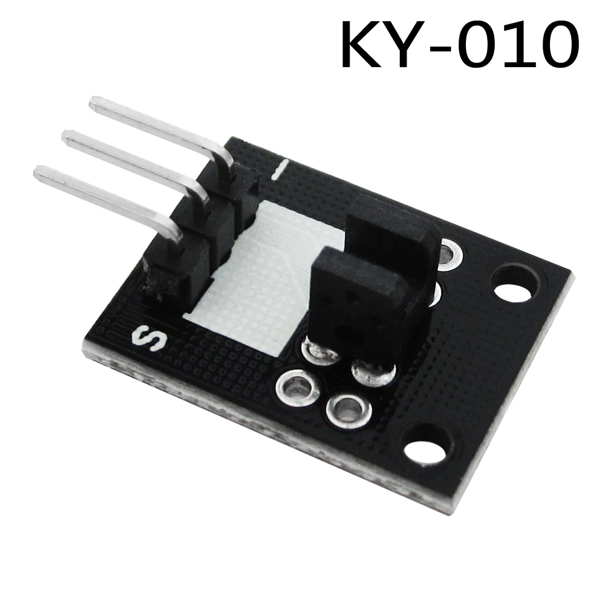
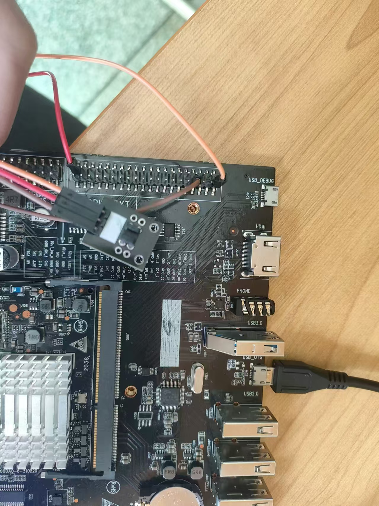
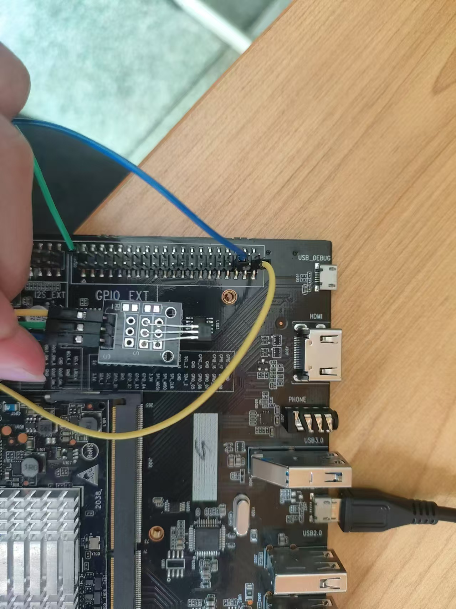
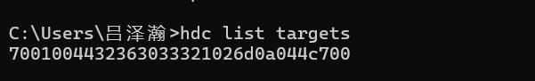
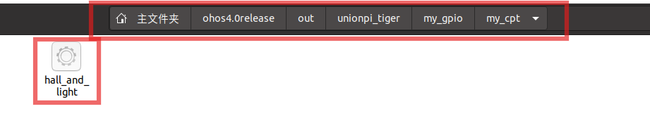
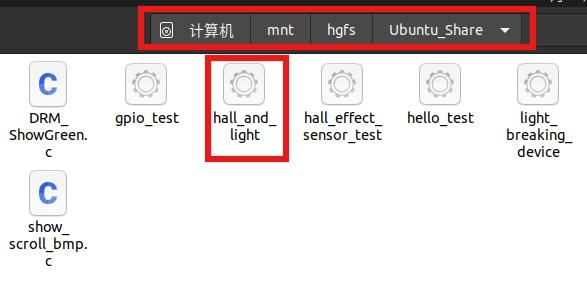
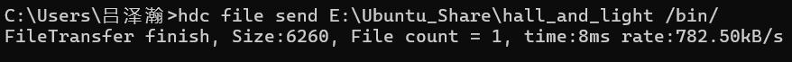
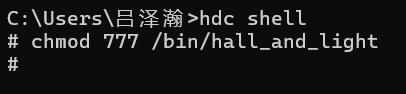
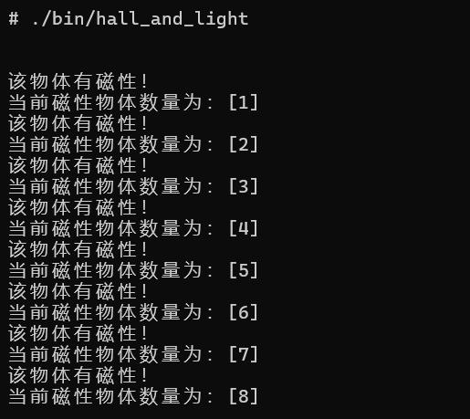
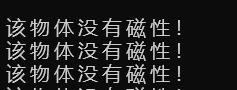

# 统计有磁性的物体数

## 购买外设
1) KY-010光折断传感器

[KY-010光折断传感器](https://arduinomodules.info/ky-010-photo-interrupter-module/)



2) KY-003霍尔磁力传感器

[KY-003霍尔磁力传感器](https://arduinomodules.info/ky-003-hall-magnetic-sensor-module/)


## 连线

1) KY-010光折断传感器

- –（左） -- GND
-   中间  -- +5V
- S（右） -- GPIO07

连线实物图



2) KY-003霍尔磁力传感器

- –（左） -- GND
-   中间  -- +5V
- S（右） -- GPIO08

连线实物图



## 编译

1) 修改 `//my_gpio/my_cpt/bundle.json`

```json
{
    "name": "@ohos/my_gpio",
    "description": "my_gpio",
    "version": "4.0",
    "license": "Apache License 2.0",
    "punlishAs": "code-segment",
    "segment": {
        "destPath": "my_gpio/my_cpt"
    },
    "dirs": {},
    "scripts": {},
    "component": {
        "name": "my_cpt",               
        "subsystem": "my_gpio", 
        "syscap": [],
        "feature": [],
        "adapted_system_type": [ "mini", "small", "standard"],
        "rom": "10KB",
        "ram": "10KB",
        "deps": {
            "components":[
                
                "c_utils",
                "hilog",
                "napi"
            ],
            "third_party":[]
        },
        "build": {
            "sub_component": [
                "//my_gpio/my_cpt:my_cpt"
            ],
            "inner_kits": [],
            "test": []
        
        }
    }
}
```
2) 编写/my_gpio/my_cpt/BUILD.gn

```gn
import("//build/ohos.gni")

group("my_cpt") {
  deps = [
    # "hall_effect_sensor:hall_effect_sensor_test",
    # "light_breaking:light_breaking_device",
      "hall_and_light:hall_and_light"
  ]
}

```

2) 编写编写//my_gpio/my_cpt/hall_and_light/BUILD.gn

```gn
import("//build/ohos.gni")
import("//build/ohos/ndk/ndk.gni")

ohos_executable("hall_and_light") {
  output_name = "hall_and_light"
  sources = [
    
    "src/light_main.c",
    "src/hall_main.c",
    "src/um_gpio.c",

  ]

  include_dirs = [ 
    "include",
    "//commonlibrary/c_utils/base/include" 
    ]

  external_deps = [
    "c_utils:utils",
    "hilog:libhilog",
  ]

  install_images = [ "system" ]
  part_name = "my_cpt"
  install_enable = true
}

```
3) 在//build/subsystem_config.json中添加字段
```json
,
  "my_gpio":{
    "path": "my_gpio",
    "name": "my_gpio"
  }
```

4) 在//vendor/unionman/unionpi_tiger/config.json添加字段

```json
,
    {
      "subsystem": "my_gpio",
      "components": [
        {
          "component": "my_cpt",
          "features": [
          ]
        }
      ]
    }
```

2. 连接开发板

   连接好开发板之后进入Windows命令行，运行命令“hdc list targets”，若输出设备号则表示开发板连接成功，输出“[Empty]”则表示开发板连接失败
   

3. 在Ubuntu中执行命令对目标进行编译

   `./build.sh --product-name unionpi-tiger --build-target hall_and_light --ccache`

4. 进入文件目录ohos4.0release/out/unionpi_tiger/my_gpio/my_gpio/my_cpt，将编译出来的可执行文件复制到共享文件夹 

   
   

5. 在Windows运行命令进行挂载

   `hdc shell mount -o remount,rw / `

   

6. 发送可执行文件至开发板中

   在Windows中打开命令行，执行命令发送可执行文件到开发板中

   `hdc file send E:\Ubuntu_Share\hall_and_light /bin/`

   

7. 打开可执行文件权限

   进入hdc shell, 打开可执行文件权限

   `chmod 777 /bin/hall_and_light`

   

8. 运行可执行文件

   运行命令
   `./bin/hall_and_light`

   

## 结果
   当带有磁性的物体经过光折断器和霍尔磁力传感器时，输出信息“该物体有磁性！”，“当前磁性物体数量为：[]”
   

   当不带有磁性的物体经过光折断器和霍尔磁力传感器时，输出信息“该物体没有磁性！”
   

