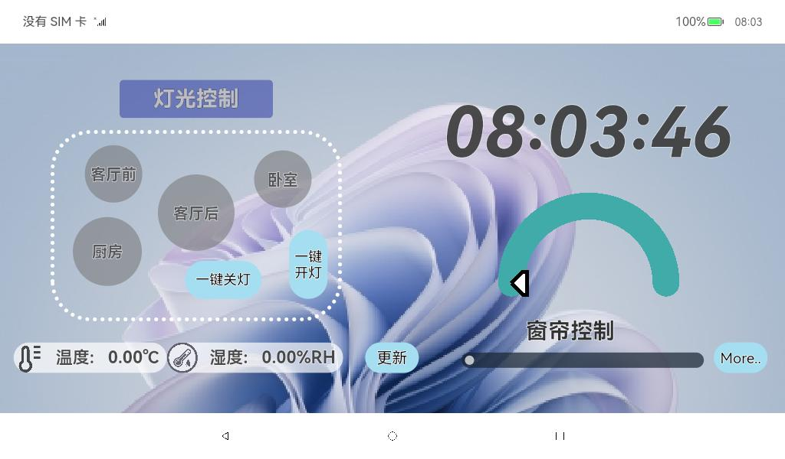
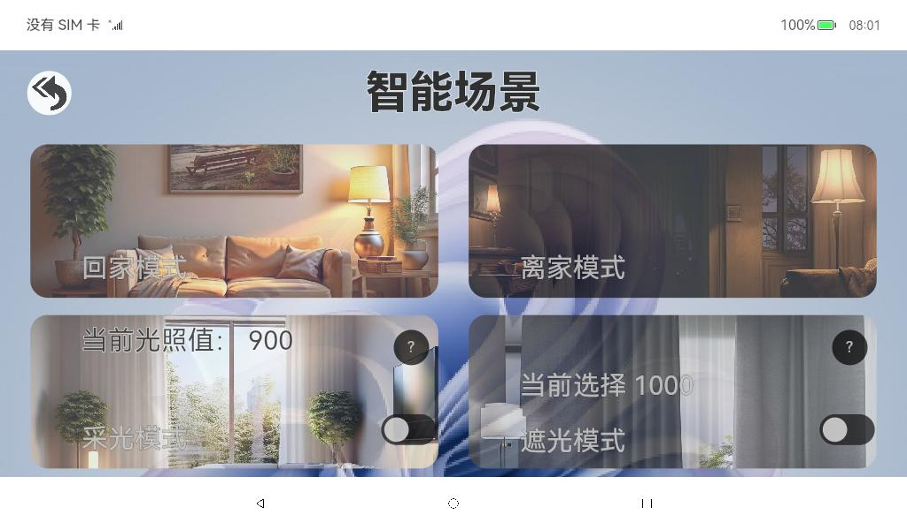
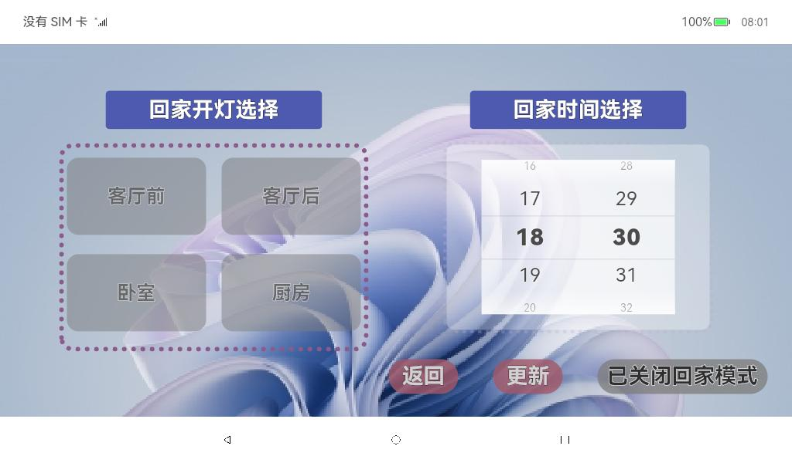
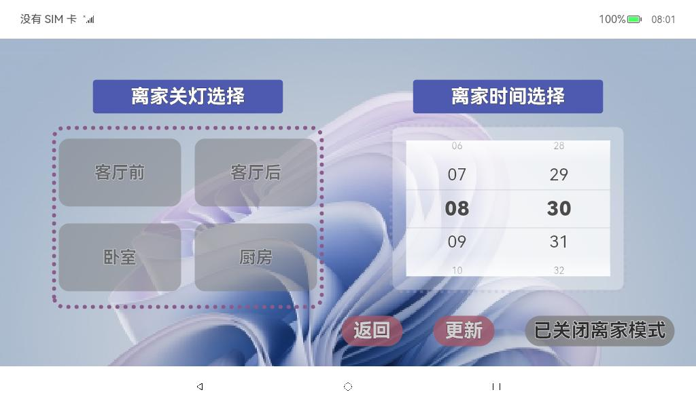

## 智能家居中控

### 样例介绍

基于OpenHarmony NAPI框架实现北向应用端控制南向设备实现智能家居功能

### 开发环境

搭载OpenHarmony的Unionpi Tiger开发板

DevEco Studio 

Ubuntu20.04虚拟机 

USB_Burning_Tool烧录工具

### 工程目录

```
\entry\src\main\ets
├─pages
|   └─Index.ets						      //主页
├─image 							    //页面截图
|   ├─backhome.jpeg
|   ├─curtain.jpeg
|   ├─index.jpeg
|   └─lefthome.jpeg
├─filemanager
|      ├─pages
|      |   ├─backhome.ets				  //回家模式页面
|      |   ├─intelligentscenario.ets					//智能场景页面
|      |   └─lefthome.ets				    //离家模式页面
├─entryability
|      └─EntryAbility.ets
```


### NAPI接口实现

NAPI接口封装在`unionman\unionpi_Tiger\sample\app\gpioled_app\README.md` 中有详细介绍及说明。

本次智能家居中控系统，LED，舵机，光线传感器外设接口采用Promise异步封装，温湿度传感器同步封装。

#### **1.创建子系统目录**

在OpenHarmony源码目录`unionpi_tiger/sample/napi`下创建一个目录作为子系统目录。如：`gpioled_subsys`，`pwm_subsys`，`tempandhum_subsys`，`light_subsys`。

#### 2.在子系统目录下新增组件

在子系统目录下创建相应的子组件目录，如`gpioled_part` ，`pwm_part`， `tempandhum_part` ，`light_part`。

#### 3.新增拓展动态库

将子组件目录作为 NAPI扩展库的代码目录，在子组件目录下创建文件代码。

以GPIO为例在`gpioled_part` 目录下创建代码文件`gpioled.cpp`。

在`gpioled_part` 目录下创建`BUILD.gn`文件，编写构建配置。

```
import("//build/ohos.gni")

ohos_shared_library("gpioled") {
  include_dirs = [ 
    "//foundation/ace/napi/interfaces/kits", 
    "//vendor/unionman/unionpi_tiger/sample/napi/gpioled_subsys/gpioled_part"
    ]

  sources = [
    "um_gpio.c",
    "gpioled.cpp",
  ]

  external_deps = [
    "hilog:libhilog",
    "napi:ace_napi",
  ]

  part_name = "product_unionpi_tiger"
}
```

#### 4.修改编译相关配置信息

由于OHOS版本更新导致子系统采用新文件`bundle.json`管理，流程如下。

修改`ohos4.0release/vendor/unionman/unionpi_tiger/bundle.json`文件，在`"deps"`中添加`"napi"`

```
"deps": {
        "components": [
          "hilog",
          "c_utils",
          "hdf_core",
          "napi"
        ],
```

修改`ohos4.0release/vendor/unionman/unionpi_tiger/sample/BUILD.gn`文件，添加组件依赖。

```
import("//build/ohos.gni")

group("sample_group") {
  deps = [
    "hardware:hardware",
    # "hdf:hdf",
    "napi/gpioled_subsys/gpioled_part:gpioled",
    "napi/pwm_subsys/pwm_part:pwm",
    "napi/tempandhum_subsys/tempandhum_part:tempandhum",
    "napi/light_subsys/light_part:light"
  ]
}
```

#### 5.修改系统配置文件

修改系统权限，使 APP 能够使用开发板 gpio，pwm，i2c，adc 的系统文件

修改`device\board\unionman\unionpi_tiger\config\init\arm\init.A311D.cfg `文件，在cmds中添加相关命令

```
"write /sys/class/gpio/export 380",
"write /sys/class/gpio/export 381",
"write /sys/class/gpio/export 382",
"write /sys/class/gpio/export 383",
"write /sys/class/gpio/export 384",
"write /sys/class/gpio/export 385",
"write /sys/class/gpio/export 386",
"write /sys/class/gpio/export 387",
"write /sys/class/gpio/export 388",
"write /sys/class/gpio/export 389",
"chmod 666 /sys/class/gpio/gpio380/direction",
"chmod 666 /sys/class/gpio/gpio381/direction",
"chmod 666 /sys/class/gpio/gpio382/direction",
"chmod 666 /sys/class/gpio/gpio383/direction",
"chmod 666 /sys/class/gpio/gpio384/direction",
"chmod 666 /sys/class/gpio/gpio385/direction",
"chmod 666 /sys/class/gpio/gpio386/direction",
"chmod 666 /sys/class/gpio/gpio387/direction",
"chmod 666 /sys/class/gpio/gpio388/direction",
"chmod 666 /sys/class/gpio/gpio389/direction",
"chmod 666 /sys/class/gpio/gpio380/value",
"chmod 666 /sys/class/gpio/gpio381/value",
"chmod 666 /sys/class/gpio/gpio382/value",
"chmod 666 /sys/class/gpio/gpio383/value",
"chmod 666 /sys/class/gpio/gpio384/value",
"chmod 666 /sys/class/gpio/gpio385/value",
"chmod 666 /sys/class/gpio/gpio386/value",
"chmod 666 /sys/class/gpio/gpio387/value",
"chmod 666 /sys/class/gpio/gpio388/value",
"chmod 666 /sys/class/gpio/gpio389/value",
"chmod 777 /dev/i2c-5",
"write /sys/class/pwm/pwmchip0/export 0",
"write /sys/class/pwm/pwmchip2/export 0",
"chmod 666 /sys/class/pwm/pwmchip0/pwm0/duty_cycle",
"chmod 666 /sys/class/pwm/pwmchip0/pwm0/period",
"chmod 666 /sys/class/pwm/pwmchip0/pwm0/enable",
"chmod 666 /sys/class/pwm/pwmchip0/pwm0/polarity",
"chmod 666 /sys/class/pwm/pwmchip2/pwm0/duty_cycle",
"chmod 666 /sys/class/pwm/pwmchip2/pwm0/period",
"chmod 666 /sys/class/pwm/pwmchip2/pwm0/enable",
"chmod 666 /sys/class/pwm/pwmchip2/pwm0/polarity",
"chmod 666 /sys/bus/iio/devices/iio:device0/in_voltage2_raw",
"chmod 666 /sys/bus/iio/devices/iio:device0/in_voltage3_raw",
```

**注：不能有多余的空格或符号，否则会导致开发板无法正常开机。**

#### 6.编译和烧录

进入根目录编译

```
./build.sh --product-name unionpi_tiger –ccache
```

打包

```
./device/board/unionman/unionpi_tiger/common/tools/packer-unionpi.sh
```

然后使用烧录工具将镜像文件烧入开发板

### APP具体实现

实时控制灯光和窗帘的开关、更新温湿度数据、浏览智能场景页面的功能接口封装在Index.ets

**灯光开关:** 使用`lightControl.toggleLight()`，并调用`UIManager.showLightToggleAnimation()`和`UIManager.showLightStatusToast()`显示动效和提示反馈。

**窗帘开关:** 使用`curtainControl.toggleCurtain()`，并调用`UIManager.showCurtainToggleAnimation()`和`UIManager.showCurtainStatusToast()`显示动效和提示反馈。

**点击“更新”按钮:** 使用`temperatureHumiditySensor.updateData()`获取新数据，并调用`UIManager.updateTemperatureHumidityDisplay()`更新显示。

**点击“More..”按钮:** 调用`Navigator.navigateTo('SmartScenesPage')`导航到智能场景页面。点击相关按钮跳转页面、更改设置，开启或关闭功能。

**跳转页面功能:** 使用`router.pushUrl`实现页面跳转。

**光照设置:** 使用`TextPickerDialog.show`展示光照选择弹窗，通过`onAccept`回调函数获取并设置选中的光照值。

**遮光设置:** 使用`TextPickerDialog.show`展示遮光选择弹窗，通过`onAccept`回调函数获取并设置选中的遮光值。

**获取传感器数据:** 使用`light.ReadLightIntensity`读取光强传感器数据。使用`TempAndHum.ReadTemp_Hum`读取温湿度数据。

**PWM控制窗帘:** 使用`pwm.SetPwmAsync`设置PWM信号控制窗帘的开闭角度。在`ClosePwm`函数中，根据光强度设置窗帘角度并调用`pwm.SetPwmAsync`。

**灯光控制模块:** 使用Button组件创建灯光开关按钮，通过`@StorageLink`绑定灯光状态变量`（backHomeLight）`。每个按钮的点击事件通过`onClick`函数改变对应的灯光状态变量。

**时间选择模块:** 使用`TimePicker`组件创建时间选择器，通过`selected`属性绑定默认时间`selectedTime`。

**模式切换模块:** 按钮点击事件通过`onClick`函数改变`backHomeLightControl`的值，并根据其值显示不同的文本和背景颜色。

### 效果预览

|     |  |
| ----------------------------------------------------- | ------------------------------------------------------------ |
|  |         |

### 使用说明

1. 在主界面，可以实时控制灯光和窗帘的开关，灯光和窗帘的开关会有动效和提示反馈。点击“更新”按钮更新温湿度数据；点击“More..”按钮浏览智能场景页面；
2. 在智能场景浏览界面，点击“回家模式”和“离家模式”按钮跳转到相应设置页面；点击“采光模式”和“遮光模式”按钮调整设置，并使用旁边的开关按钮开启或关闭功能；
3. 在回家模式页面，可以选择需要开启的灯光，选择后会有动效反馈。拖动时间选择器设置回家时间，并点击“更新”按钮确认。点击“已关闭回家模式”按钮后，按钮变色，字体变为“已开启回家模式”。点击“返回”按钮回到智能场景界面。
4. 离家模式页面功能与回家模式页面相同。
