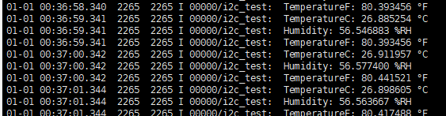

## Unionpi_Tiger—i2c实验

### 读取温湿度传感器

#### 1.传感器简介

本模块采用SHT31-DIS-F芯片，这个芯片是SHT2x系列温湿度传感器的新一代继承者，相比上一代芯片精度更高，在SHT3x系列中属于标准版,同时这款芯片上面还有一层保护膜。

芯片测量数据经过出厂校正、线性化和温度补偿，具有温湿度报警输出、软硬件复位功能。

传感器的湿度测量范围是0-100%RH，温度测量范围是-40-125℃。I2C接口，可选I2C 地址，工作电压范围宽（2.15V至5.5 V）。

保护膜是IP67的PTFE膜，可防止传感器开孔接触灰尘，因此允许传感器在恶劣环境条件下使用，如密切接触灰尘可能对传感器的精准性具有影响的地方。由于最小封装和膜的高 水气渗透性，相对湿度和温度
信号的响应时间与没加膜的传感器所实现的相同。虽然，保护膜可完美防止灰尘的进入，但在一般情况下它不能防止挥发性化学物质的污染。

- 工作电压：2.15V~5.5V

- 工作电流：<1.5mA

- 湿度测量精度：±2%RH

- 湿度测量范围：0-100%RH

- 温度测量精度：±0.2℃

- 温度测量范围：-40℃~125℃

- 通信接口：Breakout 2.54mm-6Pin I2C

- 外形尺寸：19mm x 16mm

- 安装孔尺寸：2mm

- 安装孔间距：15mm

- 工作温度：-40℃~125℃

  

  #### 2.使用教程

  **准备**：Unionpi-Tiger开发板

  ​			杜邦线

  ​			SHT31-DIS-F 数字温湿度传感器

  

  ***接线：***Unionpi-Tiger上的GPIO_EXT与温湿度传感器连接

  ​			***SCL_1 ——SCL***

  ​			***SDA_1——SDA***

  ​				***5V  ——VCC***

  ​     		  ***GND——GND***

  

##### 		**具体实现(sample/i2c)**

​		首先使用i2ctools查询设备挂载在哪条i2c总线上

​		(如不在i2c-5上需要修改成相对应的总线，具体在main.c的main函数开头)

​		用usb线连接开发板的debug，使用串口工具输入hilog -T i2c_test &  后再输入  i2c_test  3 2

​		SHT3X支持12种工作模式，分别有高，中，低三档可选刷新率。mps=0.5,1,2…时，分别代表每两秒采集一次数据，每秒采集一次数据，每秒采集两次数据…

​		i2c_test后的第一个参数(如:i2c_test  **3** 2)为设置传感器的mps

​		i2c_test后的第二个参数(如:i2c_test  3 **2**)为设置传感器的repeatability		

​		第一个参数取值为0-4，分别对应mps=0.5、1、2、4、10

​		第二个参数取值为0-2，分别对应低刷新率、中刷新率、高刷新率

​		运行如图：

​		         

