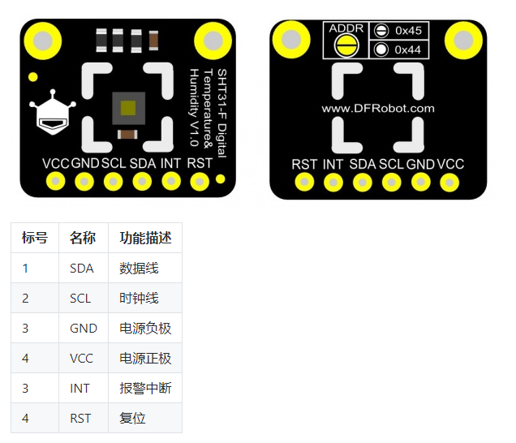
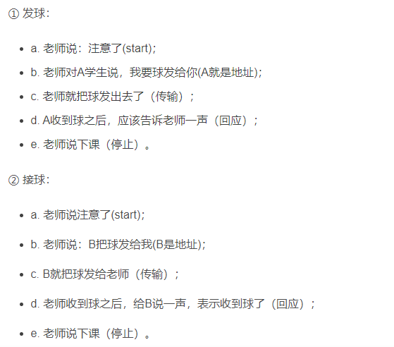
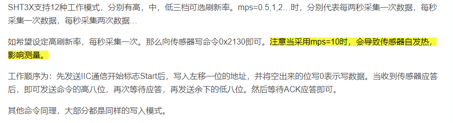
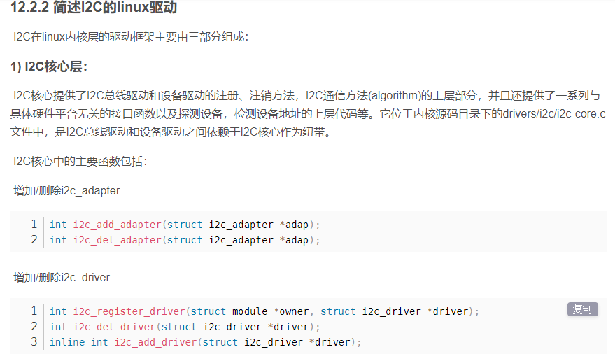
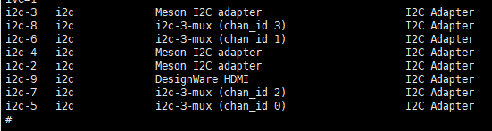
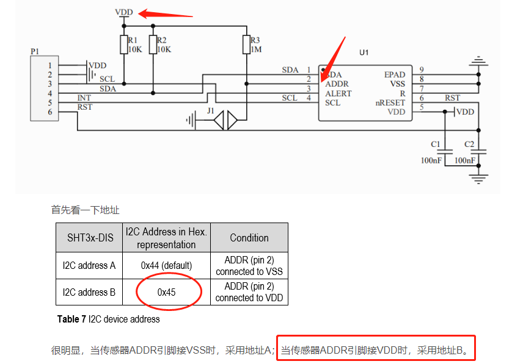

# Unionpi_Tiger—i2c实验

## 										读取温湿度传感器——开发笔记

#### 第一步：先了解传感器硬件信息

#### 第二步：了解I2C通信协议及如何使用I2C与这个芯片通信

​																				I2C的总线结构图

**简单总结**：先发从机地址选定芯片-->发送控制命令-->读取芯片内部寄存器的值（读取温湿度）-->显示出来

#### 第三步：了解linux环境下的i2c应用开发

​		

PS：sample中使用的是linux中i2c子系统的ioctl编写接口

​         **先发从机地址选定芯片-->发送控制命令-->读取芯片内部寄存器的值（读取温湿度）-->显示出来**

